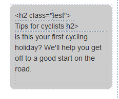

I have a user control that lets the editor pick which level of heading to use (e.g. h2 if the information supplements the main article, strong/span if it doesn't). Headings are stored as items in a configuration folder, with a single-line text field for the heading type (e.g. h1) and one for a CSS class. The final output looks like this:

```html
<h2 class="heading">My text</h2>
```

However, when I load a page up in Page Editor, I get this:



Because the heading type and class fields are going through FieldRenderer, Sitecore thinks that they should be editable. To stop this from happening, disable web editing:

```csharp
FieldRenderer.Render(HeadingType, "Element", "disable-web-editing=true");
```

-- OR --

```html
<sc:Text Field="Heading" DisableWebEditing="true" runat="server" />
```

Those fields are no longer editable, but the actual heading text is:


You might also want to do this to the **page title** and **meta description** in the page `head`.

<div class="comments">

## Comments (imported from wordpress)

### [Mike Reynolds](http://sitecorejunkie.wordpress.com/)

I would opt to use the second solution — setting the DisableWebEditing attribute on the Sitecore FieldRenderer WebControl.

If the requirements for making this work in the page editor change in the future, you can easily remove this attribute and push the presentation file containing the FieldRenderer WebControl to the production server without having to updated DLLs in the /bin folder — thus not causing disruption to website users during said deployment.

Mike

</div>