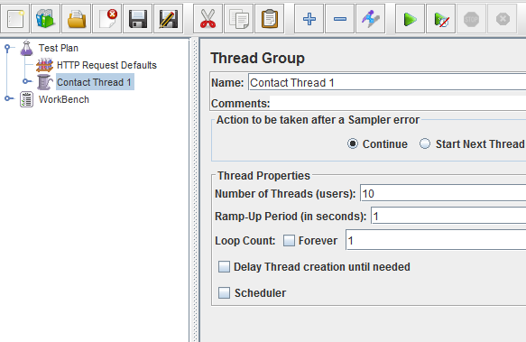

**Note:** Although the screenshots I am using are from the Experience Profile interface, which is not publicly available at time of writing, this method will work with older versions of Sitecore as well.

**Edit (05/08/2014):** See comments by Alen, Ivan, and Michael regarding robot detection and forcing session end, as these may affect whether or not JMeter activity is excluded from analytics.

The Sitecore Experience Platform combines the CMS with a whole host of marketing and analytics features. In the upcoming 7.5 release, the system architecture that drives these features have been given an overhaul -- where previously there was a single SQL database, there is now a more scalable infrastructure that brings MongoDB and search indexes into play.

There is also a new interface -- the [Experience Profile, which you can read more about here](http://www.sitecore.net/unitedkingdom/Products/Experience-Database.aspx). This interface lets you view contacts and their interactions with your brand in a user-friendly SPEAK interface. You can see the engagement value they have accrued in total and per visit, see which pattern card best matches them based on the pages they have visited, and how they came to the site -- to name a few.

I am working with this version at the moment, and it brought up an age-old problem -- how do we generate meaningful, fake analytics data? I have previously used the Traffic Generator, but I would like more control than that, and I do not want to generate it all by hand.

Why bother? Well, internally, we need meaningful data for training -- you may need it to show customers what they can expect from the interface, or test that your goals and profile points are adding up as expected (I wouldn't run this on a live site, though, as it will interfere with your analytics data).

Sitecore Support gave me the idea to use JMeter (I know there are plenty of other performance testing tools out there, but this one worked for me). In this blog post, I will show you how to:

-   Generate large amounts of traffic
-   Customize the request header to fake referers, user agents, etc
-   How to fake multiple visits from a single contact -- but you still only have to run the script once

## A single session with a couple of page visits

First of all, [download Apache JMeter](https://jmeter.apache.org/download_jmeter.cgi). Open it by running the `jmeter.bat` file in the bin folder -- it will open a terminal window and this interface:


Next, we are going to create a thread with a number of page requests.

### Create some defaults

Right-click on the test plan and Add > Config Element > Http Request Defaults. Put this at the top of your test plan. This node has many of the same fields as an individual Http Request node, and allows you to set up defaults. The only one I need right now is Server Name or IP, which I will set to `http://traincore` -- now I will need need to specify the host name every time I create a request node. You can override it per Http Request, of course:


### Create a thread

Right-click on the test plan and Add > Thread (Users) > Thread Group. Give the thread group a new name -- I have called mine Contact Thread 1:



A thread is like a browser session -- it is the same thing as you opening your browser, clicking around a bit, and closing your browser again. Change the Number of Threads (users) to 10.

### Create a cookie manager

In order for a thread to take cookies into account, you need to create an Http Cookie Manager node. Right-click on the thread thread node OR the test plan node as a whole and Add > Config Element > Http Cookie Manager.


That's it. The very fact that this node exists in your thread means that the thread will use cookies -- which will be very important once we come to generating multiple interactions from a single contact.

### Create a number of page request

Right-click on your *thread* and Add > Sampler > Http Request. This will be your first page visit. In the Path field, type a path to a site page that is relative to the host name you set up in the Http Request Defaults node -- e.g. `/holidays/battle-of-the-hills/itinerary/day-1`.

Give your node a meaningful name (Battle of the Hills -- Day 1), and create a few more, each for a different page. I have added three separate requests to simulate the following user simple journey: Holidays > Battle of the Hills > Itinerary : Day 1:


Before we run this test plan, right-click on your thread and Add > Listener > View Results Tree. Ensure that this is at the bottom of your thread. As your thread runs, this node will collect the results:


Now run your test plan by pressing the play button.

## JMeter results

Cick on the View Result Tree node. In the Sampler result tab, you can see what came back from the server:


We ran 10 separate sessions, and each session started with a visit to the Holidays page. Click on that, and you should see something like this:

```
Response headers:
HTTP/1.1 200 OK
Cache-Control: no-cache, no-store
Pragma: no-cache
Content-Type: text/html; charset=utf-8
Expires: -1
Server: Microsoft-IIS/7.5
Set-Cookie: ASP.NET_SessionId=gsogo1kq3vhymh0togwpt1o0; path=/; HttpOnly
X-AspNet-Version: 4.0.30319
Set-Cookie: SC_ANALYTICS_GLOBAL_COOKIE=10f2535e791043fd9e9e7b67a2e4eb93|False; expires=Tue, 23-Jul-2024 17:26:06 GMT; path=/; HttpOnly
X-Powered-By: ASP.NET
Date: Wed, 23 Jul 2014 17:26:05 GMT
Content-Length: 22440
```

That is a response header. You can see that the Sitecore analytics cookie is returned to your 'browser' (which is JMeter): `Set-Cookie: SC_ANALYTICS_GLOBAL_COOKIE=10f2535e791043fd9e9e7b67a2e4eb93|False; expires=Tue, 23-Jul-2024 17:26:06 GMT; path=/; HttpOnly`

Click on several Holiday debug entries and confirm that the analytics cookie is new in each case -- from Sitecore's perspective, we have simulated ten different contacts visiting the site.

If you look at the response header for a later step in the test plan, such as Battle of the Hills, you will not see the Sitecore analytics cookie in the respone header, because it has already been set for that session:

```
HTTP/1.1 200 OK
Cache-Control: no-cache, no-store
Pragma: no-cache
Content-Type: text/html; charset=utf-8
Expires: -1
Server: Microsoft-IIS/7.5
X-AspNet-Version: 4.0.30319
X-Powered-By: ASP.NET
Date: Wed, 23 Jul 2014 17:26:06 GMT
Content-Length: 12383
```

## Viewing this data in Sitecore

Like I said at the start -- this method does not require Sitecore 7.5. Let's look at the Experience Editor interface. The first page lists the most recent visits -- we should have 10 separate visits, and they will all look like this:


But they look a bit boring! Each was 0 seconds long, no engagement value was triggered, we know they went to exactly the same pages, and each contact only made a single visit.

Don't worry -- we can fix all of that.

## Using a random controller to vary user path

I want my user paths to vary a little bit. Not everyone takes exactly the same path through the content, and I want to simulate that.

However, keep in mind that a visitor's path is not *totally* random. Let's think about the types of people that might visit the holiday site -- an expert mountain biker or a dad looking for something family-friendly. I want each session to *either* simulate a visitor looking for family holidays *or* an visitor looking for challenging mountain biking holidays.

To do this, I right-click on my thread again and Add > Controllers > Random Controller. A random controller execute one of its child nodes -- and any sub-trees it has.

Inside the random controller -- create two children of type Simple Controller but right-clicking and selecting Add > Controllers > Simple Controller. Call one Expert and the other Family. Under each of these Simple Controller nodes, build a list of Http Request nodes to simulate a journey for that particular visitor type -- a family-oriented visitor might visit 'Bikes for Families' and 'Road Safety', whilst an expert cyclist might visit 'Battle of the Hills -- Adrenaline Holidays' or 'Latest deals on high-performance bikes':


Remeber, JMeter has no idea what this means, it is only making requests -- *Sitecore* is the one that will think this particular 'visitor' is from a particular location.

Lastly, to avoid every 'family' and 'expert' visit being identical, you might want to add a second Random Controller node (before or after the first one) with a number of HttpRequest children that anyone might visit -- contact us, special offers, deals. You might even create a number of sub-trees using Simple Controller nodes to simulate a variety of possible paths. This is totally optional:


With enough nested Random Controller nodes, you can start to create journeys that look nothing alike. Run your test plan again and look at the View Result Tree node (it is best if you change the thread user count back to 1 and run the plan several times) -- each journey is slightly different. Your analytics will reflect this.

## Adding pauses

But every visit is still zere seconds. You can change that by adding some random pauses to your test plan in the form of Test Action nodes (Add > Sampler > Test Action). This node allows you to specify a Pause in milliseconds. Sprinkle randomly throughout test plan, and use Random Controller nodes to ensure that every user's visit time is slightly different.


## Triggering some goals

What about engagement value? Well, we know that a contact's engagement value depends on which goals they trigger.

You *could* trigger goals the way a human being triggers them -- by downloading files, filling in forms.. or you could just trigger them with `sc_trk={GUID}` (this query string may be different depending on what your configuration is set up to do).

To do this, your HTTP Request node needs to have a parameter specified (the query string key) and a value (in our case, the GUID for the goal. Because the GUID includes curly braces, make sure you tick 'encode':


You can see what your request looked like by using the View Result Tree node, and looking the Request tab for the request that had the query string.

Again, I am going to put a number of goal triggering requests under a Random Controller to give me some variety.

My visits now have varying durations, engagement value, and pages visited. But I still only have a single visit per visitor.

## Faking multiple visits from the same contact

How does Sitecore know you are a return visitor? It uses the `SC_ANALYTICS_GLOBAL_COOKIE` cookie. This cookie is set when you first visit a Sitecore site, with an expiry date set far in the future -- ten years, or something like that. When you close your browser, the browser session ends -- but your cookie is still there. When you visit again, Sitecore recognizes that you have visited the site before.

This does not work very well for developers, who clear their cache several times a day or refuse to accept cookies -- but a normal internet user doesn't actually bother clearing their cookies all that often (true story).

How do we use the same cookie over multiple threads in JMeter?

There is a way to share variables across threads in JMeter. I took advantage of this. First of all, I duplicated my entire thread a few times -- and changed aspects of it (different 'Family' and 'Expert' paths, different goals, more Random Controller nodes). I even created a Http Request Header node in *each thread*, and specified a different Referer for each. This will vary the 'traffic source' property for each visit.

Let's say we have four threads. In each of the threads following the first one, I want there to be a 50/50 chance that the cookie from the first visit will be re-used.

To do that, I first need to extract the analytics cookie from the first page request in the first visit.

## Extracting the cookie

Enter PreProcessor and PostProcessors. They allow me to do things before and after a request has been made. My first Http Request node in the first thread is to the Holidays page. I am going to Add > PostProcessor > Regular Expression Extractor to that:


This extractor will allow me to look at the response (header or body) and extract what I need using RegEx. I want everything that follows `SC_ANALYTICS_GLOBAL_COOKIE` in the header. I am not particularly good at RegEx, but this worked for me:

```
SC_ANALYTICS_GLOBAL_COOKIE=(.+?);
```

Here is the whole thing:


Once extracted, this value is stored as the variable name you specify in the Reference Name field -- I chose AnalyticsCookie.

## Making the cookie available to other threads

Now that I have my cookie, I want to make it available to subsequent requests in my test plan. JMeter has something called global variables, which allow me to set variables in one thread and retrieve them in the other.

To do this, I am going to create another PostProcessor node that runs immediately after the Regular Expression Extractor -- a BeanShell PostProcessor. BeanShell is dynamically interpreted Java (with some extra 'stuff').

This postprocessor is going to retrieve the locally scoped variable and set it to a global variable. This is the script:

```js
import org.apache.jmeter.util.JMeterUtils;
 
var analyticsCookieLocal = vars.get("analyticscookie");
 
JMeterUtils.setProperty("analyticsCookie", analyticsCookieLocal);
 
print("Cookie set: " + JMeterUtils.getProperty("analyticsCookie"));
```

And as a screenshot:


I have used `print` to show what is going on in the terminal window that opened up when I started JMeter. As your test plan runs, it will print out 'Cookie set: (COOKIE)' each time the script runs.

Now that we have set the cookie, we need to move on to our subsequent threads and randomly choose whether the cookie is re-used or reset.

## Re-using or resetting the cookie

Go to the second thread in your list. Make sure this thread has an Http Cookie Manager node.

The first thing we want to do in this new thread (which represents a person opening a new browser window) is to either send the existing analytics cookie with the first request or accept a new cookie from the server.

To do this randomly, create a Random Controller node. Inside it, create at least two Http Request child nodes -- they do not have to be for the same page.

As we know, the random controller will choose one of its children to run. We also know that there is such a thing as *pre-*processors, that run before a request is executed. Assuming you have two Http Request nodes, add a BeanShell PreProcessor node as a child to each one.

Here is the result:


In one of the pre-processors, simply print a message:

```java
print("NO RE-USE");[/java]
 
If the random controller chooses that Http Request node, all the pre-processor will do is print out a message - it will then hit the first page and a fresh analytics cookie will be returned.
 
In the second pre-processor script, <strong>extract and set the cookie stored in the global scope</strong>:
 
import org.apache.jmeter.util.JMeterUtils;
import org.apache.jmeter.protocol.http.control.CookieManager;
import org.apache.jmeter.protocol.http.control.Cookie;
 
// Get context cookie manager
CookieManager manager = cm=ctx.getCurrentSampler().getCookieManager();
 
// Create new cookie, retrieve global variable and set as value
Cookie cookie = new Cookie("SC_ANALYTICS_GLOBAL_COOKIE",JMeterUtils.getProperty("analyticsCookie"),"traincore","/",false,0);
manager.add(cookie); 
 
print("RE-USING THIS COOKIE: " + JMeterUtils.getProperty("analytics"));
```

Screenshot:


This script retrieves the current Http Cookie Manager in code and creates a new analytics cookie from the global variable you set in the first thread. This script will run before the request does, setting the cookie, which is then passed to the server (you can see this happening if you use a View Result Tree). Sitecore now thinks you are returning with the same analytics cookie, and will count you as an existing, anonymous contact, and a second visit.

If you duplicate the second thread a few times - the one with the cookie-setting pre-processor - there is a 50/50 chance in each thread that the cookie will be re-used. You will see a contact visit count with between 1 and `n`, where `n` is the number of threads. Provided you only have two options for your starting page in each thread, there is a 50% chance that a contact will make 2 visits, a 25% chance they will make 3 visits, a 12.5% chance they will make 4 visits, and so on until infinity (well, `n`).

Sitecore now thinks I'm a repeat visitor:


You can use this method with other cookies (ASP.NET session, for example), although I believe there is a smarter way to authenticate users.

We now have contacts making multiple visits, of varying value and duration, following different paths. Already, the data is starting to look more realistic. What else can you do?

## More options for faking analytics data

The Http Request Header tells you a lot about a visitor. JMeter has a configuration node called Http Request Header that allows you to fake things like the Referer (which site did your user browse to your page from?) or X-Forwarded-For(which IP did this person come from?). You can set the request header defaults per thread or for an entire test plan.

You could also pass other global varibles between threads. Currently, I am getting JMeter to store the 'visitor type' path a visitor took, saving that as a value ('family', for example), and using it to determine what type of content the visitor hits in subsequent threads - if the cookie is re-used, because that means it's the same visitor. The result is that someone who visited 'family' holiday pages in their first visit will not suddenly be visiting pages about expert bike repair.

<div class="comments">

## Comments (Imported from wordpress)

### Ivan Buzyka

_July 25, 2014 at 13:21_

In case of using this stuff in Sitecore 7.5 people should be careful since robot detection was significantly improved there and due some circumstances it checks whether visitor moved mouse (touched screen). JMeter probably cannot do that stuff, so sometimes you won't get anything in Analytics DB.

### Martina

_July 28, 2014 at 08:28_

Thank you for this -- I will edit the post to include these warnings (and what Alen said about disable robot detection).

### Alen Pelin

_July 28, 2014 at 01:22_

It is recommended to disable robots detection while such performance testing and data population. Also you need to write logic for generating random IP for different visitors. Another tool for such testing would be LoadUI/LoadSOAP that has much better UI, but uses Go language for scripting. So ideal solution for me is to use self-written tool in C# that is easy to configure for different scenarios. We have such a prototype for testing, contact me if you need it. Also I'd like to hear if you know anything better that has scripting in C#.

### Martina

_July 28, 2014 at 08:28_

LoadUI was suggested to me -- perhaps I should do a version with that, too! Could you fake the originating IP in the header?

### Alen Pelin

_September 18, 2014 at 04:08_

Yes, you need to set following setting:

And then add FAKE_IP header to all your requests.

### Alen Pelin

_September 18, 2014 at 04:10_

Yes, you need to set the Analytics.ForwardedRequestHttpHeader setting value to FAKE_IP and then add FAKE_IP header to all your requests.

### Mike

_August 5, 2014 at 11:00_

For those using JMeter you will need to update the analytics settings to not automatically detect robots and to not ignore them:

```xml
<!– ANALYTICS AUTO DETECT BOTS
Enable auto detection of bots.
Default: true
–>
<setting name="Analytics.AutoDetectBots" value="false" />
 
<!– ANALYTICS ROBOTS IGNORE ROBOTS
Ignore requests and do not write information to the Analytics database when the visitor
classification identifies the visitor as a robot.
Default: true
–>
<setting name="Analytics.Robots.IgnoreRobots" value="false" />
```

You should also create a page that ends the current user's session. Data isn't flushed to the analytics database (in 7.5) until the user session has ended. The simplest method is to create a page beneath /layouts/testing called EndSession.aspx. In the page load add the following code:

```csharp
public partial class EndSession : System.Web.UI.Page
    {
        protected void Page_Load(object sender, EventArgs e)
        {
            HttpContext.Current.Session.Abandon();
 
        }
    }
}
```

Make this the last request in your test script for all users.

After ending the session there will be a short delay before the data shows in the Experience Profile as Sitecore processes the new data.

### [Nick Wesselman (@techphoria414)](http://twitter.com/techphoria414)

_September 29, 2014 at 15:37_

Thanks for this Martina. Love the JMeter, such a useful and flexible tool. Don't care that the scripting is in Java!

Another useful approach w/ JMeter is to record a test plan using its proxy server. This allows you to add URLs to the test plan by simply browsing through the site. Especially useful for scripting complex interactions w/ AJAX. Described here:

[Click to access jmeter_proxy_step_by_step.pdf](http://jmeter.apache.org/usermanual/jmeter_proxy_step_by_step.pdf)

The only problem is that sometimes it records too much. You can filter using the include/exclude URL patterns, or a conditional proxy tool in your browser like FoxyProxy (http://getfoxyproxy.org/).

### Pingback: [Sitecore 8 : Overview of Experience Profile | Horizontal Integration](http://blog.horizontalintegration.com/2014/11/01/sitecore-8-overview-of-experience-profile/)

### [Derek Hunziker](http://layerworks.com/)

_December 19, 2014 at 20:38_

There is a setting in JMeter under the HTTP Request Default named Retrieve All Embedded Resources. This will cause JMeter to request imagery and other static resources with every request. Crucially, it will generate a request to the faux CSS file that is generated by the VisitorIdentification Control / HTMLHelper which in turn will allow JMeter requests to be seen as legitimate.

This seems to work fine up to Sitecore 7.2.

If you are using JMeter for performance testing, this setting will also help simulate real traffic loads as it generates more requests per page view.

### Pingback: [Diagnosing a Sitecore Memory Leak when using a Custom Controller Factory - Wesley Lomax](https://blog.wesleylomax.co.uk/2016/07/06/diagnosing-a-sitecore-memory-leak-when-using-a-custom-controller-factory/)

### Pingback: [Load Test from the Cloud | The Code Attic](https://thecodeattic.wordpress.com/2017/02/07/load-test-from-the-cloud/)

</div>