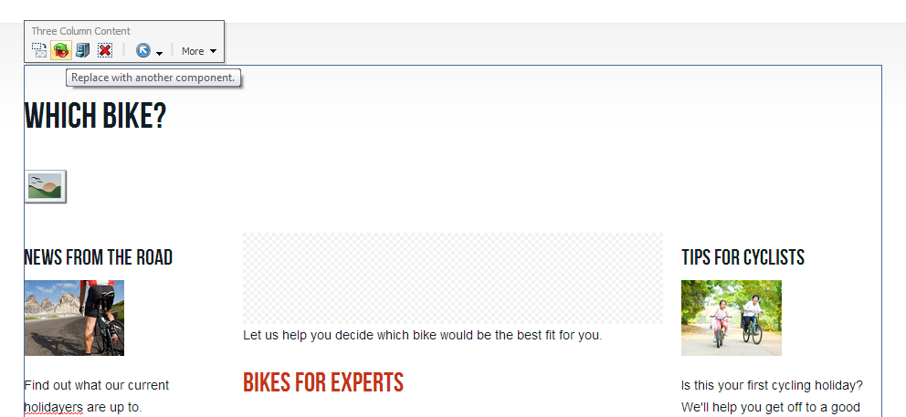

This blog post continues the series from [sitecore.net](https://www.sitecore.net/Community/Technical-Blogs/Martina-Welander-Sitecore-Blog.aspx). Refer to the bottom of this post for direct links to parts 1 -- 3. *The 'HTML for the Page Editor' has been temporarily postponed whilst work is being done on the front-end developer course!*

## What are compatible renderings?

Every component definition item in Sitecore allows you to specify a list of **compatible renderings** for that component. Setting this up allows you to swap quickly between different ways of representing data, rather than having to add and configure a new component in exactly the same way. Compatible renderings should should adhere to the following guidelines:

-   They accept the same datasource or output the same data
-   They accept the same parameters
-   They are allowed in the same placeholder
-   They have a very similar function, but a slightly different design

Although it is not strictly necessary for compatible renderings to share the same datasource type and rendering parameters, they would not be 'compatible' in the stricter sense of the word if they did not. You *could* make a side-navigation menu and a banner compatible, if they can appear in the same placeholder, but you are not adding any value -- apart from their capacity to appear in the same location (which you can enforce by making both of them allowed controls in that placeholder), they have nothing in common.

A good example of compatible renderings are columns. The following three column component can be replaced with a two column and one column variant. As long as the nested placeholders have the same key (*maincolumn* for all three, and *leftcolumn* for both the two and three column variants), they are compatible:

A page using the Three Column Content sublayout, with the Compatible Rendering button highlighted

Swapping between three and two columns will retain the left-hand *News from the road* widget. The editor should understand that swapping a three column for a one column component will mean that neither the *News from the road nor the *Tips for cyclist components will appear.**

Click the Replace with another component button...

... and choose a compatible rendering:

But what happens if you do not want the editor to be able to be able change between two, three, and one columns in one particular instance?

## Using compatible renderings with placeholder settings overrides

This is where placeholder settings overrides come in. Let's take the holiday detail page as an example. Here, I also have the option to switch to one or three columns. However, using a single column would hide the Available dates component, and make it impossible for visitors to make a booking. Not good.

However -- in order for a compatible rendering to appear in the 'Select a replacement rendering' dialogue, it must also be allowed in that placeholder. By default, all 'column' components are allowed in the PageContainer placeholder. If we do not want a single column to be an option, we can create a placeholder override setting for this particular data template.

The holiday detail page uses a data template named (wait for it) *Holiday Detail*. Because I want this rule to apply to all current and future Holiday Detail pages, I will make the change on that data template's standard values.

1.  Locate the data template's standard values in the Content Editor and click Presentation tab → Details button.
2.  Click Edit next to the device you want to configure -- let's assume Default
3.  Click Placeholder Settings, and Add a new one
4.  Click Create New Settings. You will be prompted for a name, and a placeholder key to to target. Because I am creating an override for the PageContainer key especially for the Holiday Detail template, I'm going to name it `pagecontainer-holidaydetail`:

    

5.  I am also given the option to specify a list of Allowed Controls. The default PageContainer placeholder settings item lists one, two, and three columns -- I am only going to allow two and three columns:

    

6.  Save -- this will create a new placeholder settings item under `/sitecore/Layout/Placeholder Settings`

If I go to any Holiday Detail page now and select the page container placeholder, it shows my override:

Holiday Detail is using the pagecontainer-holidaydetail settings item rather than the standard pagecontainer settings item. I can only add two and three column containers to the placeholder...

...and more importantly, the compatible renderings selection list only shows the Three Column Content component, even though we have not changed the Compatible Renderings list at all:

This happens because allowed trumps compatible. We have overridden the Allowed Controls list for the PageContainer key on all Holiday Detail pages to exclude One Column Content -- editors can still use the compatible renderings functionality on the Holiday Details page without the risk of booking functionality being removed.