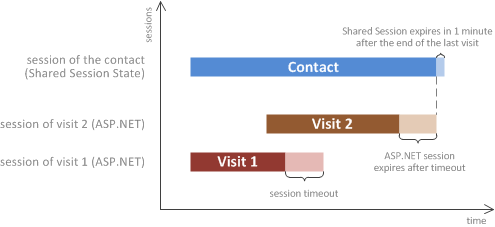

When the Experience Database (xDB) was released, there was suddenly a lot of information floating around about session state. In this blog post, I will defeat this nemesis of mine by covering:

-   The role played by session state in the xDB
-   What 'private' and 'shared' session state means
-   The effect your choice of server architecture has on the way session state must be configured (specifically in-proc versus out-proc)

At time of writing, the most recent release of Sitecore is 8.1 Update-2.

<!-- toc -->

## What is session state, again?

If you already know what session state is, skip ahead -- or refresh your memory by reading the MSDN article https://msdn.microsoft.com/en-us/library/ms178581.aspx

This is how I understand session state: HTTP is a stateless protocol. That means that when I request https://mhwelander.net/ (request #1) and subsequently request https://mhwelander.net/blog/ (request #2), the server treats me as a magical and interesting stranger each time. ASP.NET session state is a mechanism by which the server remembers who I am by keeping a short-term record of me. It gives me a session ID when I first start browsing, puts it in a cookie (usually), and hey presto -- the server now has a way to identify me as me each time I make a request. Additional data can be added into session state as I make requests -- for example, if I use my name to fill in a form, the application might store that as a session state value so that it can add my name into marketing campaigns: "Martina, get 20% off motherboards!"

When we talk about session state in an xDB context, this is what we are talking about -- the ASP.NET session state mechanism.

## What is 'out-proc' and 'in-proc'?

You can either store session state data in memory (in-proc, or 'in process'), or you can store it somewhere else -- such as in a SQL database (out-proc, or 'out-of-process').

In a standard ASP.NET application, there are different out-proc session state providers to choose from -- you can see a comparison of the most popular providers here: https://blog.devopsguys.com/2013/07/26/best-performing-asp-net-session-state-providers-2013/.

At time of writing, there are two session state providers available for Sitecore and xDB -- one that uses SQL, and one that uses MongoDB. xDB requires that session state providers support the Session_End event, which rules out Redis Cache for the version of Sitecore that is currently available (8.1 Update-2). You should choose the provider that uses a technology that you are able to support and optimize.

## What role does session state play in xDB?

Before xDB, there was Sitecore's Digital Marketing Suite -- or DMS (aww, memories). The DMS was a very "chatty" application that made frequent trips to read from and write to the SQL analytics database during the course of a visitor's session. This had performance implications -- particularly for high-traffic, geographically distributed sites where large amounts of data had to travel across huge distances.

By contrast, Sitecore accesses the xDB's collection database twice during the course of a visitor's session -- once at the start, to identify the visitor and load data into session if the visitor is already known, and once at the end, to flush session data into the collection database. Whilst the session is ongoing, all data -- pages visited, goals triggered, patterns matched -- are held in session.

Relying on session state to hold important data about visitors and their interactions creates the following requirements:

-   Session state should be managed out of process -- this session state resilient against ASP.NET errors and IIS restarts, and it is a hard requirement in a clustered environment with multiple content  delivery servers (I will cover this later)
-   Every content delivery cluster should have a dedicated session state database server
-   The session database server should be as physically close to the CD servers as possible, and on the same network

The following example shows two content delivery clusters, each with a dedicated session state server:

In this scenario:

-   A visitor hits a cluster (e.g. Europe) -- a request goes out to the collection database to identify that contact
-   If they are known, data about the contact is loaded into session and a lock is placed on the contact against the current cluster until the end of the session
-   The visitor browses, bouncing between content delivery servers within the cluster (sticky sessions are not required if session state is managed out of process) -- data about the visitor's interaction is written to the session state database
-   After a period of inactivity, the session expires -- analytics data is written to the collection database and removed from the session state database, and the lock on the contact against the cluster is released

## Private and shared session state

There are two types of session state -- private and shared. An easier way to think of this is that there are two types of session state *data* being stored; data that is private to a particular interaction and data that is shared between interactions that overlap. Private session state contains information about the interaction -- such as pages visited and goals triggered on that device. Shared session state contains information about the contact -- such as their e-mail address and engagement plan state.

When you install Sitecore locally, private and shared session state are set to 'in-proc'. Private session state is configured where you would configure regular old ASP.NET session state -- in web.config. Shared session state is configured in Sitecore.Analytics.Tracking.config.

This distinction (shared vs private) is required to support a single contact with two concurrent sessions on two different devices -- for example, you might start browsing a website on your laptop and continue on your phone *whilst the laptop session is still ongoing*(maybe you had to pee during the last few moments of an E-Bay bidding war). What happens if you moved to a different engagement plan state during the laptop session, or update the e-mail address that is stored in xDB? The laptop session is still ongoing, so those changes have not made it to the collection database yet.

This is where shared session state comes in, flexing and looking impressive. Contact data needs to be shared across multiple device sessions, and is therefore stored in shared session state. If I moved into a different engagement plan state or changed my name on my laptop, my toilet phone needs to know about it immediately -- *before* that information hits the collection database.

Why is it important to share certain data between sessions? From a purely technical standpoint, you do not want data from session 1 to be lost because session 2, which expires *after* session 1, loaded out-of-date information from the collection database before it started. The diagram below (from http://doc.sitecore.net/) shows the lifetime of shared session:

From a usability point of view, you are offering a seamless experience across multiple devices -- imagine how unimpressed you would be if the personalization rule for a particular engagement plan state was active on your laptop, but your toilet phone acted like it was living in the past.

Read more about private and shared session state on doc.sitecore.net: https://doc.sitecore.net/sitecore_experience_platform/setting_up__maintaining/xdb/session_state/session_state

### A little note about cluster-forwarding

You may wonder what happens if toilet phone is routed to a *different* cluster of content delivery servers (let's say you are in between an east coast and west coast cluster). Worry not -- at the start of your laptop session, a lock was placed on your contact data against a particular cluster. When your second session starts, Sitecore checks the xDB and forwards you to the cluster that your pre-existing session is on.

Read more about cluster forwarding on doc.sitecore.net: https://doc.sitecore.net/sitecore_experience_platform/setting_up__maintaining/xdb/server_considerations/server_clusters_and_transferring_contact_sessions

## When and why do I have to use out-proc session state management?

If you are using the xDB and you have more than one content delivery server per cluster, you MUST USE OUT-PROC SESSION STATE. In-proc is categorically not an option, not even if you use sticky sessions. This is all because of the need to support the sharing of session state information for a contact with two concurrent session on different devices. Let's look more closely at why you cannot solve the problem with sticky sessions:

I visit a website from my laptop and log in. My login details happen to be my unique identifier in the xDB, and it loads my contact information from the collection database. This website is backed by three content delivery servers -- my session sticks to content delivery server #1 and will stay there for the duration of my session. Session state data is managed in-proc; private and shared session state data is written to memory. So far, so good.

I abandon my laptop and switch to my phone -- I log in, am identified a second time, and a new session starts. *Or does it*? If my phone session sticks to a different content delivery server, Sitecore has no way of knowing what is happening to my contact data on content delivery server #1 -- because it has no way of accessing the memory (and therefore the shared session data) of another machine. I could have changed my name to Myrtle McMuffin; until that information makes its way into the collection database, my mobile phone has no idea that this has happened.

At time of writing, I do not know what will happen in this scenario (edit: [but Tauqir Malik does](https://mhwelander.net/2016/05/19/lets-talk-about-session-state/#comment-3191)!)  -- either the second session simply cannot get a lock on the contact and the session hangs, *or* you open yourself up to data inconsistencies when session B overwrites session A, and Myrtle McMuffin disappears forever.

This is why  you must use out-proc session state management in an environment with multiple content delivery servers.

Read more about session state and the xDB on doc.sitecore.net: https://doc.sitecore.net/sitecore_experience_platform/setting_up__maintaining/xdb/session_state/session_state

## Hey -- can I mix in-proc for private and out-proc for shared?

Technically yes*, *since you can configure different providers for shared and private session state, but I cannot point to proof that you gain anything at all from doing so. Shared session state must always be configured to use out-proc session state in a multi-content delivery server environment, and will be your limiting factor.

## Update: What happens to session state data if the collection database becomes unavailable?

Please see [Jason Wilkerson](https://twitter.com/LonghornTaco)'s post on [xDB Session Info and Mongo Availability](https://citizensitecore.com/2016/07/01/xdb-session-info-and-mongodb-availability/).

## Thanks!

Thank you in particular to Dmitry Kostenko and Todd Mitchell for helping me make sense of session state. Diagrams courtesy of [SimpleDiagrams](http://www.simplediagrams.com/).

This is a confusing topic, and I welcome corrections and clarifications! Either post a comment or contact me on Twitter: [@mhwelander](http://twitter.com/mhwelander)

## Comments (Imported from wordpress)

### Mark Ursino](http://firebreaksice.com/)

_May 19, 2016 at 21:16_

Awesome explanation. The little bits of humor made a quite technical topic a great read. Thanks!

### [Mrunal](http://sitecorestuff.wordpress.com/)

_May 19, 2016 at 23:00_

Really good and easy explanation. Thanks for sharing.

### [Jason Wilkerson](http://citizensitecore.com/)

_May 19, 2016 at 23:30_

Fantastic article! But poor Myrtle... I heard she was nice. 😦

### Tauqir Malik

_May 19, 2016 at 23:31_

We faced issue on our CD sites where it would break and keep throwing that Tracker is null. We opened up a ticket with Sitecore and they mentioned that even though we have a load balancer with Sitcky session and inProc mode, the shared session should be out of proc. This article is gem for this ticket. This issue happened twice since we launched the site six months ago.

I also set the Analytics.ClusterName in our case to application name instead of site domain name. Incase of one cluster or load balancer with multiple CD servers this setting shouldn't be set in my understanding. The KB article https://kb.sitecore.net/articles/965127 talks about setting the value to cluster dns incase of multiple clusters to avoid contact locking. In our case with the value set to application or string didn't cause any such locking issue. So keeping it default value of empty doesn't hurt.

### [Andrew Lansdowne](http://www.e3.co.uk/)

_May 23, 2016 at 08:36_

Very useful thanks.

Following "This distinction (shared vs private) is required to support a single contact with two concurrent sessions on two different devices" I was still unclear what Sitecore uses the Private vs Shared for -- surely everything needs to go in Shared because it won't know there is going to be a 2nd concurrent session until it actually begins.

But reading https://doc.sitecore.net/sitecore_experience_platform/setting_up__maintaining/xdb/session_state/session_state it seems that some things are deemed only relevant to the session and don't need to be shared (pages viewed, etc) and things that may need to be shared (contact info, engagement plan states, etc) go in the shared store.

I was left thinking, with sticky sessions why couldn't you leave the Private (i.e. aspnet) session as InProc, and put the Shared session onto out proc? Indeed this is recommended by https://doc.sitecore.net/sitecore_experience_platform/setting_up__maintaining/xdb/session_state/session_state_configuration_scenarios

You might need to keep aspnet session InProc if you have legacy application that uses Session to store some data that can't serialize. I wonder though, if you do leave it InProc what happens if the application restarts, does the session_end fire and persist the data, or is it lost?

ps. It would be much clearer if they just named it "ASPNET Session State" and "Sitecore Shared Session State" ...

### Martina

_May 23, 2016 at 08:48_

That's right -- only data specific to the contact gets stored in shared session because it's the same person on the laptop and on the phone, but the interaction data (pages viewed, goals triggered) is specific to the device and is therefore not shared. Who knows -- that might change in future.

Regarding mixed in-proc and out-proc -- this is what I wonder too. I'm waiting to hear back on whether it's actually a recommended scenario. I'll keep you posted. Thank you so much for taking the time to contribute to this! I will make a few edits based on what you've added.

### [chrispauly](http://chrispauly.wordpress.com/)

_August 19, 2016 at 21:59_

We found that the most fragile session, is the private (ASP.NET) session state. If you are using a MongoDB for that, then the MongoDB can not become unavailable for any reason, or your website will throw an exception. So, you definitely should use a mongodb replicaset (at least 2 mongo db servers w/ either one arbiter process or another replica server) for that database. It appears that the backup filesystem SubmitQueue may only be used by the shared session and/or the xDB collection database.

### Erwin

_November 10, 2016 at 13:26_

We explain the naming convention of the session databases in this way:

private: contains data with a high throughput, thus the state has to be stored to each "private" CD server in the cluster.

shared: contains data with a lower throughput, thus the state can be stored in a shared storage, that's shared by all the CD servers in the same cluster.

That's immediately the reason I'm a little confused about the fourth picture, which shows a Europa- and an Australia-based CD server where each of them has an own session state server. In my opinion that can be only a OutProc private session state server (and you need a sticky loadbalancer), and is a shared session state server omitted from the picture. Unless both CD servers are moved into separate clusters and the transferring of contact sessions is invoked.

### Martina

Do you mean this picture? https://sitecoremartina.files.wordpress.com/2016/05/scaled.png

If so, the setup is:

* Europe and Australia each have a cluster that contains 3 CD servers\
* There is a single session state server in each cluster (1 session state server between 3 CDs), which stores BOTH shared and private session state data (to make maintenance easier you might want to store in different DBs, but that diagram just has one)\
* No load balancer, all session data (private and shared) is managed outproc -- no in proc session state

My understanding of private vs shared is:

private -- data that is unique to an interaction; could also be called 'device session state'\
shared -- data that is unique to a contact, who might have multiple ongoing interactions; could also be called 'contact session state'

Edit: I still do not know if using outproc for shared and inproc for private is recommended; I will need to chase someone.

### Erwin

_November 11, 2016 at 14:20_

That's the picture I meant, indeed. And I misread the text: you are talking about clustered environments. mea culpa 🙂

Your definition about private and shared is outstanding. I only tried to create a mnemonic for the words "private" and "shared" with my explanation. Device/ASPNET Sessions State and Contact Session State are better names.

Mixing InProc for private session state and OutProc for shared session state is in my opinion a workable scenario, but then and only then if you have a sticky loadbalancer for the multiple CD servers in your cluster. Otherwise you have to go OutProc with your private session state because all the CD servers must have access to the same private session data. So, in my opinion it's an architecture question. But if you've chased for the recommendations, we'll glad to hear

And last but not least: excellent article(s)!

### Martina

_November 14, 2016 at 11:01_

Aha! Perhaps I should label the image -- to be honest it's not particularly clear that those shapeless blobs are servers. Thanks for the feedback! I will definitely update the post when I hear back about any recommendations.

### marvinglennlacuna*

_May 25, 2016 at 03:05_

Easy to understand and very well constructed article about Session State. I also like the visuals, pretty informative. Thanks Martina.

### ashiga

_June 10, 2016 at 15:50_

Hi Martina, thanks for this article, it clarifies a few points that are not as clear in the Sitecore docs.

We are currently troubleshooting xDB collection issues for a couple of clients; only a subset of expected interactions seem to be captured and I suspect it is related to session configuration as we're digging deeper.

### Martina

_July 1, 2016 at 14:49_

So glad you found it useful! Any news on the missing interactions?

### Pingback: [xDB Session Info and MongoDB Availability -- CitizenSitecore](http://citizensitecore.com/2016/07/01/xdb-session-info-and-mongodb-availability/)

### Pingback: [MongoSessionStateProvider might slow down your application | Sitecore basics!](https://sitecorebasics.wordpress.com/2016/09/25/mongosessionstateprovider-might-slow-down-your-application/)

### [FAIYAZUL HAQUE NOOR (@faiyazulnoor)](http://twitter.com/faiyazulnoor)

_December 1, 2016 at 09:02_

Can we use Out Proc session in a Load balanced CM server (we have 2 CM servers load balanced) ? Our Azure Load balancer has problem with sticky session so want to go for out-proc but getting lot f serialization error. Is there any way to configure as this point of time we cant go and make changes in code for making all object serializable.

### Pingback: [Sitecore Analytics #xDB troubleshoot and #mongosession configuration -- Sitecore Area](https://sitecoreares.wordpress.com/2016/12/30/sitecore-analytics-xdb-troubleshoot-and-mongosession-configuration/)

### Kit

_August 21, 2017 at 12:45_

Hi Martina, good explanation.

On this point: "By contrast, Sitecore accesses the xDB's collection database twice during the course of a visitor's session -- once at the start, to identify the visitor and load data into session if the visitor is already known"\
-- how does Sitecore serve personalized content the moment a visitor (known or unknown) lands, if there is a depency on sending a request to xDB first?

### Pingback: [RedisTimeoutException with Sitecore 9.0.2 -- 9.3 | Sitecore basics!](https://sitecorebasics.wordpress.com/2020/02/15/redistimeoutexception-with-sitecore-9-0-2-9-3/)

### Pingback: [Large Session Size Causing Sitecore Redis Timeouts, Identify and Resolve -- Sitecore Rap](https://sitecorerap.wordpress.com/2020/10/14/large-session-size-causing-sitecore-redis-timeouts-identify-and-resolve/)

### Pingback: [Sitecore Site/Solution Best Practices -- Sitecore Blogs](https://sitecorelearn.wordpress.com/2022/03/03/sitecore-site-solution-best-practices/)

