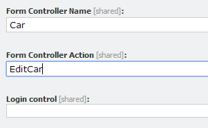

I was writing a blog post about `TempData`, and quickly realized that I needed to preface that blog post with one about your options when it comes to posting forms in Sitecore MVC.

There are two *main* types of rendering in Sitecore MVC -- controller renderings and view renderings. This post will cover how to post a form from a view rendering.

## But first, regular ASP.NET MVC

As usual, we'll start by looking at how a form post works in regular ASP.NET MVC. Imagine that you've got this very simple view model -- it only has two properties:

```csharp
public class CarViewModel {
    public string CarName { get; set; }
    public string CarManufactureYear { get; set; }
}
```

You have a controller with an action called `EditCar`. This retrieves your current car (using the ID provided in the URL; I have assumed that there is an injected data repository available). The view that it returns contains a form, and the form displays the data associated with your current vehicle:

```csharp
public ActionResult EditCar(int id) {
    var car = _repository.GetYourCar(id);
    return View(car);
}
```

The view -- `EditCar.cshtml` -- would look like this:

```csharp
@model CarViewModel
 
@using (Html.BeginForm())
{
    @Html.LabelFor(x => x.CarName)
    @Html.EditorFor(x => x.CarName)
 
    @Html.LabelFor(x => x.CarManufactureYear)
    @Html.EditorFor(x => x.CarManufactureYear)
 
    <input type="submit" />
}
```

Your form will be pre-populated by whatever data you pass into the model in your `EditCar` action.

### What happens when you hit the submit button?

You can post to a particular action in a particular controller -- to do this, edit `Html.BeginForm` to include your desired controller/action. In the example above, however, hitting submit will post back to the same controller. It will look for an `HttpPost` version of your `EditCar()` action. Because the view's model is `CarViewModel`, it will be expecting to receive that type. This is what the `HttpPost` version of the `EditCar` action looks like:

```csharp
[HttpPost]
public ActionResult EditCar(CarViewModel carViewModel) {
    // Save your new values
    // Return view or redirect to another action
}
```

The model binder will automatically map form data back to the view model -- at this point, you can save the model and return a 'Thank You' view.

This is a very simple example of how to post a form. How would you achieve the same thing in Sitecore -- using view renderings?

## Posting a form from a view rendering

Let's split this into three tasks.

### Create a model

The first step is to make our view rendering use a custom model (`CarViewModel`)- [the second part of the Sitecore MVC video series on YouTube has an explanation of how to achieve this](https://www.youtube.com/watch?v=dW_rQp9bMmE). In short, the steps are as follows:

1.  Create a `CarViewModel` class
2.  Inherit from `RenderingModel` *or* implement `IRenderingModel`
3.  Rely on the Sitecore MVC pipeline to populate the model -- either in the getter for each property, or the model's `Initialize()` method
4.  Once you have created your model class, register it with Sitecore by creating a corresponding item under `/sitecore/layouts/models`
5.  Go to the component definition item for your view rendering and tell it to use the model item you just created

Ensure that the `.cshtml` file that the view rendering points to is declaring `CarViewModel` as its model. When you place the rendering on a page, Sitecore's MVC pipelines will instantiate and assemble your model by calling its `Initialize()` method.

### Create an action to receive the post

The second step is to tell the view rendering where to post to. This is done by specifying a controller and action on the component rendering item:



This can be any controller and action -- marking it with `HttpPost` is not mandatory, but I do anyway. Note that you will not have a corresponding `HttpGet`, because view renderings are handled by the main Sitecore controller and associated pipelines. There is nothing different about this action compared to plain ASP.NET MVC [except for the fact that you cannot `RedirectToAction`](https://mhwelander.net/2014/05/22/passing-data-between-actions-in-sitecore-mvc/ "Passing data between actions in Sitecore MVC") or `return View()`, as this will interrupt Sitecore's page rendering pipeline and return a single view rather than a complete page.

If you want to post back to the same page, return the main Sitecore controller's `base.Index` (which requires you to inherit from `SitecoreController`) or trigger the page rendering pipeline yourself.

Returning `base.Index()`:

```csharp
public class CarController : SitecoreController
{
    [HttpPost]
    public ActionResult EditCar(CarViewModel carViewModel)
    {
        // Deal with form submission here
        // Hand over to rendering pipeline
        return base.Index();
    }
}
```

Kicking off the page rendering pipeline yourself (this means that you do not have to inherit from `SitecoreController`):

```csharp
public class CarController
{
    [HttpPost]
    public ActionResult EditCar(CarViewModel carViewModel)
    {
        // Deal with form post here
 
        // Do what base.Index() eventually does
        IView pageView = PageContext.Current.PageView;
        if (pageView == null)
        {
           return new HttpNotFoundResult();
        }
        else
        {
            return (ActionResult)this.View(pageView);
        }
    }
}
```

If you do not wish to post back to the same page, you can use `RedirectToRoute` to display a thank-you page. Note that we are redirecting to a Sitecore URL here, and not a controller and action:

```csharp
var options = new UrlOptions
{
    AddAspxExtension = false,
    LanguageEmbedding = LanguageEmbedding.Never
};
 
var pathInfo = LinkManager.GetItemUrl(_pageContext.Current.Item.Children.FirstOrDefault(), options);
 
return RedirectToRoute(MvcSettings.SitecoreRouteName, new { pathInfo = pathInfo.TrimStart(new char[] { '/' }) });
```

### Use Sitecore's FormHandler

In the third and final step, we need to make a slight alteration to the form mark-up.

```razor
@model CarViewModel
 
@using (Html.BeginRouteForm(Sitecore.Mvc.Configuration.MvcSettings.SitecoreRouteName, FormMethod.Post))
{
    @Html.Sitecore().FormHandler() 
 
    @Html.LabelFor(x => x.CarName)
    @Html.EditorFor(x => x.CarName)
 
    @Html.LabelFor(x => x.CarManufactureYear)
    @Html.EditorFor(x => x.CarManufactureYear)
 
    <input type="submit" />
}
```

Rather than `Html.BeginForm`, we are using `Html.BeginRouteForm` and specifying Sitecore's default route.

`@Html.Sitecore().FormHandler()` is responsible for generating two hidden fields that specifies which controller and action to post to. These are the ones that you specified on the view rendering definition item. If you look at the form source, you will see this:

```xml
<input id="scController" name="scController" type="hidden" value="Location" />
<input id="scAction" name="scAction" type="hidden" value="FavouriteLocation" />
```

Note: You can override the controller and action by hard-coding the values:

```razor
@Html.Sitecore().FormHandler("MyController", "MyAction")
```

## What about form validation? *(Edit: 09/06/2014)*

Thank you to Kevin and [this discussion on the Sitecore MVC](http://sdn.sitecore.net/Forum/ShowPost.aspx?PostID=61553) forum for prompting this edit.

In plain ASP.NET MVC, you can add validation attributes to your model properties. `Required` is a common one:

```csharp
public class CarViewModel {
    [Required]
    public string CarName { get; set; }
    public string CarManufactureYear { get; set; }
}
```

When a form is posted, you can check `ModelState.IsValid`, which will return false if validation fails -- in this example, failing to fill in `CarName` would result in `ModelState.IsValid` returning false. In this situation, you would want to return *the same page* with a validation error. In standard ASP.NET MVC, that looks like this:

```csharp
[HttpPost]
public ActionResult EditCar(CarViewModel carViewModel) {
    if (ModelState.IsValid)
    {
    // Save your new values
    // Return view or redirect to another action
    }
 
    return View(carViewModel);
}
```

In your view, you would use `@Html.ValidationSummary("My error text")` to write out your error message (you can choose whether or not a message for each property -- "The CarName field is required" -- is output):

```csharp
@model CarViewModel
 
@using (Html.BeginForm())
{
    @Html.ValidationSummary("Errors occurred!")
 
    @Html.LabelFor(x => x.CarName)
    @Html.EditorFor(x => x.CarName)
 
    @Html.LabelFor(x => x.CarManufactureYear)
    @Html.EditorFor(x => x.CarManufactureYear)
 
    <input type="submit" />
}
```

Submitting a form with validation errors will return you to the same view, maintain your form values, and display an error message.

## Form validation with Sitecore view renderings

Standard ASP.NET MVC validation works with Sitecore view renderings, with one key difference. You cannot return a view if validation fails -- this interrupts the page rendering process and you end up displaying a single MVC view rather than a Sitecore page. To avoid this, [use one of the methods already detailed for posting back to the same page](posting-forms-in-sitecore-mvc-part-1-view-renderings).


Return `base.Index()`:

```csharp
public class CarController : SitecoreController
{
    [HttpPost]
    public ActionResult EditCar(CarViewModel carViewModel)
    {
        if (ModelState.IsValid)
        {
            // Save your new values
            // Return view or redirect to another action
        }
 
        return base.Index();
    }
}
```

Or trigger the page rendering pipeline yourself:

```csharp
public class CarController
{
    [HttpPost]
    public ActionResult EditCar(CarViewModel carViewModel)
    {
        if (ModelState.IsValid)
        {
            // Save your new values
            // Redirect to route or return the same page
        }
 
        IView pageView = PageContext.Current.PageView;
        if (pageView == null)
        {
           return new HttpNotFoundResult();
        }
        else
        {
            return (ActionResult)this.View(pageView);
        }
    }
}
```

In either case, Sitecore will return the assembled page with your validation error message displaying. You will find that including more than one form on the page will result in every instance of `@Html.ValidationSummary()` being displayed if one form fails validation -- [however, this challenge is not specific to Sitecore MVC](http://mahaafifi.blogspot.co.uk/2011/12/multiple-validation-summary-at-single.html).

Part 2 will focus on posting forms from controller renderings -- which is rather more fiddly.

<div class="comments">

## Comments (Imported from wordpress)

### Pingback: [Posting forms in Sitecore MVC (Part 2) -- Controller Renderings | (MH) Welander](https://mhwelander.net/2014/05/30/posting-forms-in-sitecore-mvc-part-2-controller-renderings/)

### Pingback: [Posting forms in Sitecore controller renderings -- another perspective | ctor.io](http://ctor.io/posting-forms-in-sitecore-controller-renderings-another-perspective/)

### Pingback: [To The Controller And Back. Part 1 -- Routing | Jocks to the Core](http://jockstothecore.com/to-the-controller-and-back-part-1-routing/)

### Pingback: [Form Post in Sitecore MVC | cprakash](http://cprakash.com/2014/11/03/form-post-in-sitecore-mvc/)

### [Borj U Ano](https://www.facebook.com/lino.francis)

_November 19, 2014 at 04:11_

Hi Martina,

on this code
```
IView pageView = PageContext.Current.PageView;
if (pageView == null)
{
return new HttpNotFoundResult();
}
else
{
return (ActionResult)this.View(pageView);
}
```

how will you pass a user message, say I want to tell to the user that his profile has been created, to the pageview?
many thanks!

### Pingback: [Posting a form in view rendering and controller rendering in Sitecore MVC »](http://nu-no.nl/posting-a-form-in-view-rendering-and-controller-rendering-in-sitecore-mvc/) 

### Pingback: [Sitecore MVC -- Multiple Forms | Horizontal Integration](http://blog.horizontalintegration.com/2015/09/25/sitecore-mvc-multiple-forms/)

### Pingback: [Sitecore MVC -- Multiple Forms -- Blog](http://wp-blog-dev.horizontalintegration.com/2015/09/25/sitecore-mvc-multiple-forms/)

</div>