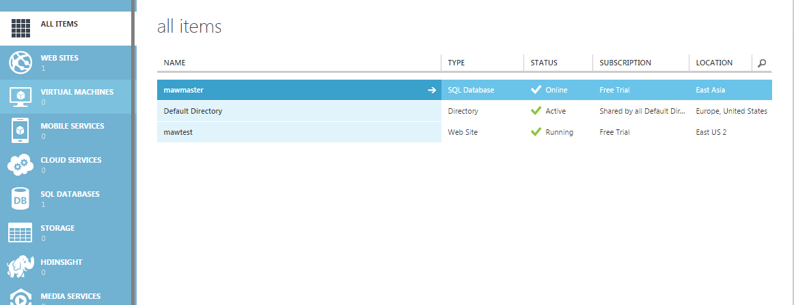
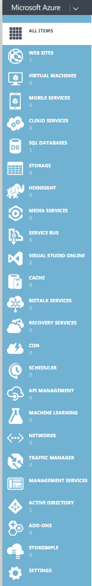
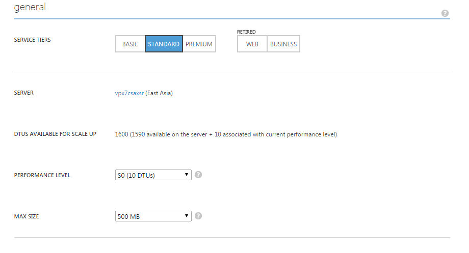

In this blog post, I will be tackling Microsoft Azure (with a nod towards Sitecore and the Sitecore Azure module). At the time of writing, I am a complete newcomer to Microsoft Azure in general. This blog post assumes that you, like me, know nothing at all about Azure beyond the fact that it has something to do with 'the cloud'.

I am going to show you around the Windows Azure dashboard (there is also a [preview of the new portal](https://portal.azure.com/), which will replace the old one soon) and explain the difference between PaaS and IaaS in plain English.

## Thanks

Special thanks to Oleg Burov (Sitecore Product Support Services) and [Damian Brooks](https://twitter.com/brooksyd2dbs) (Sitecore UK Technical Consulting) for fielding endless questions from me on this subject.

## What is Microsoft Azure, and what does it offer?

The [introductory blurb about Microsoft Azure](https://azure.microsoft.com/en-us/overview/what-is-azure/) is actually quite useful. When you choose to deploy your application to something like Azure, it is because you do not want to be in charge of your own physical kit. That includes hardware, the operating system, network load balancing -- things that really have nothing to do with your core application.

There are other cloud platforms out there -- like Google Cloud Computing and Amazon Web Services (which focuses on IaaS). They all offer similar services. This series covers Microsoft Azure only.

## What does Microsoft Azure look like?

For the purposes of this blog post, I signed up to a trial of Microsoft Azure (it lasts 1 month). They give you a subscription ID. This is what my Management Portal looks like (notice that I have created an SQL Database and a Web Site):

And here is a complete view of the services available:

As a beginner, my first reaction to this list was: where on earth does PaaS and IaaS fit in to this list? I certainly cant 'create a PaaS. At this point, I am going to take the opportunity to make the distinction between Platform as a Service and Infrastructure as a Service, because it isnt as obvious as I thought it would be.

## IaaS and PaaS

IaaS, PaaS, (and indeed SaaS) are choices you make about the level of abstraction you require. They arent things or services in themselves, or something you buy. Your final setup might be (and probably will be) a combination of IaaS and PaaS elements.

Infrastructure as a Service (IaaS) means that you are handing over the responsibility of machinesand network to a cloud platform. Essentially, you are opting for virtual machines over physical machines. You are still able to log in to these virtual machines and do things like configure IIS, mess around in MSSQL, and look at your web root.

Platform as a Service (PaaS) means that you are handing over the responsibility for things like SQL management to the cloud platform by making use of services. At the time of writing, the Sitecore Azure module makes use of five Azure PaaS services: Cloud Service, Storage Service, SQL Databases Service, Traffic Manager Service, and Cache Service to some extent (more on this later -- caching is done in the role, but the Cache Service is used to support DistributedCacheSessionStateProvider).

Rather than logging in to a virtual machine to manage these aspects of your application, you are letting the cloud platform do the heavy lifting. As an example, here is a view of the sample database I created. By using this service, 'scaling is now a matter of making a choice in a dropdown:

Finally, Software as a Service (SaaS) takes things one step further -- all you do is sign up. Google Apps for Work is an example of SaaS; you have no idea what goes on behind the scenes, you just care that it works.

There are pros and cons to each approach. The Azure documentation has a very good [article comparing websites, cloud services, and virtual machines](http://azure.microsoft.com/en-us/documentation/articles/choose-web-site-cloud-service-vm/) (all of them are options available through Azure). In each case, the end result is the same -- a website, but the level of control you have is inversely proportional to ease of use. [This post by nonlinear also does a great job of differentiating between IaaS, PaaS, and SaaS.](http://www.nonlinearcreations.com/Enterprise/how-we-think/articles/2014/04/Understanding-cloud-platforms.aspx)

## Back to Sitecore

If you want to use Microsoft Azure with Sitecore, you have a few options:

-   Use virtual machines. This is the Infrastructure as a Service approach -- you will be required to set up a number of content management, content delivery, and SQL servers, just as you would if you owned the hardware yourself.
-   Use [Sitecore's Azure module](http://sdn.sitecore.net/upload/sdn5/products/azure/310/getting_started_with_sitecore_azure_310-a4.pdf) (link is to version 1.3), which provides a layer of abstraction on top of a number of Azure services. This is the Platform as a Service approach -- the module automates the deployment of content delivery and content management farms.
-   A hybrid approach -- such as a PaaS approach without using the Sitecore Azure module

## Warning: Will PaaS and the Sitecore Azure Module Suit Your Project?

On paper, the Platform as a Service approach using the Sitecore Azure module seems like the obvious choice for all Sitecore implementations -- the screenshots literally show an application where you can right-click and *'Add Editing Farm...'*. But please remember that it is not magic!

However, certain implementations arent suited to this level of abstraction. Keep in mind that by opting for a service, you are relinquishing a certain amount of control.

-   Make sure you understand the limitations of the services that the Sitecore Azure module relies on -- for example, SQL Azure has limits on transaction log size, which becomes an problem when attempting to rebuild heavily fragmented indexes.
-   Make sure you have a solid understanding of Microsoft Azure in general -- especially the services that the Sitecore Azure module makes use of. You can read more about these services at the end of this article. Just as you must understand ASP.NET in order to make use of Sitecore as a developer, it is highly recommended that you understand Microsoft Azure before deploying your solution to the cloud.

## Useful Links

* Sitecore Azure How Tos: https://kb.sitecore.net/SearchResults#fltr=t1,p8&slider=0,9&pg=1
* Azure Cloud Service: http://msdn.microsoft.com/en-us/library/azure/jj155995.aspx
* Azure Storage Service: http://msdn.microsoft.com/en-us/library/azure/gg433040.aspx
* Azure SQL Databases Service: http://msdn.microsoft.com/en-us/library/azure/ee336279.aspx
* Azure Traffic Manger Service: http://msdn.microsoft.com/en-us/library/azure/hh745750.aspx

## Comments (Imported from wordpress)

### Love

_February 19, 2015 at 06:12_

Hi...thanks for such a nice blog to help others get start and become smart in sitecore.

Referred many blog no clue to get evaluation for few days. and not working for me link http://xpress.sitecore.net/

I get struck in the step 1 😦 itself. hope you can help in min.

I cant download any of the form(exe, zip, sim) to install sitecore in my machine as development site.

can u help to take latest(evaluation at least). I'm not a partner or sitecore project company. I'm individual like to know basics before spent any money in certification or partner. Help me out to be a sitecorian. Hope some way exist that experience sitecorian might know.

waiting.

### [Vishal Gupta](http://www.facebook.com/1229280324)

_March 10, 2015 at 13:28_

Hi Martina,

Can you please specify the specific limitation we have in Sitecore Azure PaaS mode and is there any update since you posted this article.

Regards,
Vishal Gupta

### Pingback: [Sitecore Azure Basics | Sitecore basics!](https://sitecorebasics.wordpress.com/2016/12/20/sitecore-azure-basics/)

### [joanmartin1185](http://joanmartinblog.wordpress.com/)

_December 8, 2017 at 06:06_

Very good written article. It will be supportive to anyone who utilizes it, including me. Keep doing what you are doing -- can't wait to read more posts.

