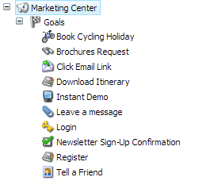
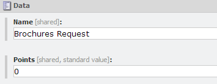
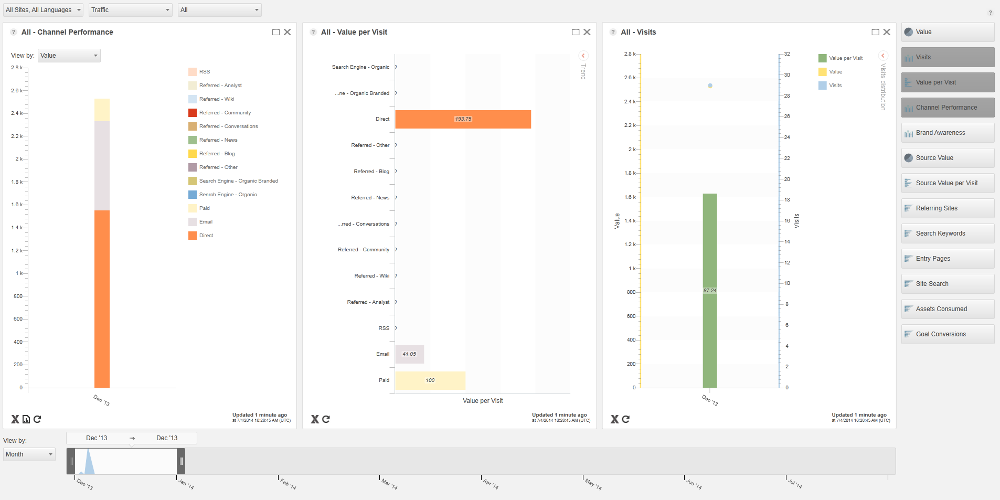
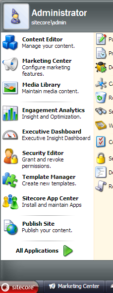
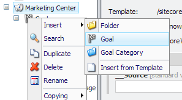
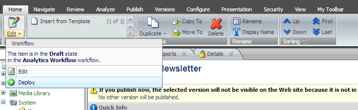
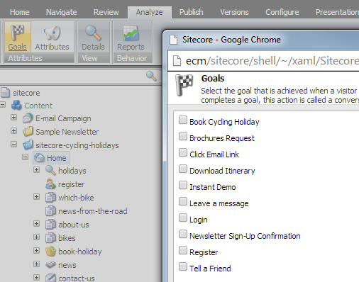
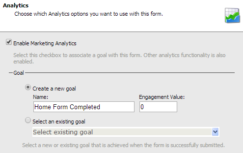

If you work as a developer in the Sitecore world, you will probably hear the term engagement value at some point. I did a quick Google (and got a 500 error, which made me think the world was coming to an end, but I've recovered from that now) and noticed that the majority of resources out there are geared towards marketers -- and fair enough; it's a tool for marketers.

But as a developer, I think it can be easy to forget that an enormous part of the Sitecore platform is dedicated to optimizing the experience for visitors -- whilst I'm silently cursing the existence of the `TemplateID` class and crying over line 230 of some repository layer, someone else is trying to figure out how best to gauge a visitor's wine preferences and personalize their experience accordingly.

Engagement value sits at the core of that. In this post, I'm going to explain what engagment value is,who is responsible for it, and how it impacts a developer's job.

## Engagement Value vs Traffic

Imagine that you run a site that sells cheese and wine. You think you're popular -- you get 10,000 visitors per day. *However*, 1 in 10,000 visitors actually buys anything. Your traffic is high (maybe you are some sort of SEO magician), but based on the sales metric alone, their engagement with your site is very poor. *Traffic* isn't an indicator of how much money you are making -- you need information about what those visitors are actually *doing* on your site. This is where engagement value comes in.

## Engagement value, goals, and the engagement value scale

In order to determine what your visitors are doing and how much that is worth to your business, you need to set up some goals. A goal corresponds to an action taken by the visitor that suggests they are engaging with your site. In our wine-and-cheese example, this might include:

-   Registering for the newsletter
-   Downloading a special offers coupon
-   Rating a product
-   Signing up for the 'Guess that Cheese' competition
-   Purchasing a product

Some of those goals are more important than others. If a visitor downloads a special offers coupon, they are clearly interested in purchasing whatever that offer entails them to -- but it isn't as important as actually parting with cold, hard cash. The more valuable a goal is to your business, the higher the engagement value associated with that goal will be.

A goal is actually an item in Sitecore, and as a developer, you can either assign it as an 'event' on a page, or trigger it programmatically. Here are some goal items:



Every goal has an Points field. This is the engagement value of the goal:



As a visitor navigates around the site, they trigger goals and accrue value for that visit. Marketers can use the Executive Insight Dashboard to see reports on traffic vs engagement:



The bars represent total engagement value. If this was the data for our wine and cheese shop, we can see that people *are* engaging with our brand -- in fact, email is generating rather a lot of engagement! Our sales might be low, but our marketing efforts have not been not a complete disaster -- people are signing up for the newsletter, downloading special offer vouchers, and rating our products. Marketers can use this data to fine-tune their approach -- why is nobody coming in from Facebook or Twitter? Have we omitted these channels? Is it really worth paying for advertising? Suddenly, you have a much more nuanced view of what is happening across the various channels available to you as a marketer.

That's all well and good -- but what is my job in all of this, as a developer?

## Who decides how much a goal is worth?

Deciding the value of a goal is definitely not a developer's job. This is something that the business must decide, and it is recommended that they attend a [scoring workshop (run by Sitecore Business Optimization Services -- or 'SBOS')](http://www.sitecore.net/unitedkingdom/Support/Consulting-Services/Business-Optimization-Services/CEP-Scoping-Workshop.aspx) to work that out. As a developer or system administrator, you should expect to be given a list of goals and values to set up in Sitecore, and instructions on when and how these goals should be triggered.

## Configuring goals

OK -- I've been given my list. How do I actually configure goals?

Goals are stored in the Marketing Center as Sitecore items. You can get to it via the Sitecore Desktop by clicking Sitecore > Marketing Center:



This will open the 'Marketing Center' portion of the Sitecore tree in a separate window. Alternatively, you can locate the Marketing Center via the Content Editor -- it's under `/sitecore/system/Marketing Center`.

Right-click on the Goals item and insert a new goal:



**Note:** At time of writing, I *believe* that putting your goals into subfolders (goal categories) might make it impossible to select them in Web Forms for Marketers (which does not expect sub-folders), so you may find that your goals need to be on one level.

Give your goal a name and fill in the Points field with the engagement value given to you by the business. The item will enter into a workflow. When you are happy with your goal, you must deploy it -- basically push it into the 'final' state of the goal workflow:



Behind the scenes, deploying a goal creates an entry in the analytics database for that goal. Tip: If you are using continuous delivery to deploy your site each time you make a code change, you will need to 're-deploy' existing goals to make sure this row is created -- see Andrew Thompson's blog post for more details on goals and continuous delivery.

And that's it -- your goal is now live and ready to be used.

Coming up with a sensible engagement value scale and setting it up in Sitecore is one of the first things marketers will do as they start getting to grips with the Sitecore platform; even if it takes a little while to get going with personalization, testing, and content tagging, you are gathering data in that time.

## Triggering goals

Goals can be triggered in a number of ways. In reality, although there is a way to assign goals to page items in the Content Editor, most goals are triggered programmatically. A visitor might land on your 'contact us' page, but they have not really engaged unless they clicked the email link or submitted a form.

More often than not, you will find that the developer is called upon to set up goal triggers using the API. Here is how (via [@anthonyhook](https://twitter.com/anthonyhook):

```csharp
if (Sitecore.Analytics.Tracker.IsActive && Sitecore.Analytics.Tracker.CurrentPage != null)
{
    var pageEventData = new PageEventData("GoalName")
    {
        ItemId = Sitecore.Context.Item.ID.ToGuid(),
        DataKey="GoalName",
        Data = Sitecore.Context.Item.Paths.ContentPath,
        Text = Sitecore.Context.Item.Name
    };
 
Sitecore.Analytics.Tracker.CurrentPage.Register(pageEventData); 
}
```

**Note:** Since the goal name is stored as a string, you need to make sure that you do not have duplicate goal names.

Finally, in case you were interested, goals can be assigned to entire pages by going to the Analyze tab and clicking the Goals button:



You can assign any number of goals to an item. I will reiterate that whilst this is a simple, UI-based way to assign goals to items, simply viewing a page is rarely a sign that someone is engaging.

### Web Forms for Marketers

Web Forms for Marketers (a Sitecore module that allows editors to build forms without help from programmers) is set up to integrate with Sitecore's marketing and analytics features, and will give you the option to choose a goal to trigger when a visitor completes a form:



## Conclusion

Traffic does not give you very much information about how a person interacted with your business, which is why Sitecore really pushes engagement value as a way for marketers to understand what their visitors are actually doing. Because this engagement value forms the core of how success is measured, most other marketing features will be based around engagement value -- for example, the success of a test variation is measured in how much engagement it resulted in, not the number of clicks.

As a Sitecore developer, you will very likely be asked to trigger goals via the API at some point, and you may even end up wrapping the goal-triggering mechanism in a web API of some kind.However, the actual goals and the associated engagement value scale is something that the business stakeholders need to work on together with their Sitecore partner's optimization experts. You can help your client by being aware of the options for triggering a goal, and the fact that certain modules will do this work for you automatically -- like WFFM.

<div class="comments">

## Comments (Imported from wordpress)

### Lars Nielsen

_August 4, 2014 at 12:18_

Thank you for a great article.

Spot on with the conclusions.

I just want to emphasize the point that Sitecore is not dismissing Traffic.

Traffic still make a lot of sense; -- it tell you how many people is coming to your website. While using engagement value, you still need traffic reports.

But visitors are just one side of the equation, and navigating by this only can be bad...

Too often, marketers pushes additional funding into activities that apparently drives additional visitors to the website. Problem is that most often increased push in visitor acqusition generate proportionally less value. That's money right out the window.

More advanced web analysts have therefore decided to measure "conversions", -- that is the completion of a measurable goal. This work well to understand if a campaign, variance test lead to a specific conversion.

Problem is, -- what if you have a lot of value generating activities on your site, -- and while a specific campaign increase a specific goal conversion, but negatively affect other conversions?

For example, which is better?

```
--- Activity 1 ---
240 conversion A
40 conversion B
550 conversion C
29 conversion D
1 conversion E
50 conversion F
119 conversion G
```

versus

```
--- Activity 2 ---
165 conversion A
140 conversion B
450 conversion C
67 conversion D
14 conversion E
131 conversion F
11 conversion G
```

Impossible to tell, yes. Engagement value instead would look like this:

```
--- Activity 1 ---
Engagement value: 5909
--- Activity 2 ---
Engagement value: 6349
```

### Arjunan

_March 6, 2016 at 00:45_

Hey Martina, Thank you so much for sharing such a nice article. First time I understand the engagement concepts clearly.I would like to try this now.

### Martina

_March 6, 2016 at 15:16_

That's awesome! 🙂

</div>