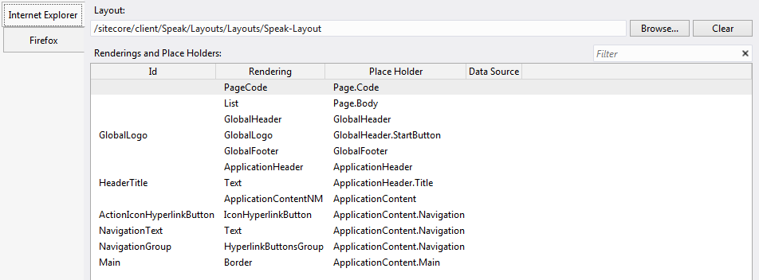
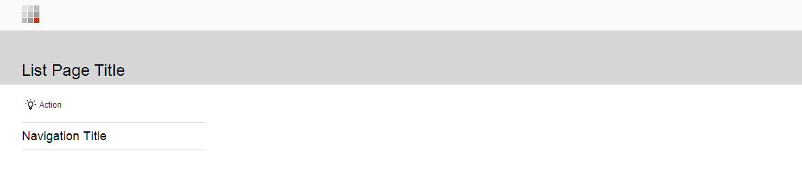
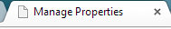
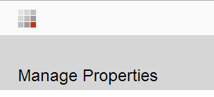

I am in the process of getting my head around SPEAK (as it appears in Sitecore 7.2), and will be writing a series of blog posts about my experiences. I am writing to share my thought processes rather than to instruct, so the solutions I come up with might not always be recommended practice.

For those of you that are completely new to SPEAK, it is a [UI technology for Sitecore that replaces SheerUI](http://www.sitecore.net/Community/Technical-Blogs/Jakob-Christensen/Posts/2014/04/01-Speak-Introduction.aspx). It allows you to build your own back-office applications. Parts of Sitecore's UI in 7.2 are SPEAK, such as the media picker dialogue:

[](./images/2014/speak-35.png)

I am going to create an application to manage a property portfolio -- [think Zoopla, for example](http://www.zoopla.co.uk/). The application is going to need a dashboard showing sales statistics, a list of properties, property detail pages, and so on. You can find more [SPEAK documentation on the SDN](http://sdn.sitecore.net/Reference/Sitecore%207/SPEAK.aspx); I am using the ['recipe' in Chapter 2 of the developer cookbook](http://sdn.sitecore.net/upload/sitecore7/72/speak_developer's_cookbook_sc72-a4.pdf) as a guide for my application.

Finally, you will notice that all of the screenshots are from Sitecore Rocks. *You cannot build a SPEAK application in the Content Editor*; the presentation details dialogue will throw errors.

## Create a new SPEAK application

SPEAK applications live in the core database, under `/sitecore/client`. By default, there is a folder called Your Apps where you can create your own applications. If you do not want your applications to live under Your Apps, can create your own applications root item under `/sitecore/client`, or use the existing Applications item.

]

I am going to start by creating a Properties folder to hold my property management application:


Beneath that, I am going to create the first page of my application -- the property list page. There are three main page types available -- Dashboard, List, and Task. I would advise using the branch templates provided, as these will create a PageSettings item for you and provide some default presentation details. For more about each page type and when to use them, refer to the [SPEAK Developer's Cookbook](http://sdn.sitecore.net/upload/sitecore7/72/speak_developer's_cookbook_sc72-a4.pdf#page=7):


Because I need a list of properties, I am going to create a list page and call it PropertyList:


Take a look at PropertyList item's presentation details (select the item in Sitecore Rocks and press `ctrl+u`). You will see that it already has a layout and a bunch of components assigned to placeholders -- just like a normal Sitecore page:



Because the page lives in the core database, there is no need to publish. If I type `http://yourhostname/sitecore/client/Your%20Apps/Properties/PropertyList` into my browser, I see the bare bones of a list page:



It is obvious what most of these components do -- NavigationText displays the Navigation Title text and GlobalHeader displays the grey bar at the very top of the page. Certain components seem a bit too specific -- like Border, but these 'scaffolding' components are necessary to maintain a consistent look and feel.\
The component that you might not recognize is PageCode. Watch what happens to the page if you remove it:


The PageCode component injects the base Javascript and CSS that a page needs. If you are interested in seeing what it does, you can right-click on the rendering and choose Edit Rendering, which opens the .cshtml file -- you will see that it adds the following scripts to the top of the page, among other things:

```xml
<link href="/sitecore/shell/client/Speak/Assets/css/sitecorify.css" rel="stylesheet" type="text/css" />
<script src="/sitecore/shell/client/Speak/Assets/lib/core/deps/require.js" data-main="/-/speak/v1/assets/main.js" type="text/javascript"> </script>
<script>require.config({ waitSeconds: 7 });</script>
```

Now that I have a base page, I want to start customizing it. Let's start by setting the browser title and header text to 'Manage Properties'.

## Change the browser title

The browser title works as you would expect. There is a BrowserTitle field on my PropertyList item:


If I change it and save, it immediately updates my application:



## Change the header text


The header text is a little bit different. It is not specified on the page item, but on the Text rendering with an ID of HeaderTitle. Double-click on on the rendering to see its properties:


The Text property is what defines the text that is output on the page. Let's change it to Manage Properties and save. This updates our page:



Initially, I balked when I saw that. I am forever telling people that data belongs in items, *not* in the component parameters -- but SPEAK is a little bit different. As it happens, there are several ways to provide content to SPEAK components -- we will get to that in part 2. For now, we will set the header text directly in the component parameters.

## Add a link to the Launch Pad

Having created and customized my list page, I now want to add a link from the Launch Pad, which is a list of all available SPEAK applications and can be accessed from the Sitecore login page:


Create a new item under `/sitecore/client/Applications/Launch Pad/Page Settings/Shortcuts` of type Speak-AppShortcut. Fill in the Title (Property Manager), Starting Page Id (a GUID), and a 48×48 icon (I dragged an image from the file system (all icons are available under `Website\sitecore\shell\Themes\Standard`) into the core database Media Library to upload it, then moved the media item to `/sitecore/client/Business Component Library/System/Icons/Dimensions/id48x48`, which seems to be where the application icons live).

Here is the final result:


In Part 2, we will add a list component to our page and look at where content comes from in SPEAK application (this includes making the HeaderText translatable).

<div class="comments">

## Comments (Imported from wordpress)

### Pingback: [Add a Sitecore SPEAK pie chart to your dashboard page | blog.mr-t.nl](http://blog.mr-t.nl/add-a-sitecore-speak-pie-chart-to-your-dashboard-page/) 

### [rene naplava](http://renasitecore.blogspot.cz/)

_July 7, 2015 at 06:06_

Hi Martina. Thanks for sharing your knowledge about SPEAK. I'm going to go through all posts... I have some "minor" question 🙂 concerning the storage of the icon for your new application. I was a little bit afraid to store my image under /sitecore/client/Business Component Library/System/Icons/... path. Instead, I've created a new folder in media library The reason is simple: to be able to upgrade sitecore to next versions smoothly. I'm always aware to put something into folders controlled by Sitecore, but I'm not sure if it's some kind of "paranoia" or it's suitable approach 🙂 What's your opinion?

Thanks in advance, rene.

### Martina

_July 8, 2015 at 15:12_

That sounds very sensible to me -- does it work OK?

### [rene naplava](http://renasitecore.blogspot.cz/)*

_July 10, 2015 at 14:30_

Yes, it works 🙂

### Pingback: [Accessing the component guidance site for SPEAK in Sitecore 8.1 | Heiko Franz]

### [sitecorerunner](http://sitecorerunner.wordpress.com/)*

_February 15, 2017 at 15:30_

So I noticed the presentation details are missing for my PropertyList item. This is Sitecore 8.1. I wonder if something has changed.

### jeoff

_March 13, 2017_

Have you been able to figure out how to add a shortcut to a speak app to the start menu? I have followed all the available tutorials on adding shortcuts to the start menu, unfortunately none of these work w/ a speak app & there aren't any tutorials for adding a speak app.

### jeoff*

_March 14, 2017 at 23:45_

nevermind, it magically started working today when i got in

### Pingback: [Sitecore SPEAK 2.0 CRUD operation part 1 -- Form component -- Pratik Satikunvar](https://pratiksatikunvar.wordpress.com/2017/08/30/sitecore-speak-2-0-crud-operation-part-1-form-component/)

### Pingback: [Sitecore Speak / Blogs / Perficient](https://blogs.perficient.com/2017/06/02/sitecore-speak/)

</div>