In part 1, we set up a property list page and added a link to the Launch Pad. In part 2, we are going to add a list control and look at how to wire up components and content.

## SPEAK components and their parameter templates

Before we deal with the property list, let's go back to the text component that outputs the header text. This component, which is of type Text, is a view rendering that lives under `/sitecore/client/Business Component Library/Layouts/Renderings/Common`:

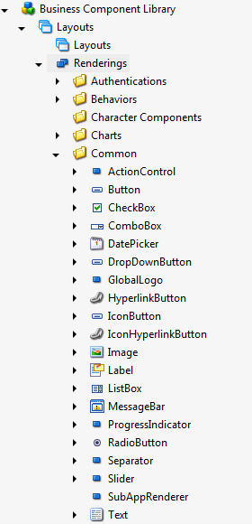

Like all view renderings, it points to a .cshtml file:

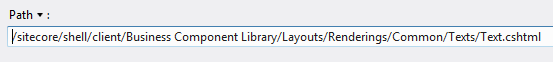

You will find that nearly every SPEAK component makes use of rendering parameters. The actual rendering parameters *template* (which does *not* inherit from Standard Rendering Parameters) lives underneath the component that uses it rather than in the 'Templates' folder:

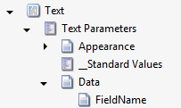

This is what the parameters template looks like:

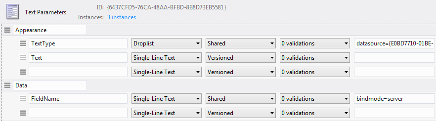

..and this is the Parameters Template field on the actual Text component. Even though the parameter template lives under the component definition item, you do still have to fill in this field:

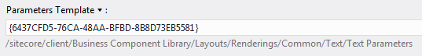

Just like in a normal Sitecore site, the result is that each instance of a component has some additional component parameter fields (the 'Properties' dialogue in Sitecore Rock). In the example below, 'Text' and 'TextType' are coming from the custom parameter template:

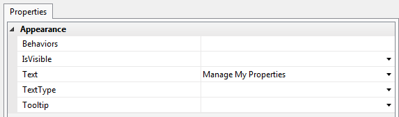

The component's associated .cshtml file extracts the value in the Text field and outputs it to the page. Different components will have different parameter template fields, though some -- like 'IsVisible' and 'DataSource' -- belong to base templates. When you create your own component, you also create a parameter template.

## Using parameter items

There is another way to set a component's properties, and this method would allow us to translate our Text component's Text property.

Rather than setting the Text value directly in the rendering's properties, create an instance of the Text Parameters template. These configuration items go under the PageSettings child of the page your component is used on:

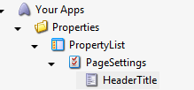

It does not matter what you call this item, but it helps if it has the same name as the ID of the component it is referring to -- in our case, that's HeaderTitle. I am going to set the item's Text field to 'Manage Properties':

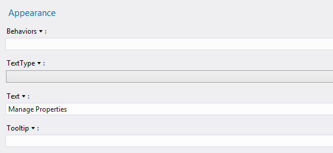

You can now tell your component to use data from this parameters item by setting it as the component's DataSource. This is the HeaderTitle component with its DataSource field set to the HeaderTitle parameters item ID:

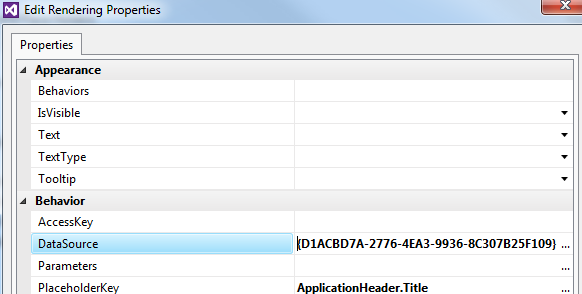

Notice that the Text parameter is empty -- SPEAK will look for a value set directly in the component's parameters before looking at the data source item!

If we refresh our list page, we will see that the component outputting data from the data source item:

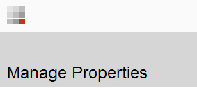

One of the biggest advantages of using a parameter item as a *datasource* is that your application is now translatable. I can create a Swedish version of my parameters item and set the Text field to 'Redigera Fastigheter', and refresh the page with `?sc_lang="sv-SE` in the query string. Because and item's layout field is shared across all languages, setting the Text property in the Properties dialogue rather than using a data source means that you are not supporting translation.

Using a parameter item is also a nice way of setting defaults, if multiple components on your page could use the same data source item.

For components that are outputting static, application-specific content (like buttons, titles, and introductory text) storing that content in parameter items is acceptable. *Business objects*, however, are probably stored as items in the master database -- in our case, a list of houses. How do we bring them into our SPEAK application?

## Data source components

Now that we have a skeleton page with a translatable title, let's turn our attention back to the list of properties (or houses) we are supposed to be outputting. Where is that data coming from?

First of all, we need to set up a template to hold our House data. I am going to go back to the master database to do this, because these items will be used by my public-facing website, too. Let's create a House template and a number of sample items:

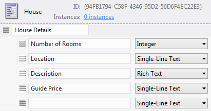

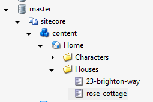

To get this data into my SPEAK application, I first need to create a datasource component. Because I want to be able to search the list of properties eventually, I am going to choose a SearchDataSource:

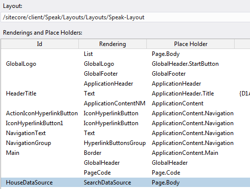

A datasource component does not actually render anything visible in the browser, but it *does* add a bit of Javascript:

```xml
<script data-sc-id="HouseDataSource" data-sc-fields="[]" data-sc-showHiddenItems="false" type="text/x-sitecore-searchdatasource" data-sc-require="/-/speak/v1/controls/searchdatasource.js">
```

Notice that it has a bunch of data attributes, like data-sc-id. These reflect the properties in the component's rendering parameters.


As with the Text component, I can either set rendering parameters directly on the component, or specify a parameter item data source. For consistency's sake, I am going to create a SearchDataSource Parameters item called HouseDataSource under PageSettings and set the SearchDataSource component's datasource to the ID of that item:

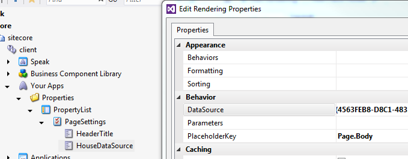

This parameters item has a bunch of exciting fields, but for now I am only interested in Database and RootItemId right now. As you can imagine, the Database field tells the component which database to look at, and RootItemId tells it which item to start searching from.

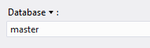

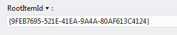

If you look at the page source now, you will see two new data attributes -- data-sc-root-id and data-sc-database:

```xml
<script data-sc-id="HouseDataSource" data-sc-fields="[]" data-sc-showHiddenItems="false" data-sc-root-id="{9FEB7695-521E-41EA-9A4A-80AF613C4124}" data-sc-language="jp-ja" data-sc-database="master" type="text/x-sitecore-searchdatasource" data-sc-require="/-/speak/v1/controls/searchdatasource.js">
```

Furthermore, if you look at the Network tab in developer tools and refresh the page (I'm using Google Chrome), you can see that a request is being fired off to the Item Web API as a result of the data source component being on the page:

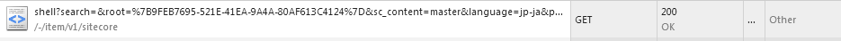

```
http://speak/-/item/v1/sitecore/shell?search=&root=%7B9FEB7695-521E-41EA-9A4A-80AF613C4124%7D&sc_content=master&language=en&payload=full
```

If I look at the JSON result, I get three items back from the master database as JSON -- Home, and the two House items I created earlier.

(I have had some issues limiting the search to particular templates when the data is coming from the master database rather than core -- I will get back to you on this.)

Now that I have data being pulled in by data source component via the Item Web API, how do I go about displaying that JSON on the page?

## Configuring the list control

In order to display the result of the search data source component on the page, we need a second component that knows how to interpret the results and display them.

Add a ListControl to the ApplicationContent.Main placeholder and open its properties. In the Items dropdown, find `{Binding HouseDataSource.Items}`. This is a Javascript property of the search data source component; you are telling your list control that it should get its data from whatever comes back from that data source component.

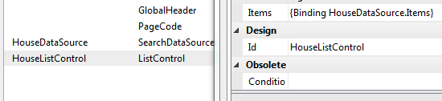

If you save and refresh the page, you will see that the list component now has 3 rows -- but no data is being displayed:

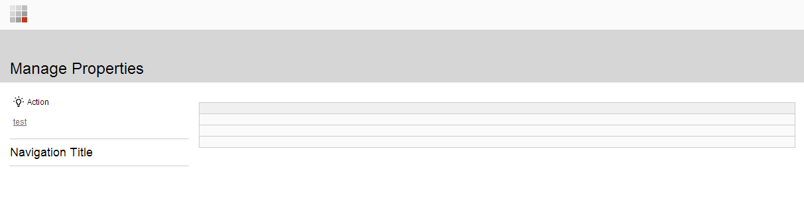

We need to configure which fields should be displayed by the list. To do this, create an item based on the ListControl Parameters template under the PageSettings item -- just as we have already done for the Text and SearchDataSource components (ignore the icon; yours will have a normal grey form icon by default):

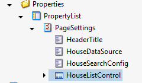

Under that, add items based on the ColumnField template. For each one, set the DataField (which is the name of the Sitecore item field you want to output) and the HeaderText, which is the title of the table column.

When you are done, set the HouseListControl data source to the ID of the HouseListControl item we just created. The list component knows that it should build columns based on the ColumnField items.

Refresh the list page -- you should now see actual data appearing in the list:

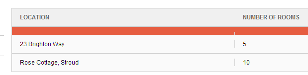

Tada -- content in your SPEAK application!

## Summary

In part 2, we looked at component parameters, parameter items, data source components, and list components.

-   For simple application-specific content, like titles and button text, you can use the component's 'Text' property -- but if you set it directly in the Properties dialogue, it isn't translatable.
-   All components have a parameters template. You can create an item based on this template under the PageSettings item of a page, and link it to the component via the DataSource field.
    -   Remember to leave the property field empty if you want to use the corresponding field from the parameter item
-   Business objects -- in our case, houses -- can come from another database. These are brought into the SPEAK application via a data source component -- in our case, a SearchDataSource component, but there are others (like QueryDataSource)
-   Data source components add a bit of Javascript to the page -- it is then up to another component, such as a ListControl to display the data

In part 3, we will add a search button and filter to our list, and link each result to an 'Edit Property' page. At this point, we will need to write some Javascript.

<div class="comments">

## Comments (Imported from wordpress)

### [gorhal](http://visionsincode.wordpress.com/)

_June 27, 2014 at 13:29_

Good post. I now want to play with SPEAK 🙂

### Thomas

_April 10, 2015 at 07:37_

You mentioned:

"(I have had some issues limiting the search to particular templates when the data is coming from the master database rather than core -- I will get back to you on this.)"

I'm having the same issue. Setting the RootItemId of the SearchDataSource somehow causes the rootitem to be returned also.

Is there a solution to this? Can I set a filter for a specific template?

### Thomas

_April 10, 2015 at 07:47_

Ok, I found out the fix myself. For anyone interested: create a new item with template 'SearchPanel Config' and set the Template field accordingly. After that, copy the GUID of the item you just created and copy it inside the SearchConfigItemId field of the SearchDataSource item.

(Ps: I'm using Sitecore 8)

### Damien.

_August 30, 2015 at 07:01_

You are a life saver Thomas worked perfectly.

### [Phani Abburi](http://phani-abburi.blogspot.com/)

_January 7, 2016 at 15:19_

I am not getting any items back. Could you please share the details on which root item is selected.

### theoneaby

_July 31, 2017 at 12:21_

Make sure that the data items are under the site Root node.

### [SYED AKHTAR](http://gravatar.com/isyedakhtar)

_October 22, 2015 at 08:32_

Hi,

Can someone help with, I have a column field which shows percent value. How can I format that field to show % symbol with every values.

Regards.

### Pingback: [Masoud's](http://wheelbarrowex.com/2016/12/23/sitecore-speak-a-quick-start/)

</div>