In [part 2](../speak-for-newbies-part-2-where-does-the-data-come-from), we ended up with a list of houses -- in part 3, we are going to add some fancy search and filtering capabilities to this list.

## Add a search panel

First of all, we are going to add a SearchPanel component to the page. This component contains a number of additional placeholders, and will help format the search button and list of filters. I have given it the ID HouseSearchPanel.

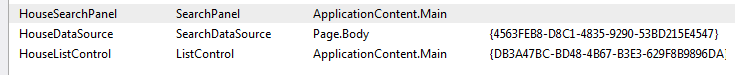

## Add a text box

Secondly, add a TextBox component to the HouseSearchPanel.Searches placeholder. I have given it the ID HouseSearchTextBox:

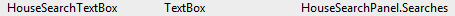

Open the HouseDataSource component's properties.

In this component's Text property, locate `{Binding HouseSearchTextBox.Text}`. You are telling your search data source component to pass along the contents of the text box when it makes a query. If I type 'Rose' into the text box and press enter, the data source component is updated, which in turn updates the list (without page load):

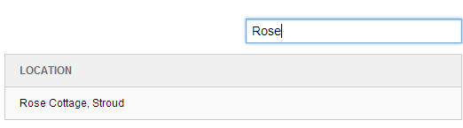

How does this work? When I added `{Binding HouseSearchTextBox.Text}` to the data source component's Text field, the script that it injects changes slightly. This is the full script:

```xml
<script data-sc-id="HouseDataSource" data-sc-fields="[]" data-sc-showHiddenItems="false" data-sc-root-id="{9FEB7695-521E-41EA-9A4A-80AF613C4124}" data-sc-database="master" data-sc-searchconfig="{5E096049-8A54-47E9-B58A-211F8A9FD501}" type="text/x-sitecore-searchdatasource" data-sc-bindings="{"text":"HouseSearchTextBox.Text"}" data-sc-require="/-/speak/v1/controls/searchdatasource.js">
```

And this is the important bit:

```
data-sc-bindings="{"text":"HouseSearchTextBox.Text"}"
```

When the contents of the text box changes, the data source component reacts and the contents of the list changes. If you look at the Network tab whilst performing a search, you will see that the query changes when you press enter. Here is the full query:

```xml
<http://speak/-/item/v1/sitecore/shell?search=23&root=%7B9FEB7695-521E-41EA-9A4A-80AF613C4124%7D&searchConfig=%7B5E096049-8A54-47E9-B58A-211F8A9FD501%7D&sc_content=master&payload=full>
```

And here is the important bit:

```
search=Rose
```

Bonus -- if you are searching for a single word, surround it with asterisks (wildcard character) to get results for that keyword within a larger bit of text:

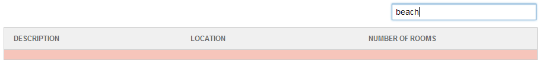

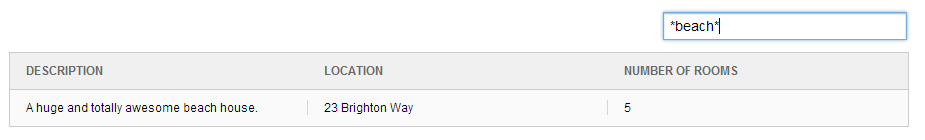

## Add a search button

If you want, you can add a search button to the text box. SPEAK cleverly steers you toward the IconButton component by automatically positioning it to the right of the text box. You *can* use a normal button, but I have a feeling you aren't supposed to.

This is how to get the button working:

1.  Add an IconButton component to the HouseSearchPanel.Searches placeholder
2.  Give it a sensible ID
3.  Set the Click parameter to `javascript:app.HouseDataSource.refresh()`, where `HouseDataSource` is the ID of your search data source component -- this is where you will wish that you had given them sensible names.
4.  Set the ImageUrl property to the SPEAK image sprite, which is located here: `/sitecore/shell/client/Speak/Assets/img/glyphicons-halflings.png` (on your file system) -- there are quite a number of sprites in that folder, including sc_sprite.png.
5.  Set the BackgroundPosition field to `-47px 0px` (you are welcome) to position the icon.

Here is the completed Properties dialogue:

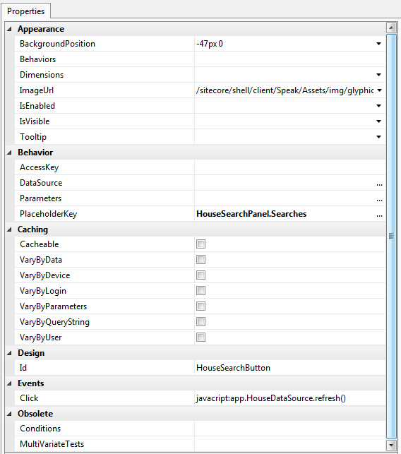

Note: The button will not appear if you do not set the Click action. This is what tells the HouseDataSource component to re-execute, and since the search data source component is wired up to check the contents of the text box, pressing the search button works in the same way as pressing enter.

## Add some filters

Now that we can search, the next major job is to add a filters. A filter is a way of narrowing down your search results, so it only makes sense to add filters for fields with a finite number of options.

(Note: Whilst going through these steps, I changed the Number of Rooms field to a Single-Line Text field, as there were some problems indexing an integer field.)

Start by adding a FilterControl to the HouseSearchPanel.Filters placeholder, and give it an ID.

Next, we need to decide what to facet on -- in other words, what properties of the 'house' item should we be able to filter by? The only one that makes sense is Number of Rooms, as both Location and Description are unique to the particular house.

We need to create a folder of our chosen facets under PageSettings. I am actually going to put them under the HouseDataSource parameter item, but you don't have to do that. Create a child item under the folder for each facet using the Facet template (`/sitecore/client/Speak/Layouts/Renderings/Data/SearchDataSource/Facet`):

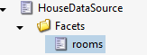

Specify which field you want to use (as it appears in the template):

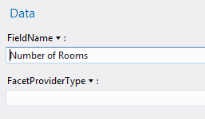

Now that we have created the folder of facets, we need to wire it up to the HouseDataSource and HouseFilterControl components.

The HouseDataSource needs to know which facets belong to it. Open the data source component's Properties and set FacetRootItemId to the ID of the folder containing your facets:

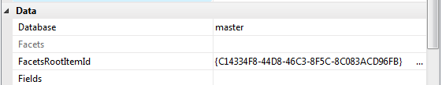

Open the HouseFilterControl component's Properties. Now that the *datasource* knows what facets to use, it can tell the filter control which ones to display. This is done by setting the Facets field to the HouseDataSource component's Facet property -- `{Binding HouseDataSource.Facets}`:

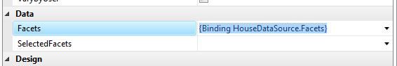

Let's pause and see what that does to the page. If you look at the marked `data-sc-id="HouseFilterControl"` you will see the following:

```
data-sc-bindings="{"Facets":"HouseDataSource.Facets"}
```

This means that the filter control is tied to the `Facets` property of HouseDataSource.

You should now see something like this:

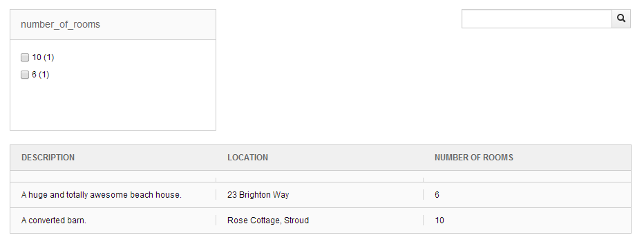

As you can see, 6 and 10 rooms are listed as options because the house data only has two results.

At the moment, ticking one of the room options will not do anything. The final step is to tell the data source component to pass the facet choice along with the query. Open the HouseDataSource Properties again. This time, set SelectedFacets to `{Bindings HouseFilterControl.SelectedFacets}`:

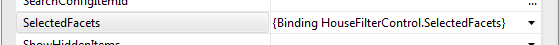

This tells the data source component to update every time the `SelectedFacet` property of the HouseFilterControl changes -- which it does if you select one of the options. If i tick '10′ now, it will narrow the results down for me:

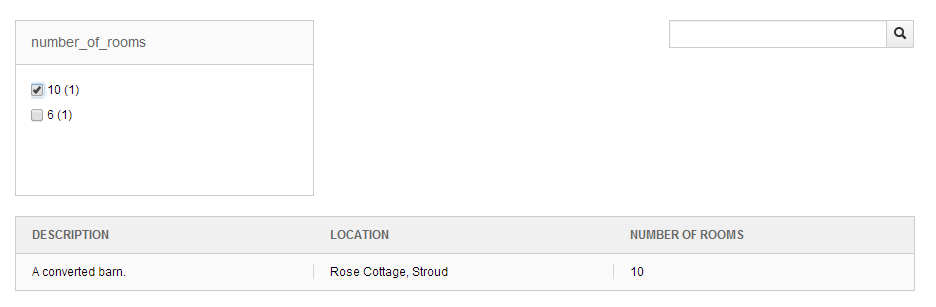

Look at the source and locate the script generated by the data source component:

```xml
<script data-sc-id="HouseDataSource" data-sc-fields="[]" data-sc-showHiddenItems="false" data-sc-facets-root-id="{C14334F8-44D8-46C3-8F5C-8C083ACD96FB}" data-sc-root-id="{9FEB7695-521E-41EA-9A4A-80AF613C4124}" data-sc-database="master" data-sc-searchconfig="{5E096049-8A54-47E9-B58A-211F8A9FD501}" type="text/x-sitecore-searchdatasource" data-sc-bindings="{"text":"HouseSearchTextBox.Text","selectedFacets":"HouseFilterControl.SelectedFacets"}" data-sc-require="/-/speak/v1/controls/searchdatasource.js">
```

Notice the `data-sc-bindings` attribute:

```data-sc-bindings="{"text":"HouseSearchTextBox.Text","selectedFacets":"HouseFilterControl.SelectedFacets"}"
```

It now includes `selectedFacets":"HouseFilterControl.SelectedFacets"`.

## Conclusion

Without needing to write any additional code, you now have a searchable, filterable list of houses. In part 4, we will move on to the first task page of the application -- Add or Edit House.