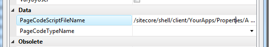
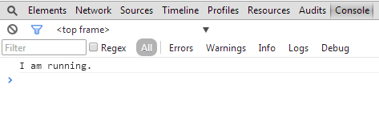
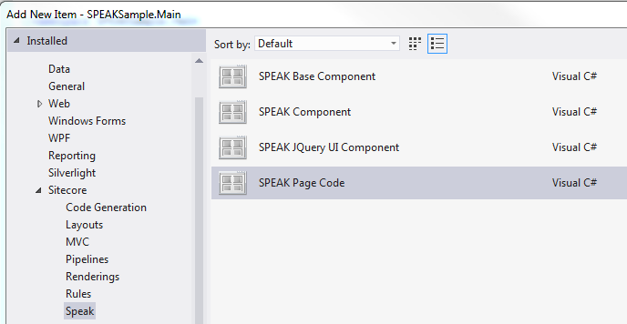

I lied -- before we create our 'Add / Edit Property' task page, I want to say a little bit more about PageCode and the Javascript libraries that SPEAK uses. I am not a native Javascript-speaker, and I am writing for the benefit of those who -- like me -- are mildly flummoxed by it.

## What happens when I add PageCode to my presentation details?

When you add the PageCode component to your presentation details, you are adding a reference to sitecorify.css and [require.js](http://requirejs.org/). The CSS obviously styles the page, and require.js is "a JavaScript file and module loader". Simply put, it loads the Javascript files your application needs by reading your config. Have a look at the script tag:

```xml
<script src="/sitecore/shell/client/Speak/Assets/lib/core/deps/require.js" data-main="/-/speak/v1/assets/main.js" type="text/javascript"> </script>
```

That basically says 'use require.js with the configuration located at `/-/speak/v1/assets/main.js`'. That configuration looks like this:

```js
(function (global) {
  require.config({
    baseUrl: "/sitecore/shell/client/Speak/Assets",
    paths: {
      jquery: "lib/core/deps/jQuery/jquery-1.10.2",
      underscore: "lib/core/deps/underscore/underscore.1.4.4",
      knockout: "lib/core/deps/ko/knockout-2.2.1",
      backbone: "lib/core/deps/backbone/backbone.1.0.0",
      sitecore: "lib/core/sitecore-1.0.2",
      sitecorify: "css/sitecorify",
      bootstrap: "lib/ui/bootstrap",    
      jqueryui: "lib/ui/deps/jQueryUI/jquery-ui-1.10.1.custom",
      dynatree: "lib/ui/deps/DynaTree/jquery.dynatree-1.2.4",
      dynatreecss: "lib/ui/deps/DynaTree/skin-vista/ui.dynatree"
    },
    shim: {
      'jquery': { exports: 'jQuery' },
      'jqueryui': { deps: ['jquery'] },
      'underscore': { exports: '_' },
      'knockout': { deps: ['underscore'], exports: 'ko' },
      'backbone': { deps: ['jquery', 'underscore'], exports: 'Backbone' },
      'sitecore': { deps: ['backbone', 'knockout'], exports: 'Sitecore' },
      'dynatree': { deps: ['jqueryui'/*, 'css!dynatreecss'*/] }
    },
    map: {
      '*': {
        'css': 'lib/core/deps/css'
      }
    }
  });
 
  require(["sitecore"], function (_sc) {
    _sc.load(global);
  });
})(this);
```

This file gives you a good idea of the technologies used to build SPEAK -- like Backbone, JQuery, and Bootstrap.

Finally, this is the bit that loads the 'sitecore' module, which is the `lib/core/sitecore-1.0.2.js` file. This is the core of SPEAK:

```js
require(["sitecore"], function (_sc) {
   _sc.load(global);
 });
 ```

As we have seen, individual components have their own .js files. All of them depend on the sitecore module. This is an excerpt from searchdatasource.js, for example:

```js
define(["sitecore"], function (Sitecore) {[
        // search data source logic
]}
```

## Creating your own page code

In our examples so far, we have not needed to write any additional Javascript -- all the wiring between the list, search box, and search filter components was done for us. However, the Add/Edit Property page needs to perform some tasks above and beyond what SPEAK components can do for you.

At this point, we need to create our own page code script. My example is called AddEditPropertyPageCode.js, and it looks like this:

```js
define(["sitecore"], function (Sitecore) {
    var ExtendedPage = Sitecore.Definitions.App.extend({
            // Your stuff here
    });
    return ExtendedPage;
});
```

This defines a module, and passes in 'sitecore' as a dependency (require.js at work), and extends the default page code -- `Sitecore.Definitions.App.extend()`.

## Using your own page code

To use your own page code, drop your Javascript file somewhere sensible -- I am putting mine in `{webroot}\sitecore\shell\client\YourApps\Properties\AddEditProperty\AddEditPropertyPageCode.js`.

In Rocks, go to the presentation details of your page item and double-click on the PageCode component to open its Properties. There is a PageCodeScriptFielName to the path of your .js file:



## Prove that it works

When your page code runs, SPEAK will look for an `initialized` function and execute it if it exists:

```js
define(["sitecore"], function (Sitecore) {
    var ExtendedPage = Sitecore.Definitions.App.extend({
            initialized: function() {
                  console.log('I am running.')
            }
    });
    return ExtendedPage;
});
```

Save, open the Network tab in your browser developer tools, and reload the page:



**Tip**: Sitecore Rocks has a bunch of SPEAK templates that makes it easier to create custom page code, among other things:



In part 5 (or 4.5), we will be using custom page code to wire up our 'Add/Edit Property' form.

<div class="comments">

## Comments (Imported from wordpress)

### Pingback: [Add a pie chart to your Sitecore SPEAK dashboard page | blog.mr-t.nl](http://blog.mr-t.nl/add-a-sitecore-speak-pie-chart-to-your-dashboard-page/)

</div>