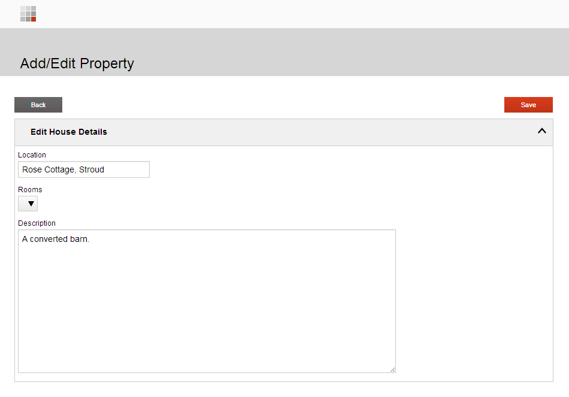
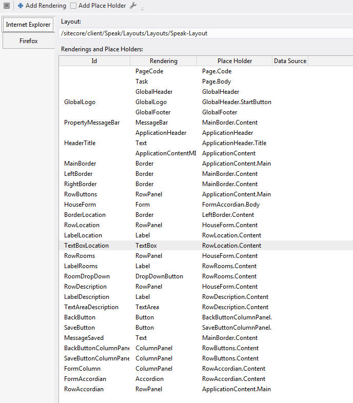
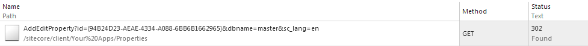
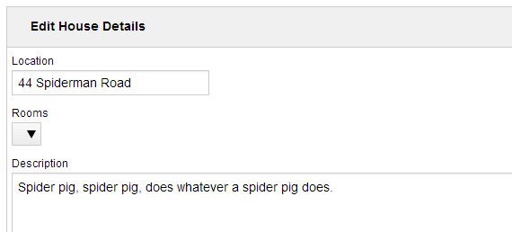
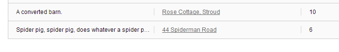

Now that we have familiarized ourselves with custom page code, let's use that knowledge to build the Add/Edit Property page. This is what we are going to end up with:



But before we throw ourselves into Javascript, there is a key decision to make -- are we going to use existing SPEAK components, or are we going to build our own?

## Should I build a custom component?

One of the key goals of SPEAK is to provide a consistent, user-friendly UI. Internally, no SPEAK component or SPEAK interface escapes into the wild without first being passed under the critical eye of a user experience expert, who makes sure that what we release will not offend and confuse the users. If I created my own form component for the 'Add/Edit Property' page -- which would include manually building the HTML for form inputs -- that responsibility would fall on me. I might be able to re-use some HTML and CSS from existing components, but chances are I will not think of everything. I would also be responsible for updating code and styles as SPEAK evolves.

There's also the development side of things to consider. The magic that allowed us to wire a bunch of components together to create a searchable, filterable list of Sitecore items without a single line of code had to be written with the need for re-use and flexibility in mind, which is difficult to do. How might a developer use this component? What options will they need? Which other components might it need to communicate with, and how?

My personal rule is to use existing SPEAK components as much as possible, and wire them up in custom page code. This is exactly what the 'Add/Edit Property' page will do. Keep in mind:

-   Your list of presentation details will grow -- fast. Don't be alarmed if it exceeds 50 components.
-   Your page code will grow quickly. Take advantage of [require.js](http://requirejs.org/) and abstract reusable code into modules.

## Build the form

The first step is to assemble the form. I found this very fiddly, especially as there is no guide to assembling more complex pages. I tried to match the appearance of my page to existing SPEAK applications, like Email Campaign Manager. Do not use this as a definitive guide to layout, as I have not been following any kind of UI guide for this example.

These are the components I ended up with:



And this is a rough guide to the hierarchy of components:

```
-- -- RowButtons (RowPanel)\
-- -- -- -- BackButtonColumnPanel (ColumnPanel)\
-- -- -- -- -- -- -- -- BackButton (Button)\
-- -- -- -- SaveButtonColumnPanel (ColumnPanel)\
-- -- -- -- -- -- -- -- SaveButton (Button)

-- -- RowAccordian (RowPanel)\
-- -- -- -- FormAccordian (Accordian)\
-- -- -- -- -- -- -- -- HouseForm (Form)\
-- -- -- -- -- -- -- -- -- -- -- -- -- -- -- -- RowLocation (RowPanel)\
-- -- -- -- -- -- -- -- -- -- -- -- -- -- -- -- -- -- -- -- -- -- -- -- -- -- -- -- -- -- -- -- LabelLocation (Label)\
-- -- -- -- -- -- -- -- -- -- -- -- -- -- -- -- -- -- -- -- -- -- -- -- -- -- -- -- -- -- -- -- TextBoxLocation (TextBox)\
-- -- -- -- -- -- -- -- -- -- -- -- -- -- -- -- RowRooms (RowPanel)\
-- -- -- -- -- -- -- -- -- -- -- -- -- -- -- -- -- -- -- -- -- -- -- -- -- -- -- -- -- -- -- -- LabelRooms (Label)\
-- -- -- -- -- -- -- -- -- -- -- -- -- -- -- -- -- -- -- -- -- -- -- -- -- -- -- -- -- -- -- -- RoomDropDown (DropDownButton)\
-- -- -- -- -- -- -- -- -- -- -- -- -- -- -- -- RowDescription (RowPanel)\
-- -- -- -- -- -- -- -- -- -- -- -- -- -- -- -- -- -- -- -- -- -- -- -- -- -- -- -- -- -- -- -- LabelDescription (Label)\
-- -- -- -- -- -- -- -- -- -- -- -- -- -- -- -- -- -- -- -- -- -- -- -- -- -- -- -- -- -- -- -- TextAreaDescription (TextArea)
```

As you can see, the majority of those components are used for layout (rows, columns, borders, more rows..), and this can make a page look a lot more complicated than it actually is. The ones that I will be targeting in my code are highlighted in bold.

## Create custom page code

Now that we have our form elements, [create a page code file for this page](../speak-for-newbies-part-4-pagecode-and-javascript-libraries/). This is where we will be doing the majority of our work. Here is the start of mine:

```js
define(["sitecore", "jquery"], function (Sitecore, jQuery) {
    var AddEditPropertyPage = Sitecore.Definitions.App.extend({
 
        initialized: function ()
        {
              // our work goes here
        }
 
    });
    return AddEditPropertyPage;
});
```

In this file, we need to accomplish the following:

-   Load property data from Sitecore based on the ID in the query string
-   Bind that data to the form inputs
-   Bind a 'save' click function to the save button
-   Handle the save

## Getting data from the query string

Imagine that we have navigated to this link: `AddEditProperty?id={94B24D23-AEAE-4334-A088-6BB6B1662965}`.

We want our page code to fetch the item that corresponds to that ID. How do we do that? In the example below, I have extended the `initialized` function and created a function called `getID()`. This function uses a helper (`Sitecore.Helpers.url.getQueryParameters`; notice that `Sitecore` object is passed in at the very top of the code sample) to fetch the ID from the query string. There are lots of helpers in the main SPEAK Javascript that you can take advantage of in your own code.

```js
define(["sitecore", "jquery"], function (Sitecore, jQuery) {
    var AddEditPropertyPage = Sitecore.Definitions.App.extend({
 
        initialized: function ()
        {
            var id = this.getID();
             
            if (id != null)
            {
                console.log('ID processed');
                // And now what?                
            }
        },
        getID: function()
        {
            var id = Sitecore.Helpers.url.getQueryParameters(window.location.href)['id'];
                        if (Sitecore.Helpers.id.isId(id))
                        {
                                 return id;
            }
        }
    });
    return AddEditPropertyPage;
});
```

Now that we have the ID, we need to do something with it. I am only going to implement the 'Edit' part of the page in this example -- if you did not get an ID back, you would still return the form but the 'Save' button would result in a new item being created (you might even change its text to 'Save new property').

## Get data from Sitecore

We have already talked about [where the data comes from in a SPEAK application](../speak-for-newbies-part-2-where-does-the-data-come-from/). In this example, I might have been able to use a data source component of some kind, or [created my own](https://www.youtube.com/watch?v=PfnTJsUKxiY), but I have chosen to bring the content in via AJAX instead. To do this, I have created a function called `getProperty()` that accepts an ID and makes a GET request to `/api/sitecore/Property/GetProperty`.

```js
define(["sitecore", "jquery"], function (Sitecore, jQuery) {
    var AddEditPropertyPage = Sitecore.Definitions.App.extend({
 
        initialized: function ()
        {
            var id = this.getID();
             
            if (id != null)
            {
                console.log('ID processed');
                this.getProperty(id);               
            }
        },
        getID: function()
        {
            var id = Sitecore.Helpers.url.getQueryParameters(window.location.href)['id'];
                        if (Sitecore.Helpers.id.isId(id))
                        {
                                 return id;
            }
        },
        getProperty: function(id)
        {
            var app = this;
             
            jQuery.ajax({
                type: "GET",
                dataType: "json",
                url: "/api/sitecore/Property/GetProperty",
                data: { 'id' : id, 'dbname' : 'master' },
                cache: false,
                success: function (data) {  
                    // Do something on success
                },
                error: function() {
                  console.log("There was an error. Try again please!");
                }
            });
        },      
    });
    return AddEditPropertyPage;
});
```

Let's have a closer look at that function:

```js
getProperty: function(id)
{
    var app = this;
     
    jQuery.ajax({
        type: "GET",
        dataType: "json",
        url: "/api/sitecore/Property/GetProperty",
        data: { 'id' : id, 'dbname' : 'master' },
        cache: false,
        success: function (data) {  
            // Do something on success
        },
        error: function() {
          console.log("There was an error. Try again please!");
        }
    });
}
```

On line `3`, we store a reference to the top-level application as a variable because [`this` changes depending on the scope](http://stackoverflow.com/questions/500431/javascript-variable-scope) (this is a Javascript thing). We make a `GET` request to the URL on line `8`, which is route to a custom controller action (more on that in a moment), which contains the data on line `9`. The target controller receives the ID we took from the query string, and `dbname : master` (you don't *have* to do this; the database name could be hardcoded into your controller).

What does the controller look like?

### The property controller

The controller is just a regular ASP.NET MVC controller. I created a standard ASP.NET MVC project, and used a Visual Studio publish profile to deploy the project over the top of my Sitecore installation:


This is what the code looks like:

```js
public class PropertyController : Controller
    {
        public ActionResult GetProperty(Guid id, string dbname)
        {
            Property property = new Property();
 
            if (ID.IsID(id.ToString()))
            {
                var db = Sitecore.Configuration.Factory.GetDatabase(dbname);
 
                if (db != null)
                {
                    var propertyItem = db.GetItem(new ID(id));
 
                    property.Location = FieldRenderer.Render(propertyItem, "Location");
                    property.Description = FieldRenderer.Render(propertyItem, "Description");
                }
            }
 
            return Json(property, JsonRequestBehavior.AllowGet);
        }
```

There are a few things to note here.

-   The name of the action parameters -- `id` and `dbname` -- match the post data we included in our `GET`
-   The `Property` class is a custom POCO -- it has simple `Location` and `Description` string properties.
-   The property is turned into a simple JSON object and returned to the client

In reality, you would probably use some kind of IoC container and only authorize requests from the context site to prevent abuse, but this example will at the very least return some data. When you create a controller, the route will be `/api/sitecore/{controller}/{action}` by default, but you can register a custom route if you want to. If you save and refresh the page with the Network tab open, you can see the request going off to the controller:



And this is a preview of what you get back:

```json
{ "Location":"44 Spiderman Road","Description":"Spider pig, spider pig, does whatever a spider pig does."}
```

Now that we have some data in the form of JSON, we want to bind the values to the form inputs.

## Binding the data

We want the data we got back from the controller to appear in the form. Let's bind the Location and Description to their respective form inputs using another function called `populateForm`:

```js
define(["sitecore", "jquery"], function (Sitecore, jQuery) {
    var AddEditPropertyPage = Sitecore.Definitions.App.extend({
 
        initialized: function ()
        {
            var id = this.getID();
             
            if (id != null)
            {
                console.log('ID processed');
                this.getProperty(id);               
            }
        },
        getID: function()
        {
            var id = Sitecore.Helpers.url.getQueryParameters(window.location.href)['id'];
                        if (Sitecore.Helpers.id.isId(id))
                        {
                                 return id;
            }
        },
        getProperty: function(id)
        {
            var app = this;
             
            jQuery.ajax({
                type: "GET",
                dataType: "json",
                url: "/api/sitecore/Property/GetProperty",
                data: { 'id' : id, 'dbname' : 'master' },
                cache: false,
                success: function (data) {  
                    app.populateForm(data);
                },
                error: function() {
                  console.log("There was an error. Try again please!");
                }
            });
        },
        populateForm: function(data)
        {
            var app = this;
 
            app.TextBoxLocation.set('text', data.Location);
            app.TextAreaDescription.set('text', data.Description);
             
        },
    });
    return AddEditPropertyPage;
});
```

Here, we locate the two form input components by ID (this is why you should give your components sensible names) and set the `text` property of each one to data returned by our controller. This is what we end up with:



## Saving changes

Finally, we want our changes we make to the form to be saved when we click the Save button. Once again, we need a controller action and a little bit of AJAX to send the contents of our form fields there.

This is the controller action:

```js
public ActionResult SaveProperty(string propertyData)
{
    var masterDB = Sitecore.Configuration.Factory.GetDatabase("master");
 
    JavaScriptSerializer jss = new JavaScriptSerializer();
    Property property = jss.Deserialize<Property>(propertyData);
 
    using (new SecurityDisabler())
    {
        var item = masterDB.GetItem(new ID(property.ID));
 
        item.Editing.BeginEdit();
        item.Fields["Location"].Value = property.Location;
        item.Fields["Description"].Value = property.Description;
        item.Editing.EndEdit();
    }
 
    return Json(new { success = true }, JsonRequestBehavior.AllowGet);
}
```

And this is the Javascript function:

```js
saveProperty: function()
{
    var app = this;         
     
    var id = app.getID();
     
    var property = {
        location: app.TextBoxLocation.get('text'),
        description: app.TextAreaDescription.get('text'),
        id: id
        };
     
    jQuery.ajax({
        type: "POST",
        url: "/api/sitecore/Property/SaveProperty",
        data: { "propertyData" : JSON.stringify(property) },
        success: function (success) {   
                // display a message
        },
        error: function() {         
          console.log("There was an error. Try again please!");
        }
    });
             
}
```

On line `7`, we get the values of the form inputs and use them to build some JSON. This is turned into a string and passed on to `/api/sitecore/Property/SaveProperty` on lines `15` and `16`.

To trigger the save, locate the save button component and open its Properties. Set the Click property to:

```js
javascript:app.saveProperty();
```

If you view source on the page and look at the button HTML, you will see that the `data-sc-click` attribute has changed:

```html
<button data-sc-id="SaveButton" class="btn sc-button btn-primary sc_Button_29 data-sc-registered" data-sc-click="javascript:app.saveProperty()" data-bind="visible: isVisible, enable: isEnabled, click: click" data-sc-require="/-/speak/v1/business/button.js" data-sc-hasnested="true" type="button"><span class="sc-button-text data-sc-registered" data-bind="text: text">Save</span></button>
```

Clicking on the save button will now post the data in those two form fields to a controller that will save the changes.

## Last but not least, let's link the two pages together

Finally, we want each row off the property list to link to the appropriate ID. Go to the PropertyList and find the ColumnField item named 'location' -- [we created this in part 2](../speak-for-newbies-part-2-where-does-the-data-come-from/).

Locate the HTMLTemplate field and add the following:

```html
<a href="/sitecore/client/Your Apps/Properties/AddEditProperty?id={{itemId}}">{{Location}}</a>
```

`{{Location}}` is the name of the field we want to output, and `{{itemId}}` is a standard token which will be replaced by the ID of the item in the row. Lastly, delete the contents of the DataField field. If you leave this filled in, the contents of the HTMLTemplate will not be output. The 'Location' text of each row will now link to the 'Add/Edit Property' page:



## Conclusion

SPEAK 1.1 does not provide a wrapper around client/server interactions, but setting up your own controller or web API to do that work is fairly trivial. Now that we have a list of properties and some rudimentary add/edit functionality, we can start refining the interface and the code. Our final page code file is quite long despite the simplicity of the page, which is something I would like to address, and in the next few blog posts I will be tackling that as well as highlighting some useful SPEAK helpers, implementing a message bar, and breaking down the recommended way to assemble a page from existing SPEAK components.

Here is the complete Javascript, including some bonus message bar code that I will cover in another post:

```js
define(["sitecore", "jquery"], function (Sitecore, jQuery) {
    var AddEditPropertyPage = Sitecore.Definitions.App.extend({
        initialized: function ()
        {
            var id = this.getID();
             
            if (id != null)
            {
                console.log('ID processed');
                this.getProperty(id);               
            }
        },      
        getProperty: function(id)
        {
            var app = this;
             
            jQuery.ajax({
                type: "GET",
                dataType: "json",
                url: "/api/sitecore/Property/GetProperty",
                data: { 'id' : id, 'dbname' : 'master' },
                cache: false,
                success: function (data) {  
                    app.populateForm(data);
                },
                error: function() {
                  console.log("There was an error. Try again please!");
                }
            });
        },
        saveProperty: function()
        {
            var app = this;         
             
            var id = app.getID();
             
            var property = {
                location: app.TextBoxLocation.get('text'),
                description: app.TextAreaDescription.get('text'),
                id: id
                };
             
            jQuery.ajax({
                type: "POST",
                url: "/api/sitecore/Property/SaveProperty",
                data: { "propertyData" : JSON.stringify(property) },
                success: function (success) {   
                    var temporary = { text: 'hello', actions: [], temporary: true, closable: false };
                    app.PropertyMessageBar.addMessage("notification", temporary);   
                    app.PropertyMessageBar.viewModel.$el.delay(2000).fadeOut();
                },
                error: function() {         
                  console.log("There was an error. Try again please!");
                }
            });
                     
        },
        populateForm: function(data)
        {
            var app = this;
 
            app.TextBoxLocation.set('text', data.Location);
            app.TextAreaDescription.set('text', data.Description);
             
        },
        getID: function()
        {
            var id = Sitecore.Helpers.url.getQueryParameters(window.location.href)['id'];
            console.log(id);
            if (Sitecore.Helpers.id.isId(id))
            {
                return id;
            }
        }
    });
    return AddEditPropertyPage;
});
```
<div class="comments">

## Comments (Imported from wordpress)

### [menno](http://www.sharevalue.nl/)

_July 11, 2014 at 14:20_

Hi Martina,

Currently we developing a speak interface to modify sitecore ses products ... the list view is done but now we want to make a detail view (Create, update, delete) and we want to use the sitecore web api to get an item and bind the fields with knockout. Is there an easy way to do that?

### Martina

_July 11, 2014 at 15:08_

Hello -- I'm afraid I'm no expert on the Item Web API. The documentation has an 'item manipulation' section (http://sdn.sitecore.net/upload/sdn5/modules/sitecore%20item%20web%20api/sitecore_item_web_api_developer_guide_sc66-71-a4.pdf) that suggests you can do basic CRUD, but I think you would need to extend it to get advanced functionality.

### [reddy000](http://meswarawaka.wordpress.com/)

_December 30, 2014 at 11:56_

Hi Martina,

we are Creating one Property controller using VSS-2012(MVC Project), How can i Insert this controller in to sitecore project. Can you Please

### [reddy000](http://gravatar.com/reddy000)

_December 31, 2014 at 09:50_

Thanks for the tutorial, but i am unable to save the data. It is displaying error as POST SaveProperty 500 Internal Server Error, [http://localhost:80/api/sitecore/Property/SaveProperty](http://localhost/api/sitecore/Property/SaveProperty)

### Pingback: [Sitecore SPEAK 2.0 CRUD operation part 1 -- Form component -- Pratik Satikunvar](https://pratiksatikunvar.wordpress.com/2017/08/30/sitecore-speak-2-0-crud-operation-part-1-form-component/)
</div>