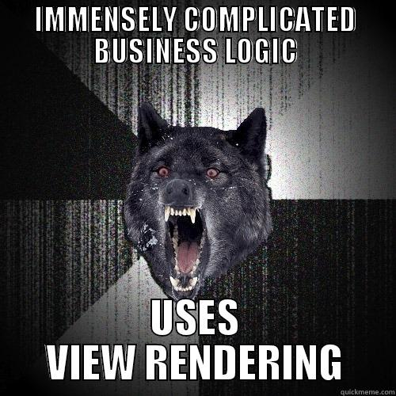

I am in the middle of writing up recommended practices for Sitecore MVC, and one of the questions I need to address is the good old controller rendering vs view rendering debate. There is no right or wrong answer, so there will be opinions ahead -- although I do try to justify what I'm saying. In a nutshell, this:

<figure class="centerFig">

<figcaption>For the uninitiated -- that is insanity wolf. He is a psychopath, and therefore makes poor rendering type choices.</figcaption>

</figure>

## View renderings

### What is a view rendering?

A view rendering consists of a view that takes a `RenderingModel` by default. The model is assembled by the Sitecore MVC pipeline, and you can create your own, custom models. Because the pipeline expects an `Initialize()` method on your model, you can either inherit from `RenderingModel` or implement `IRenderingModel`.

To post a view rendering, specify the controller and action that you want to post to on the component's definition item.

### Pros

-   They are simple to use -- especially if you do not use a custom model. Most of the time, you only want to display some content from the context or data source item without requiring any business logic -- a simple 'page' will often consist of a title and some text, which you can do very easily with Sitecore's `RenderingModel` and the `@Html.Sitecore()` helper. There isn't much to unit test here (you can certainly do web tests), and creating a controller action seems extraneous.
-   When you post a form from a view rendering, it will only post the action you have specified -- after which you can redirect to another page or trigger the Sitecore rendering pipeline. This is not the case with controller renderings, which make posting forms a bit more difficult.

### Cons

-   If you need to do any business logic when retrieving your model, you will want to do that in a separate layer. However, because you do not have access to a controller, the only place you can do this logic is in the `Initialize()` method of a custom model -- and putting business logic in the model itself is not ideal.
-   It's just not very ASP.NET MVC. Developers are used to having a controller and an action, and view renderings do not work like that. However, you must keep in mind that Sitecore MVC is an *implementation* of ASP.NET MVC that needs to suppor the same features as its Web Forms counterpart. The modular nature of a Sitecore page introduces challenges.

### Uses

Personally, I would use a view rendering if all I was doing was outputting some data from the context item or data source item -- or even if I was outputting a list of an item's children, as long as there is no business logic (access rights, for example) involved. If I was doing something that required any business logic at all (outputting the reduced special offer price of a hilariously kitsch pair of fuzzy dice, for example), I would use a controller rendering.

## Controller renderings

### What is a controller rendering?

Rather than specifying a view, the component definition item for a controller rendering specifies a controller name and an action name. When the rendering is added to a placeholder, this action is executed and the view is returned.

### Pros

-   They look ASP.NET MVC. You can use dependency injection and common patterns (like the repository pattern) as you normally would, and create your own actions.
-   Keeps your business logic separate from your model; you can create plain POCO classes that are hydrated by a business logic layer.

### Cons

-   Although they look ASP.NET MVC, they are still *renderings* and will not behave exactly as a controller action might in a standard ASP.NET MVC application. This is particularly evident when you try to have more than one post on the page, or attempt to `RedirectToAction`.
-   They are executed *after* the main view has already been rendered, which results in some unexpected behaviour -- again, this might cause some strange behaviour when you try to post a form, and with `TempData` (if you use that).
-   In some instances, a controller rendering is a lot of unnecessary work

### Uses

Personally, I use controller renderings whenever I have to do any business logic -- I inject a domain / business logic layer and use it to construct a view model specific to that rendering, which is often a mixture of rendering parameters and content. If I am posting a form, I will use AJAX as much as possible to avoid having to deal with some of the form posting peculiarities.

I have not come across any evidence that would suggest that controller renderings perform worse than view renderings.

## In conclusion

Having favoured controller renderings for everything to begin with because they feel more ASP.NET MVC, I now use view renderings whenever my only job is purely to output content -- and since Sitecore is a CMS, this happens quite a lot. If there is so much as a line of business logic code needed -- controller rendering. My rule is to follow general ASP.NET MVC practices as much as possible: dumb models, no business logic where it does not belong, separation of concerns, etc. If I can follow those rules with the rendering I pick, it's probably fine.