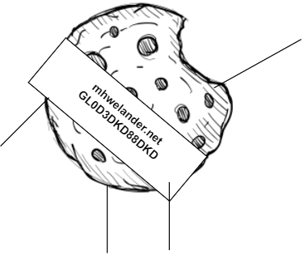
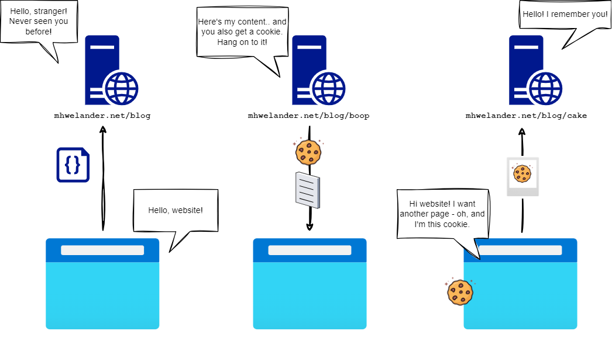
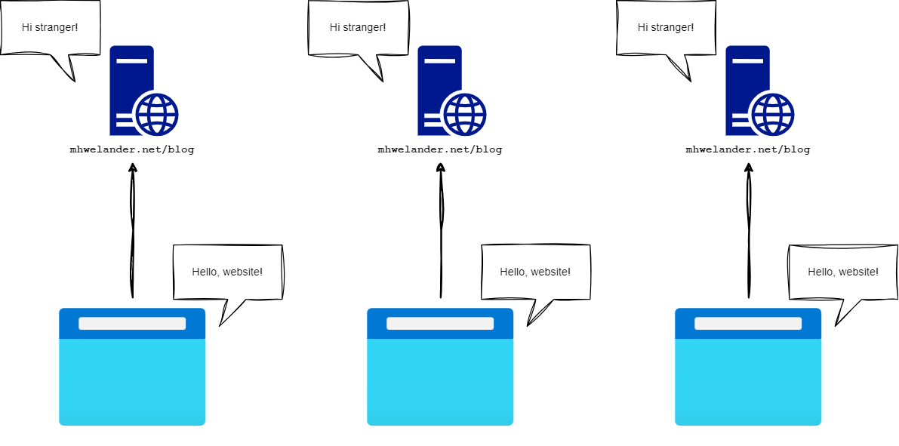

import Block from '../../components/Block.astro'

I'm pretty sure I know what **cookies** are, and how they work. But I'm _also_ pretty sure I know what a **cat** looks like, and yet, drawing one without reference results in.. something less than ideal:

<figure class="centerFig">

<figCaption>... meow, I guess?</figCaption>
</figure>

So I did some research. This post is for anyone with passing knowledge of cookies who really wants to get into the crumbs.

<!-- toc -->

## What is a cookie?

A cookie is a **piece of text** that a website sends to your browser that **uniquely identifies you** to that website:

<figure class="centerFig">

<figCaption>"Hi, I'm your cookie"</figCaption>
</figure>

 Your browser **stores that cookie**, and includes it in every subsequent requests to that website. The website now has a mechanism by which to identify you between page requests and (depending on the type of cookie) between browsing sessions:

<figure class="centerFig">

<figCaption>A website recognizing an old friend</figCaption>
</figure>

Without a cookie, a website has no way of identify you between page requests or sessions. You are a shiny and exciting stranger each time you request a page:

<figure class="centerFig">

<figCaption>This website is a total Dori</figCaption>
</figure>

### Who decides which cookies a website should issue?

Technically speaking, the **website owner** decides which cookies a website issues to visitors - but it's not always obvious where the cookies are coming from. Cookies can created by:

* The website itself (through Javascript or server-side code)
* An embedded script (for example, Google Analytics)
* An embedded an iframe (for example, a YouTube video)

I was surprised by the number of cookies set by YouTube.

<Block class="warning">

If you have a large website with many embedded scripts and iframes, it can be really difficult to know where all the cookies are coming from.

</Block>

### Do websites really need cookies?

Some cookies are in fact 🔖**essential**, which means that a website cannot function correctly without them. For example, cookies are required to:

* Keep you logged between page requests (session cookie)
* Save your preferences (for example, dark mode or light mode)

**🔖Non-essential cookies** include cookies used for:

* Analytics (website performance)
* Personalization

"Improving your website experience"

Very useful to a business, and often make your experience more tailored to you, but you do not have to accept them. The website will still work.

### How long does a cookie last?

In my house? Less than three minutes.

In a browser, however, a 🔖**persistent cookie** lasts until you delete it, or until it expires. The website that issues the cookie sets the expiry date, but:

* Most browsers limit the max age ([Chrome's upper limit is 400 days](https://developer.chrome.com/blog/cookie-max-age-expires))
* Expiry dates must follow any regulation/s in the visitor's country

If you were given a 🔖**session cookie**, the website can identify you until you close your browser.

## What is a cookie used for?

Cookies by themselves don't really do anything - they are bits of text. Just like your passport doesn't really 'do' anything on its own. The point of a cookie is to identify that events belong to a particular person.

* I visited trains page
* I visited another trains page
* I scrolled all the way to the bottom of a page
* I came back to the website every day for a week

Shove all that into an analytics database.

### Example: Analytics

* Collect sessions from 100 people 
* Notice that people drop off at the checkout page
* Notice that pages that are image heavy get the most views

### Example: Personalization

* You are very interested in trains from 1900 - 1920 -- suggest related content to you

## How does it actually work?

When you request a web page - let's say, `mhwelander.net` - that web page sends you a **response**. That response contains all the pieces of text required to display the page: HTML, CSS, scripts, images, fonts - and **cookies**, although you (and many legislative bodies) could argue that cookies are an _optional_ part of a healthy diet.

[image]

You can see this happening in [Chrome Developer Tools](https://developer.chrome.com/docs/devtools). Click `Option + ⌘ + I` (Mac) or `F12` (Windows), then click on the **Network** tab and refresh your page. Notice that the response from `mhwelander.net` includes various requests to get fonts, stylesheets, and script files:

<figure class="centerFig">

<figCaption>The network app</figCaption>
</figure>

### Seeing your cookies

Although cookies are not on that list on an obvious way (websites are not sending `23dDie8abc303.cookie` files), _one or more of the requests in that list_ is **delivering cookies to your browser**:

[Highlight things that could be setting cookies]

 You can see the cookies your browser has stored for a particular site in **Application** tab of the Chrome Developer Tools, under **Storage > Cookies > [yourwebsite]**:

<figure class="centerFig">

<figCaption>Cookies sent by mhwelander.net</figCaption>
</figure>

For example, the contents of my `_ga` cookie is `GA1.1.748647506.1724449994` - tasty stuff. Your browser then **stores** those cookies until:

* They expire
* You delete them
* A script on the website (such as a cookie consent banner) deletes them - or at least the ones [that a script is capable of deleting](#)

### Cookies come from a script or from the HTTP response header

If websites are not sending you `*.cookie` files, then how do they make? You can receive a cookie from a website in two ways:

* In the HTTP response header (so fancy)
* Set by some Javascript

### Cookies are included in the request header

## First party and third party cookies

http response header - set third party cookie

### Why does the Google Analytics script say mhwelander.net and not google.com?

Ah, well.. 'first party cookie' means 'cookie where the domain is mhwelander.net'. 

Isn't that the same thing?

Yeah. Kind of. :) 

## HTTP-Only and regular cookies

## What is all the fuss about cookies?

## Glossary

### Session cookie

### Persistent cookie

### Essential cookies

### Non-essential cookies