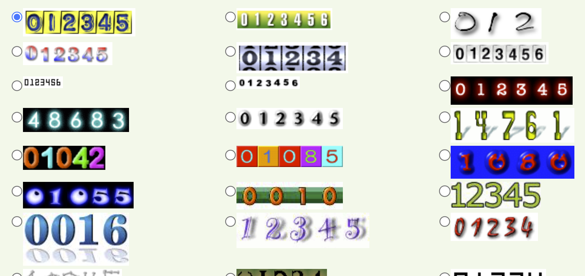
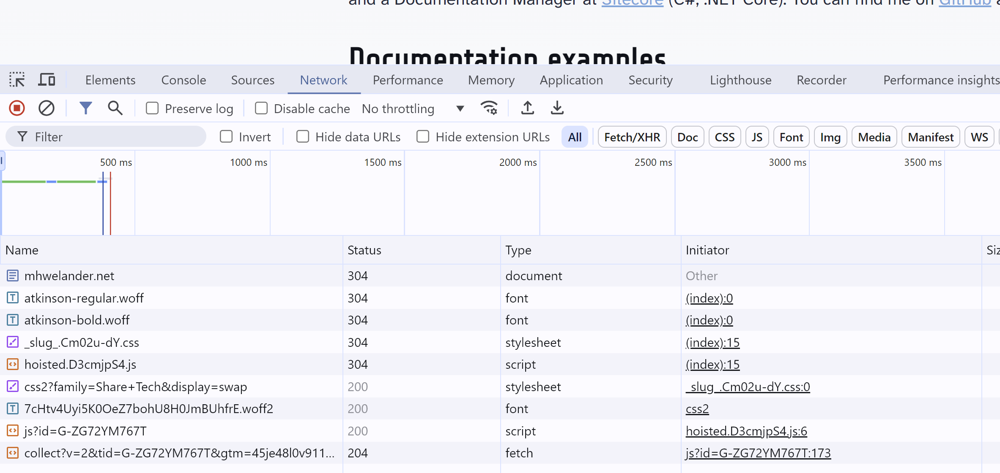
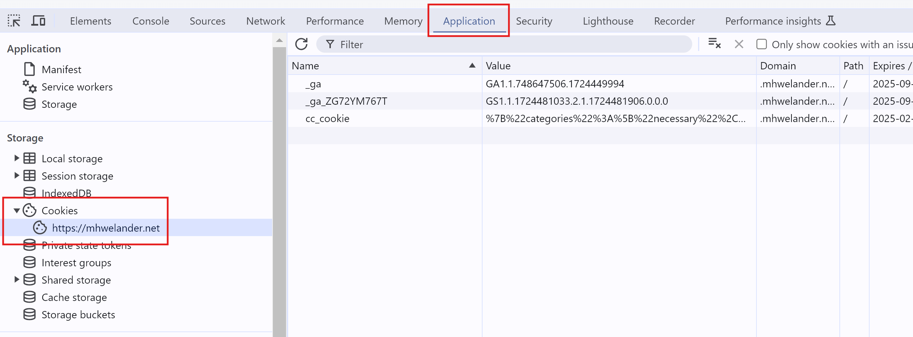

I'm pretty sure I know what **cookies** are, and how they work. But I'm _also_ pretty sure I know what a **cat** looks like, and yet, drawing one without reference results in.. something less than ideal:

<figure class="centerFig">

<figCaption>... meow, I guess?</figCaption>
</figure>

So I did some research. This post is for anyone with passing knowledge of cookies who really wants to get into the crumbs.

## First of all: What is the point of a cookie?

A cookie is a way to **uniquely identify** a person **between page requests** (going from one page to another) and **between sessions** (visiting a site on Monday, and then on Friday). Here is how the internet works without cookies (if we assume that [cookies are the only way to uniquely identify a person](#), which is not strictly true):

* You visit a website about birds
* You look at a page about pidgeons
* You look at a page about hawks
* Three days later, you open your browser again and visit a page about peregrine falcons

Without cookies, there is **no way to know that these requests came from the same person**. I can't track your path through the website or how long you spent, or that you had two sessions. 

[image of scattered data]

It's all just 'hits', like in the olden days of hit counters.

<figure class="centerFig">

<figCaption>Retro hit counters, still available on hitwebcounter.com</figCaption>
</figure>

With cookies:

* You visit website about birds, and it ends you a cookie that is unique to you
* You look at a page about pidgeons - it knows about the cookie
* You look at page about hawks - it knows about the cookie
* Three days later, you open your browser again and visit a page about peregrine falcons - it, too, knows about the cookie

[image of connected data]

## Who cares?

Why is that important? Tracking, personalization.. 'a human from Colorado visited pages about birds' is not possible without a cookie (or some other identifier). The best you can do without a cookie is to say 'people visited the pidgeon page'. 

## You get a cookie, and you get a cookie!

When you request a web page - let's say, `mhwelander.net` - that web page sends you a **response**. That response contains all the pieces of text required to display the page: HTML, CSS, scripts, images, fonts - and **cookies**, although you (and many legislative bodies) could argue that cookies are an _optional_ part of a healthy diet.

[image]

You can see this happening in [Chrome Developer Tools](https://developer.chrome.com/docs/devtools). Click `Option + ⌘ + I` (Mac) or `F12` (Windows), then click on the **Network** tab and refresh your page. Notice that the response from `mhwelander.net` includes various requests to get fonts, stylesheets, and script files:

<figure class="centerFig">

<figCaption>The network app</figCaption>
</figure>

## But where be the cookies?

Although cookies are not on that list on an obvious way (websites are not sending `23dDie8abc303.cookie` files), _one or more of the requests in that list_ is **delivering cookies to your browser**:

[Highlight things that could be setting cookies]

 You can see the cookies your browser has stored for a particular site in **Application** tab of the Chrome Developer Tools, under **Storage > Cookies > [yourwebsite]**:

<figure class="centerFig">

<figCaption>Cookies sent by mhwelander.net</figCaption>
</figure>

For example, the contents of my `_ga` cookie is `GA1.1.748647506.1724449994` - tasty stuff. Your browser then **stores** those cookies until:

* They expire
* You delete them
* A script on the website (such as a cookie consent banner) deletes them - or at least the ones [that a script is capable of deleting](#)

## Exactly how are cookies being delivered?

If websites are not sending you `*.cookie` files, then how do they make? You can receive a cookie from a website in two ways:

* In the HTTP response header (so fancy)
* Set by some Javascript

### Set by Javascript

### Set by the HTTP response header

## So I've caught cookies. What are they used for?

## Domain matters: First party and third party cookies

http response header - set third party cookie

### Why does the Google Analytics script say mhwelander.net and not google.com?
