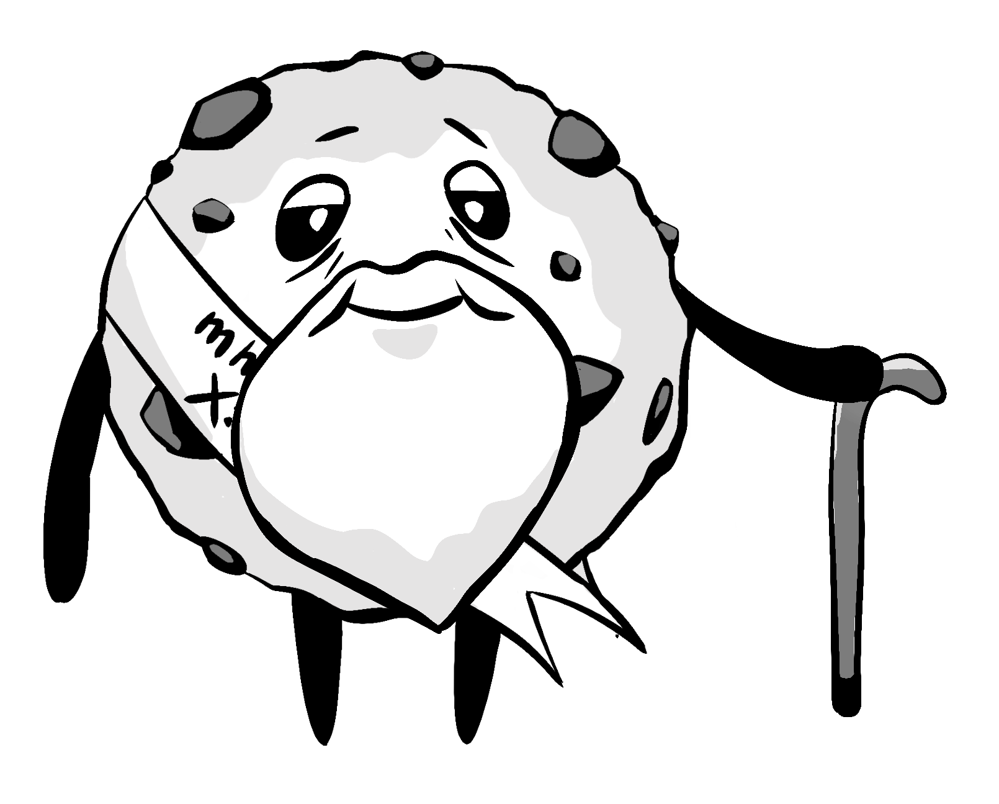
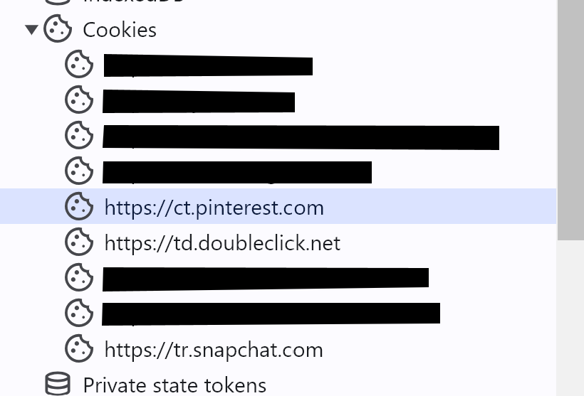
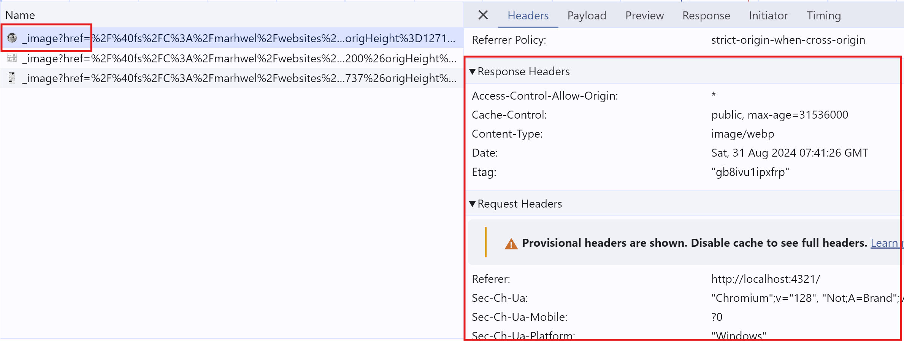
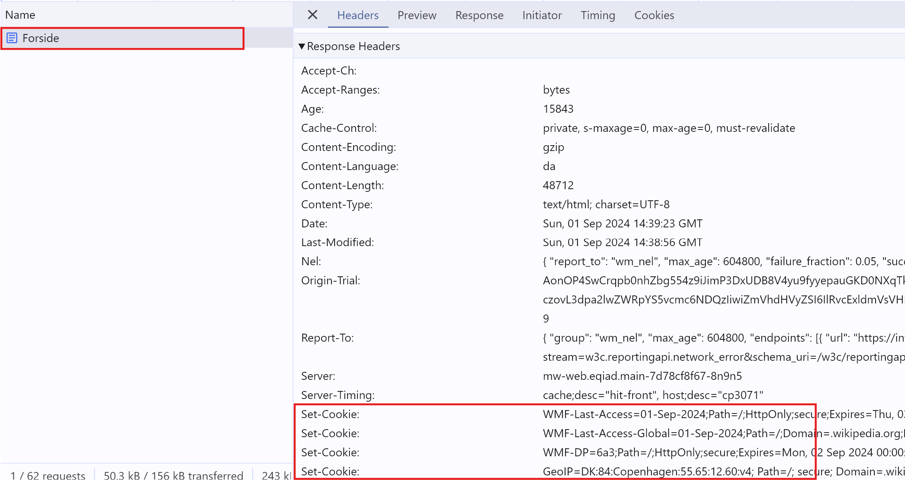
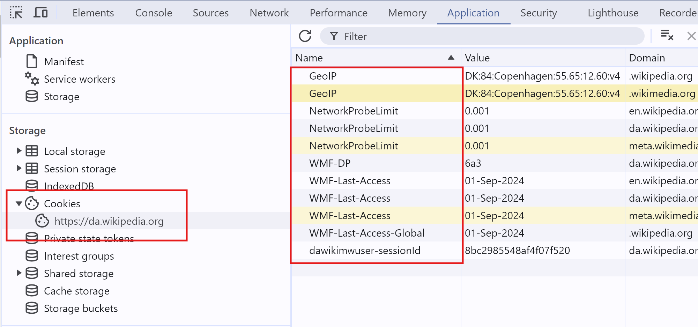
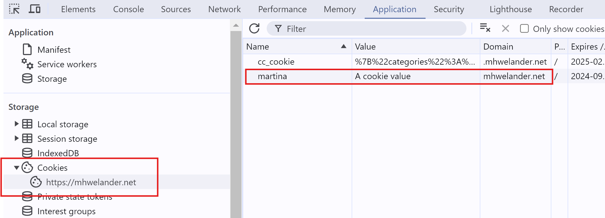
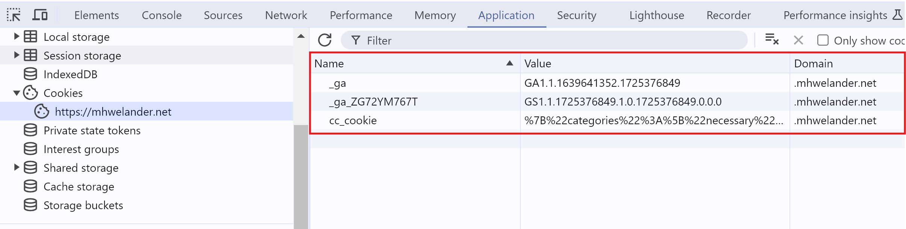
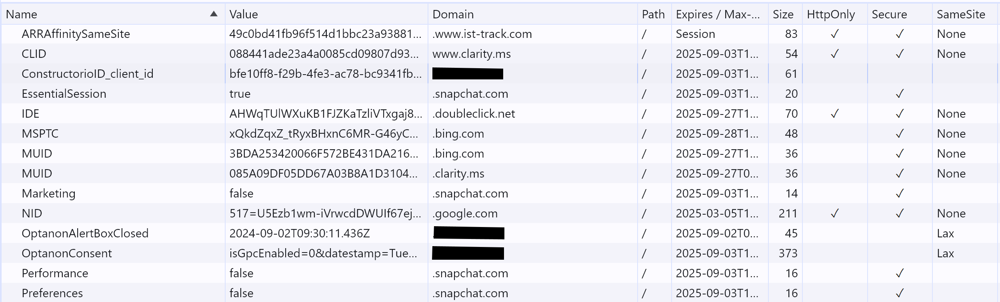
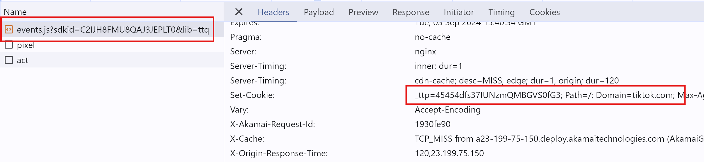

import Block from '../../components/Block.astro'

I'm pretty sure I know [what **cookies** are](https://developer.mozilla.org/en-US/docs/Web/HTTP/Cookies), and how they work. But I'm also pretty sure I know what a **cat** looks like, and yet, drawing one without reference is.. difficult:

<figure class= "centerFig w300" data-lightbox="true">


<figCaption>... meow, I guess?</figCaption>
</figure>

So when I added Google Analytics to my website, I did some research. This post is for anyone with passing knowledge of cookies who really wants to get into the crumbs.

<Block class="note">
This blog post is about how cookies work - specifically _cookies_, and specifically how they _work_. It is **not legal advice**, nor does it cover other means of tracking and/or identifying users online in any detail.
</Block>

<!-- toc -->

## What is a cookie?

A cookie is a **piece of text** sent by a website to your browser that **uniquely identifies you** to that website. They have (at minimum) a name (`X`), a weird-looking value (`902A4Y`), and a domain (`mhwelander.net`):

<figure class="centerFig w300">

<figCaption>"Hi, I'm your cookie"</figCaption>
</figure>

Your browser **stores the cookie** in a backpack of cookies, and includes it in subsequent requests to that website _or_ that website's resources (images, scripts) [for as long as that cookie lasts](#how-long-does-a-cookie-last):

<figure class="centerFig w600">

<figCaption>A website recognizing an old friend</figCaption>
</figure>

Including relevant cookies in requests is just **something that a browser does**. If there's a cookie from `mhwelander.net` in your backpack, your browser will include that cookie in <span class="highlight">**all and any requests**</span> to `mhwelander.net` URLs.

The website now has a  **mechanism** by which to identify you between page requests and (depending on the type of cookie) **between browsing sessions**:

<figure class="centerFig w400">

<figCaption>A website recognizing an old friend</figCaption>
</figure>

Without a cookie (or some other online identifier), a website cannot identify you between requests. You are a shiny and exciting stranger each time you request a page - like the internet of <s>my youth</s> old.

### What is a cookie used for?

Cookies by themselves <span class="highlight">**don't really do anything**</span>; the website and the browser pass them back and forth in a not-so-thrilling game of virtual table tennis. However, once a website can identify a visitor, it can do things like **keep you logged in** (pretty essential) or **use a script to track your activity** (less essential).

<figure class="centerFig w300">

<figCaption>A lil' tracking script, ready to capture the action</figCaption>
</figure>

I think of cookies as name tags, and there is a difference between wearing a name tag, and wearing a name tag whilst someone observes and records that you eat boogers.

<figure class="centerFig w600">

<figCaption>Captured: You, eating snot</figCaption>
</figure>

A tracking script can capture things like:

* The path you took through the website
* What you clicked and downloaded
* How long you spent on each page
* Which components you interacted with and how far you scrolled

Companies can use this data to **personalize your experience** and **monitor trends** - if you spent three sessions looking at 🐝beekeeping paraphernalia, the website might start to suggest that you buy the discounted Beginner Beekeeper Bundle.

<figure class="centerFig w500">

<figCaption>A path through the content</figCaption>
</figure>

Without a cookie, these actions are disconnected. "Someone" from Denmark looked at manual honey extractors and "someone" from Denmark for spent 10 minutes reading a single page about carpets. Is it the same person? Who knows. Is it booger lady? If you're lucky.

<span class="highlight">**But does it really matter**?</span> On this website, maybe not - if you consent, I give you a cookie and track which pages you look at on this site _only_. So far, not excessively creepy (you can of course still opt out of tracking - just click the preferences link in the footer).

But what if you brought that cookie with you to **hundreds of thousands of websites** with that **same tracking script**? Now it's watching you shop, book appointments, and browse listicles about why cats suck (how dare you). This is the potential threat posed by [third-party cookies with wide reach](#third-party-cookies).

### How long does a cookie last?

In my house? Less than three minutes.

In a browser, however, a **persistent cookie** lasts until you delete manually it, or until it expires. The website that issues the cookie sets the expiry date, _but_:

* Most browsers limit the max age ([Chrome's upper limit is 400 days](https://developer.chrome.com/blog/cookie-max-age-expires)) and may have additional rules that affect cookie expiry date
* Expiry dates must follow any regulation/s in the visitor's country

By contrast, a true **session cookie** (a cookie issued without an expiration date) lasts until you close the browser.

<figure class="centerFig w400">

<figCaption>A well-aged cookie</figCaption>
</figure>

### Who decides which cookies a website should issue?

Technically speaking, the **website owner** decides which cookies a website issues to visitors - but it's not always obvious where the cookies are coming from. Cookies can created by:

* The **website itself** - through server-side code or JavaScript
* An **embedded resource from another website**, such as a script, image, or iframe

If a cookie comes from a different website (has a different domain) than the one you are currently visiting, it is called a **[third party or 'cross-site' cookie](#third-party-cookies)**.

### Do websites really need cookies?

Some cookies are in fact **essential** for a website to function correctly. For example, many websites use session cookies to keep you logged. without that cooke, you can't log in.

Cookies used for marketing purposes such as tracking and analytics are considered **non-essential** - they might be essential to the _business_, but they are not essential to the visitor.

## Let's get technical: How do cookies actually work?

When you request a web page - let's say, `mhwelander.net` - that web page sends you a **response** (usually some HTML). That response triggers a **_cascade_ of responses** to get any referenced stylesheets, scripts, images, and fonts required. You might also receive some 🍪**cookies**:

<figure class="centerFig w500">
![An illustration of a browser character wearing a hat and a backpack. The badges on the straps say 'Cool Browser Club' and 'I love HTTP'. The browser is looking down at a collection of resources consisting of a page, a PNG (represented by a polaroid icon), a Javascript file (represented by a curled page icon), a .woff file (represented by the letters Aa), and a .css file (represented by a paintbrush with rainbow paint). There is an arrow going from browser to document that includes a cookie. The arrow cascades down to the other resources. Finally, there are arrows going back to the browser character, who looks a bit shocked.](./images/2024/responses.png)
<figCaption>Responses</figCaption>
</figure>

If you use Chrome, you can see the responses in [Chrome Developer Tools](https://developer.chrome.com/docs/devtools). Click `Option + ⌘ + I` (Mac) or `F12` (Windows), click on the **Network** tab, and refresh your page. Notice that the response from `mhwelander.net` includes various requests to get fonts, stylesheets, script files, and iframes:

<figure class="centerFig">
<div  data-lightbox="true">

</div>
<figCaption>The network tab</figCaption>
</figure>

### I was promised cookies - where are they?

Cookies are either set by the `Set-Cookie` header included in one of these requests, or they are set by Javascript. You can see the cookies your browser has stored for the site you are looking at in **Application** tab of the Chrome Developer Tools, under **Storage > Cookies > [yourwebsite]**:

<figure class="centerFig">
<div  data-lightbox="true">

</div>

<figCaption>Cookies sent by mhwelander.net</figCaption>
</figure>

If a website contains **iframes**, cookies are organized by which 'frame' (including your website, which is the 'top' frame) is using the cookie in a request or a response:

<figure class="centerFig w400">
<div  data-lightbox="true">

</div>

<figCaption>Cookies used by iframes</figCaption>
</figure>

An iframe is a reference to a third-party resource - just like an image or a script - and [can set cookies](https://prototyp.digital/blog/how-to-set-cookies-from-an-embedded-iframe-2) if the parent frame allows it.

### Setting cookies

Cookies can come from two places:

* [HTTP response headers](#http-response-header)
* [Javascript](#javascript)

A response header can do certain things that Javascript cannot - such as creating a third-party cookie, or marking a cookie as HttpOnly. Javascript _code_ also cannot access cookies from another domain than the one you are currently on.

#### Setting cookies with a HTTP response header

All requests and responses includes **headers**. [Headers](https://developer.mozilla.org/en-US/docs/Web/HTTP/Headers) are **meta data** about the request - for example, the `Content-Type` header describes kind of content that was requested. The following request returns an `image/webp`:

<figure class="centerFig">
<div   data-lightbox="true">

</div>
<figCaption>Setting cookies</figCaption>
</figure>

A response can also **set a cookie** via the [`Set-Cookie` header](https://developer.mozilla.org/en-US/docs/Web/HTTP/Headers/Set-Cookie). You can set a cookie with a response from a document, or a script, or even an image. When I load the Wikipedia homepage, _Forside_ document sets several cookies:

<figure class="centerFig">
<div   data-lightbox="true">

</div>
<figCaption>Several Set-Cookie headers</figCaption>
</figure>

These cookies show up under **Application > Cookies**:

<figure class= "centerFig">
<div   data-lightbox="true">

</div>
<figCaption>Wikipedia cookies</figCaption>
</figure>

In this particular example, all cookies are **first-party** - they come from `wikipedia.com`. However, the `Set-Cookie` header can also be used to set a **third-party cookie**.

#### Setting cookies with Javascript

Javascript can also set cookies - this example sets a cookie named `martina` that expires in 2030 (in reality, browsers have a max age for cookies):

```js
document.cookie = "martina=a cookie value;expires=Thu, 18 Dec 2030 12:00:00 UTC"
```

You can paste this one line into the **Console** tab and press enter to create a genuine cookie - it will appear alongside other cookies in the Applications tab:

<figure class= "centerFig">
<div   data-lightbox="true">

</div>
<figCaption>I'm a real cookie</figCaption>
</figure>


**Any script** can create a cookie. That includes scripts hosted on your own domain _and_ scripts from other domains, like Google Tag Manager:

```html
<script async src="https://www.googletagmanager.com/gtag/js?id=G-12345667"></script>
```

However, scripts can _only_ create cookies for the current domain - in other words, they can only create **first-party cookies**. If you attempt to run the following in the Console tab on mhwelander.net, the cookie will not be set - the domain does not match the website you are on:

```js
document.cookie = "martina=a cookie value;expires=Thu, 18 Dec 2030 12:00:00 UTC;domain=notmhwelander.net"
```

Even the Google Analytics script creates a first-party cookie - the domain is mhwelander.net:

<figure class= "centerFig">
<div   data-lightbox="true">

</div>
<figCaption>Google Analytics cookies</figCaption>
</figure>

#### HTTPOnly cookies

Cookies set by the `Set-Cookies` response header _can be_ [set to HttpOnly](https://developer.mozilla.org/en-US/docs/Web/HTTP/Headers/Set-Cookie#httponly). This means that a cookie **can only be accessed by the server** (included in the `Cookies` request header), _not_ by Javascript. Requests initiated _by_ Javascript will still include this cookie, but the script itself cannot access it.

### Accessing cookies

You can access a cookie through Javascript via the `window.cookie` property _if_:

* The cookie is from _your domain_
* The cookie is _not_ marked as HttpOnly


If a cookie is from another domain, it will be included in `Cookies` header of any requests going back to that domain - that's it. For example, if a cookies's domain is `*.tiktok.com`, the browser includes it in any requests to `*.tiktok.com`.

But this is **how many tracking script work** - they track what you do on site A and send a request back home to Site B with your cookie in the `Cookies` request header, like a stamp on an envelope.

<table>
    <caption>Ways to access a cookie</caption>
    <thead>
        <tr>
            <th>Current domain</th>
            <th>HttpOnly cookie</th>
            <th>Access</th>
        </tr>
    </thead>
    <tbody>
        <tr>
            <td>`mhwelander.net`</td>
            <td style="text-align: center;">✓</td>
            <td>* Accessible while on `mhwelander.net` (server-side code)<br />* Included in requests to `mhwelander.net` via `Cookies` request header</td>
        </tr>
        <tr>
            <td>`tiktok.com`</td>
            <td style="text-align: center;">✓</td>
            <td>* Accessible while on `tiktok.com` (server-side code)<br />* Included in requests to `tiktok.com` via `Cookies` request header</td>
        </tr>
        <tr>
            <td>`tiktok.com`</td>
            <td></td>
            <td>* Accessible while on `tiktok.com` (Javascript or server-side code)<br />* Included in requests to `tiktok.com` via `Cookies` request header<br /></td>
        </tr>
        <tr>
            <td>`mhwelander.net`</td>
            <td></td>
            <td>
                <p>* Accessible while on `mhwelander.net` (Javascript or server-side code)<br />* Included in requests to `mhwelander.net` via `Cookies` request header</p>
            </td>
        </tr>
    </tbody>
</table>

## Third-party cookies

On many websites, particularly after you accept non-essential cookies, you will suddenly see cookies from a list of _other_ domains - often domains you do not recognize or have never visited.  These are **third party or 'cross-site' cookies**.

<figure class="centerFig w400">

<figCaption>A sneaky third-party cookie - where did you come from?</figCaption>
</figure>

The thing that makes them third-party cookies is this: <span class="highlight">**the cookie domain does not match the current site.**</span> That's it. If you include a `mhwelander.net` resource on _your_ website that sets a cookie, the domain of that cookie is `mhwelander.net` and it is a third-party cookie in the context of your website.

I visited ███████.com, accepted all cookies, and looked in the Application tab - notice that _most_ of the cookies are from other domains and are therefore third-party:

<figure class= "centerFig">
<div   data-lightbox="true">

</div>
<figCaption>Third party cookies on ███████.com</figCaption>
</figure>

It is the **context in which a cookie appears** that makes it third-party or first-party; the cookie itself is not inherently third or first party.

### Where do they come from and how are they used?

When a website owner <span class="highlight">**embeds a resource from another website**</span>, such as an image or a script, the **response** from that resource can include a `Set-Cookie` header. This sets a **third-party cookie** - it comes from a website you might never have visited.

<figure class="centerFig w400">

<figCaption>A sneaky third-party cookie - where did you come from?</figCaption>
</figure>

For example, the HttpOnly `_ttp` cookie (TikTok) is set by the `Set-Cookie` header when you load `events.js` script from `analytics.tiktok.com` (the cookie is set by the request,  _not_ the Javascript itself).

<figure class= "centerFig">
<div  data-lightbox="true">

</div>
<figCaption>A cookie set by the `Set-Cookie` header</figCaption>
</figure>

The tracking script is able to send information about your activities back home to the Planet TikTok because the request to `*.tiktok.com/events.js` **automatically** includes your `*.tiktok.com` cookie in the `Cookies` request header.

Here's the critical part:

> <span class="highlight">**any other website** you visit with the TikTok tracking script is able to send your TikTok cookie back to TikTok in this way</span>

This means that you can be **tracked as a single individual** across the **hundreds of thousands of websites** that implement this script. TikTok isn't exactly an obscure advertising platform - and neither is Google, or Amazon.

And remember - _we invite these cookies_ by adding tracking scripts to our websites. We invite them, and we give them a way to phone home and gossip about us (sometimes too much, if we misconfigure the script):

<figure class="centerFig w500">

<figCaption>This Snapchat cookie is invited</figCaption>
</figure>

And frankly, for advertising purposes - third-party cookies are useful! By collecting data about an individual across many, many websites, advertising platforms are able to target ads with **incredible accuracy**. This is great for anyone who uses the platform to advertise - and great for the platform, because we pay them. 

And, if I'm being honest, I'm not _too_ mad about it when Instagram shows me an ad for exactly the thing I want. I _was_ looking for moisture-wicking socks with a reinforced heel - how did you know?

But it's a bit creepy. In fact, under the right (or wrong) circumstances, it can be outright damaging.

## What's the big deal?

If you steal my laptop and look at my cookies, you probably (PROBABLY!) won't get a lot of interesting information out of them in isolation.

<figure class="centerFig w400">

<figCaption>"Oooh, some random numbers, how SCANDALOUS"</figCaption>
</figure>

But a cookie, particularly a **third-party (cross-site) cookie** that really 'gets around', _can_ compromise your privacy online. Let's say you have lived a wild, third-party cookie-accepting life online up until this point.

> Many tracking services and advertising platforms have stored a _lot_ of **data** about your online activities - <span class="highlight">and it's all linked together by a **single identifier**.</span>

And here's the thing about all of this data:

* You don't know **exactly what data** has been collected
* People **mess up**, and **data breaches happen**

For example, a misconfigured script on 💅 Mr. Bob's Nail Salon's booking form might have sent your name and email address to an ad platform - it probably violates the terms of said platform, but Mr. Bob slapped the tracking script on his site over a boozy lunch in 2013 and hasn't thought about it since.

In isolation, this might not seem like it matters. However, it probably _does_ matter if **the same tracking script, using the same cookie**, later ⚠️[records you downloading the patient handbook for a specific disease from a hospital website](https://www.theguardian.com/society/2023/may/27/nhs-data-breach-trusts-shared-patient-details-with-facebook-meta-without-consent).

In this example, <span class="highlight">specifically because the cookie's **cross-site presence**</span>, a single identifier now links your name and email address to your expensive nail habit.. and ⚠️ **your private medical information** - and all of it has been sent to a third party. This may sound like a worst case scenario, but [it seems to happen all the time](https://www.npr.org/transcripts/1197960899).

<figure class="centerFig w300">

<figCaption>Et tu, cookie?</figCaption>
</figure>

<Block class="note">
First-party still make it possible to track your activity **across sessions** on a **single website** - this could absolutely be a problem if a hospital accidentally sends some of your patient data to a tracking service. The risk increases with a cookie that stalks you all over the internet.
</Block>

## Oh no! What's being done about the cookies?

Data privacy isn't a new thing, but I started to have more conversations about cookies and tracking in particular in the mid-2010s - there's a [great timeline of data privacy online over here](https://clario.co/blog/privacy-definition-over-years/). Suffice to say, in 2024, a large percentage of people understand that **their online activities leave prints**.

There is a lot of **[privacy legislation](#privacy-legislation)** that affect cookies, and **[your browser](#browsers)** is getting protective by default (which I didn't know until recently).

### Privacy legislation

The ✨**general vibe**✨ of privacy legislation (at least in the EU) centers on **active consent** and **the right to be informed**.

The EU [ePrivacy Directive](https://eur-lex.europa.eu/legal-content/EN/TXT/?uri=CELEX%3A32009L0136) has been around since 2002 and mentions requiring consent to store information (such as cookies) on user equipment. [GDPR](https://www.edps.europa.eu/data-protection/data-protection/legislation/history-general-data-protection-regulation_en) has applied in the European Union since 2018, and requires [consent](https://gdpr-info.eu/art-6-gdpr/) (with some caveats) to process personal data - which includes [online identifiers](https://gdpr-info.eu/recitals/no-30/).

I actually started writing this blog post because I wanted to understand _exactly_ why Google Analytics requires consent, and here it is: it issues a cookie (ePrivacy Directive), and that's an online identifier that is being processed and stored by Google (GDPR).

### Browsers

Browsers themselves are getting generally more protective of their meat-flavored pilots (that's you and me). Where third-party cookies are concerned, the **default behavior** of several browsers is to block them, which means you have to **actively opt _in_** to receive these cookies.

**[Firefox](https://developer.mozilla.org/en-US/blog/goodbye-third-party-cookies/?_gl=1*1109wif*_ga*MzIzODU0NDU3LjE3MjM5MjIyNjU.*_ga_X4N05QV93S*MTcyNjE2NzIxMS4xLjEuMTcyNjE2NzI0Mi4wLjAuMA..)** and have done _many_ other things to keep users safe on the internet, including blocking third-party cookies by default. There's [a beautifully illustrated timeline here](https://clearcode.cc/blog/firefox-privacy-changes-timeline/). **Safari** similarly [blocks third-party cookies by default](https://help.apple.com/safari/mac/8.0/en.lproj/sfri11471.html#:~:text=By%20default%2C%20Safari%20accepts%20cookies,cookies%20and%20other%20website%20data.).

**Chrome** is.. [working on it, kind of](https://digiday.com/marketing/after-years-of-uncertainty-google-says-it-wont-be-deprecating-third-party-cookies-in-chrome/). You CAN block third-party cookies, but they are not blocked by default. But Chrome is owned by Google, who might just be making a little bit of money from online advertising. :)

<Block class="note">
You can also choose a privacy-focused browser like [Brave](https://brave.com/).
</Block>

## No cookies, no problems?

No, not really. There are many other ways to [fingerprint a person](https://privacycheck.sec.lrz.de/), even across _browsers_ (seriously, check out that website). There's a reason why GDPR vaguely refers to **online identifiers**.

Third-party cookies seem like they might be doomed, and first-party cookies still require consent - something that often causes **a dramatic drop-off in recorded website traffic**. Naturally, a lot of companies are asking:

> How can I track someone's activity 'anonymously' - in a way that does not require active consent?

**Cookie-less tracking** offers an alternative - but you can't track visitors between websites, _or even between sessions_. As soon as your tracker uses and **identifier that persists or can be reliably re-created** across sessions, I would argue that it's processing personal data, and personal data requires consent.

For example (opinion ahead) - if you fingerprint someone by generating _and storing_ a hash of their IP address, user agent, and some other browser information, _without_ using so much as a sprinkle of some kind of time-limited salt.. that smells like a cookie in a Halloween costume to me.

<figure class="centerFig w300">

<figCaption>OoOoOoooooo!</figCaption>
</figure>

Most cookie-less trackers that I have looked at _do_ use some kind of time-limited salt. I still have Some Thoughts™️ about consent there, but that feels like an entirely separate blog post, and a whole new cast of characters.
