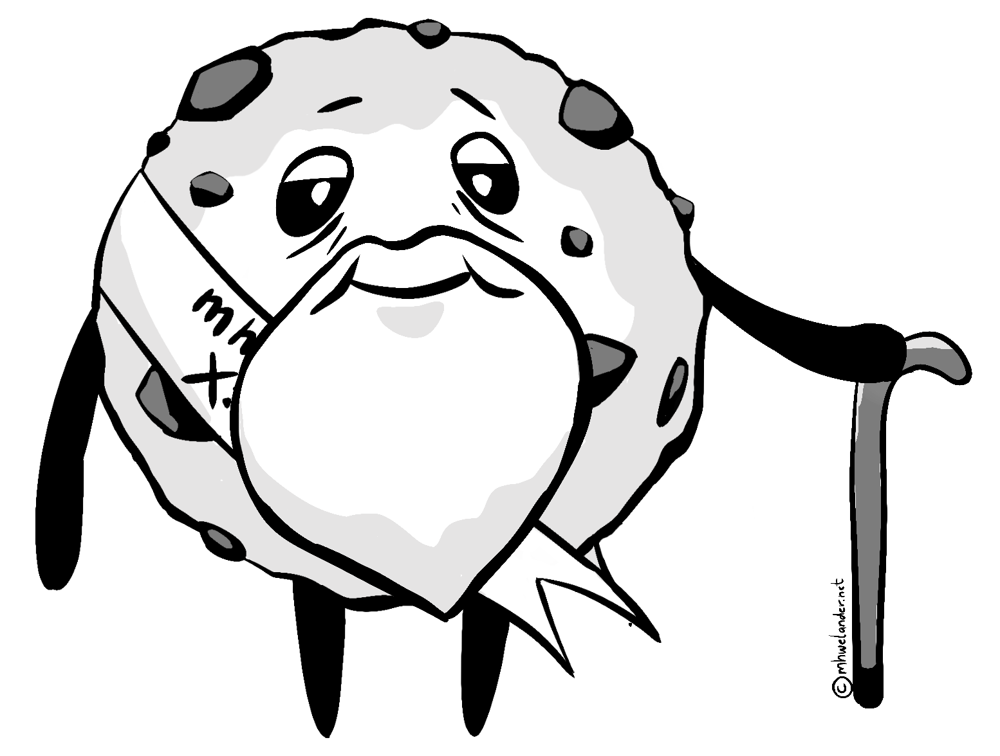
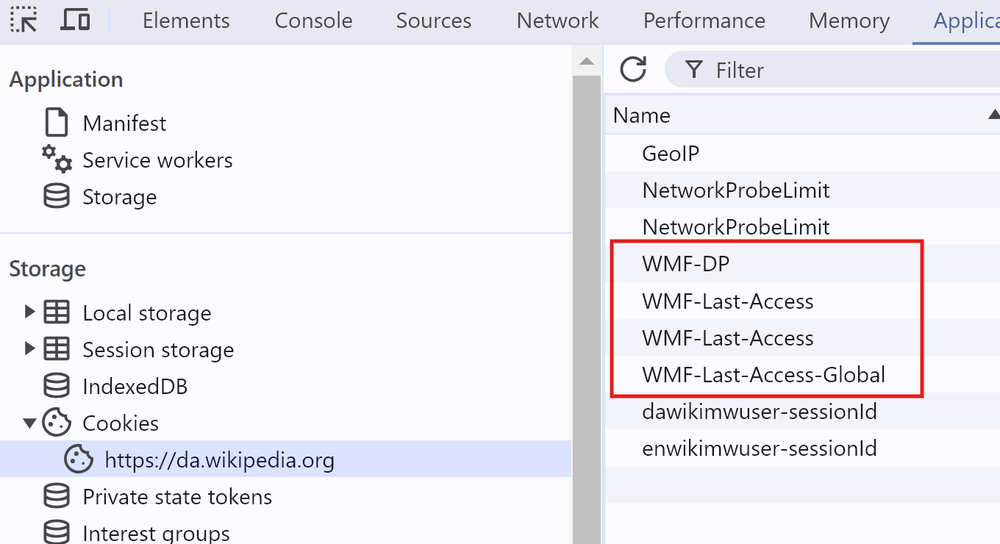

import Block from '../../components/Block.astro'

I'm pretty sure I know [what **cookies** are](https://developer.mozilla.org/en-US/docs/Web/HTTP/Cookies), and how they work. But I'm _also_ pretty sure I know what a **cat** looks like, and yet, drawing one without reference results in.. something less than ideal:

<figure class= "centerFig w400" data-lightbox="true">

[IMAGE NEEDED]

<figCaption>... meow, I guess?</figCaption>
</figure>

So I did some research. This post is for anyone with passing knowledge of cookies who really wants to get into the crumbs.

<Block class="note">
This blog post is about how cookies work - specifically _cookies_, and specifically how they _work_. It is not legal advice, nor does it cover other means of tracking and/or identifying users online.
</Block>

<!-- toc -->

## What is a cookie?

A cookie is a **piece of text** sent by a website to your browser that **uniquely identifies you** to that website. They have a name (`_X`) and a weird-looking value (`902A4Y`):

<figure class="centerFig w300">

<figCaption>"Hi, I'm your cookie"</figCaption>
</figure>

Your browser **stores the cookie** when it receives it, and includes it in subsequent requests to that website [for as long as that cookie lasts](#how-long-does-a-cookie-last):

<figure class="centerFig w600">

<figCaption>A website recognizing an old friend</figCaption>
</figure>

This means that the website has a **mechanism by which to identify you** between page requests and (depending on the type of cookie) between browsing sessions:

<figure class="centerFig w400">

<figCaption>A website recognizing an old friend</figCaption>
</figure>

Without a cookie (or some other online identifier), a website cannot identify you between requests. You are a shiny and exciting stranger each time you request a page - like the internet of <s>my youth</s> old.

### What is a cookie used for?

Cookies by themselves **don't really do anything**; the website and the browser pass them back and forth in a not-so-thrilling game of virtual table tennis. However, once a website can identify a visitor, it can [use a tracker like Google Analytics](https://www.zipy.ai/blog/website-tracking-tools) to string disparate activities together into a cohesive journey.

A tracker can show the path you took through the website, how long you spent on each page, and maybe even which components you interacted with and how far you scrolled. Companies can use this data to **personalize your experience** and **monitor trends** - if you spent three sessions looking at 🐝beekeeping paraphenalia, the website might start to suggest that you buy the discounted Beginner Beekeper Bundle.

<figure class="centerFig w500">

<figCaption>A path through the content</figCaption>
</figure>

Without a cookie, these actions are disconnected. "Someone" from Denmark looked at manual honey extractors and "someone" from Denmark for spent 10 minutes reading a single page about carpets. Is it the same person? Who knows.

<Block class="note">
**Is it technically possible to track visitors by IP address?** An IP address does not necessarily identify an individual - it identifies a node on a network, which _could_ be a personal device - or it could be the router in an office.  Furthermore, most IP addresses are dynamic (they can change).
</Block>

### How long does a cookie last?

In my house? Less than three minutes.

In a browser, however, a **persistent cookie** lasts until you delete manually it, or until it expires. The website that issues the cookie sets the expiry date, _but_:

* Most browsers limit the max age ([Chrome's upper limit is 400 days](https://developer.chrome.com/blog/cookie-max-age-expires))
* Expiry dates must follow any regulation/s in the visitor's country

By contrast, **session cookies** (a cookie issued without an expiration date) last until you close the browser.

<figure class="centerFig w400">

<figCaption>A well-aged cookie</figCaption>
</figure>

### Who decides which cookies a website should issue?

Technically speaking, the **website owner** decides which cookies a website issues to visitors - but it's not always obvious where the cookies are coming from. Cookies can created by:

* The **website itself** - through server-side code or JavaScript
* An **embedded asset from another website**, such as a script, image, or iframe

A cookie set by a different website than the one you are currently visiting is called a ⚠️**third party or 'cross-site' cookie** - [more on them later later](#), and why they can [come across as a little creepy](https://developer.mozilla.org/en-US/docs/Web/Privacy/Third-party_cookies#what_is_the_problem_with_third-party_cookies). Even embedding a YouTube video on your website will set several cookies.

<figure class="centerFig w500">

<figCaption>Surprise cookies from a YouTube embed!</figCaption>
</figure>

Safari blocks third-party cookies by default and [Google Chrome is wrestling with a solution to the problem](https://developers.google.com/privacy-sandbox/cookies/prepare/overview#preserve).

### Do websites really need cookies?

Some cookies are in fact **essential** for a website to function correctly. For example, many websites use session cookies to keep you logged.

Cookies used for marketing purposes such as tracking and analytics are considered **non-essential** - they might be essential to the _business_, but they are not essential to the visitor.

## Let's get technical: How do cookies actually work?

When you request a web page - let's say, `mhwelander.net` - that web page sends you a **response** (usually some HTML). That response triggers a **_cascade_ of responses** to get any referenced stylesheets, scripts, images, and fonts required. You might also receive some 🍪**cookies**:

<figure class="centerFig w500">

<figCaption>Responses</figCaption>
</figure>

You can see the responses in [Chrome Developer Tools](https://developer.chrome.com/docs/devtools). Click `Option + ⌘ + I` (Mac) or `F12` (Windows), then click on the **Network** tab and refresh your page. Notice that the response from `mhwelander.net` includes various requests to get fonts, stylesheets, and script files:

<figure class="centerFig">
<div  data-lightbox="true">

</div>
<figCaption>The network app</figCaption>
</figure>

### I was promised cookies - where are they?

Cookies are not separate requests - they are set by a request header or by Javascript. You can see the cookies your browser has stored for the site you are looking at in **Application** tab of the Chrome Developer Tools, under **Storage > Cookies > [yourwebsite]**:

<figure class="centerFig">
<div  data-lightbox="true">

</div>

<figCaption>Cookies sent by mhwelander.net</figCaption>
</figure>

If a website contains **iframes**, cookies are organised by which 'frame' (including your domain) is using the cookie in a request or a response:

<figure class="centerFig w400">
<div  data-lightbox="true">

</div>

<figCaption>Cookies used by iframes</figCaption>
</figure>

### Where cookies come from

A website sets a cookie in several ways:

* Via an HTTP response header
* Via Javascript

A response header can do certain things that Javascript cannot - such as creating a third-party cookie, or marking a cookie as HttpOnly.

#### HTTP response header

All requests and responses includes **headers**. [Headers](https://developer.mozilla.org/en-US/docs/Web/HTTP/Headers) are **meta data** about the request - for example, the `Content-Type` header describes kind of content that was requested. The following request returns an `image/webp`:

<figure class="centerFig">
<div   data-lightbox="true">

</div>
<figCaption>HTTP-only cookies</figCaption>
</figure>

A response can also **set a cookie** via the [`Set-Cookie` header](https://developer.mozilla.org/en-US/docs/Web/HTTP/Headers/Set-Cookie). You can set a cookie with a response from a document, or a script, or even an image. When I load the Wikipedia homepage, _Forside_ document sets several cookies:

<figure class="centerFig">
<div   data-lightbox="true">

</div>
<figCaption>HTTP-only cookies</figCaption>
</figure>

These cookies show up under **Application > Cookies**:

<figure class= "centerFig">
<div   data-lightbox="true">

</div>
<figCaption>HTTP-only cookies</figCaption>
</figure>

#### Javascript

Javascript can set cookies - that includes scripts hosted on your own domain _and_ scripts from other domains, like Google Tag Manager:

```html
<script async src="https://www.googletagmanager.com/gtag/js?id=G-12345667"></script>
```

You can event set a cookie by writing some Javascript in the Console tab. This script sets a cooke named `martina` with the value `A cookie value`:

<figure class= "centerFig">
<div   data-lightbox="true">

</div>
<figCaption>A cookie that does nothing</figCaption>
</figure>

This script creates a genuine cookie - it appears alongside other cookies in the Applications tab:

<figure class= "centerFig">
<div   data-lightbox="true">

</div>
<figCaption>I'm a real cookie</figCaption>
</figure>

* Cannot create or access HttpOnly cookies
* Cannot create cookies from a different domain

## First-party and third-party cookies

On many websites, particularly after you accept non-essential cookies, you will suddenly see cookies from a list of _other_ domains - often domains you do not recognize or have never visited. Skip on down to the section about [third-party cookies](#third-party-cookies) if you're itching to find out where they came from:

<figure class= "centerFig">
<div   data-lightbox="true">

</div>
<figCaption>Where did these come from?</figCaption>
</figure>

#### Iframes


## HttpOnly and regular cookies


### Why does the Google Analytics script say mhwelander.net and not google.com?

Ah, well.. 'first party cookie' means 'cookie where the domain is mhwelander.net'. 

Isn't that the same thing?

Yeah. Kind of. :) 