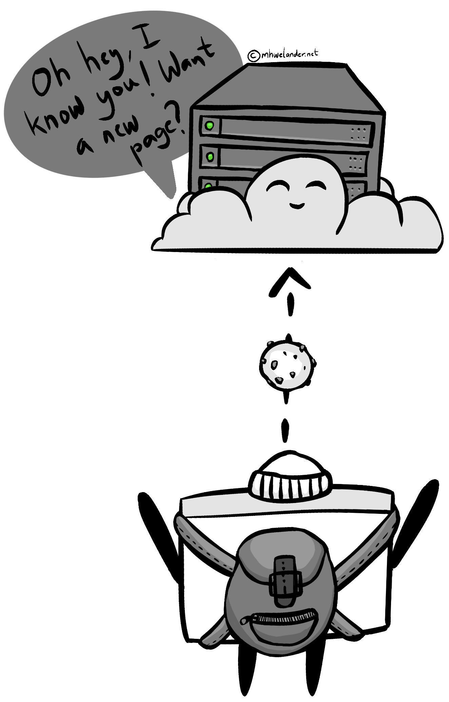
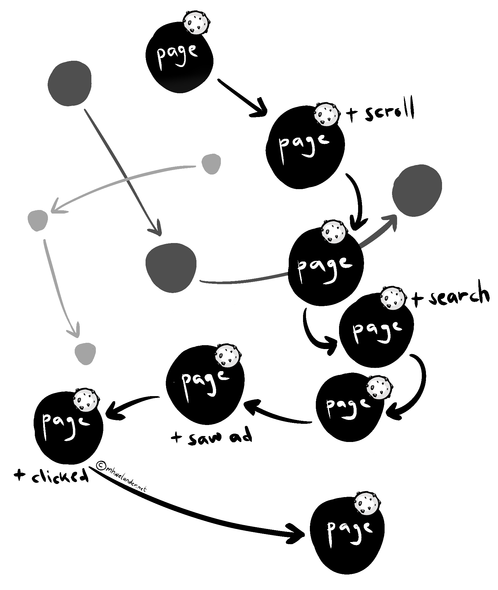
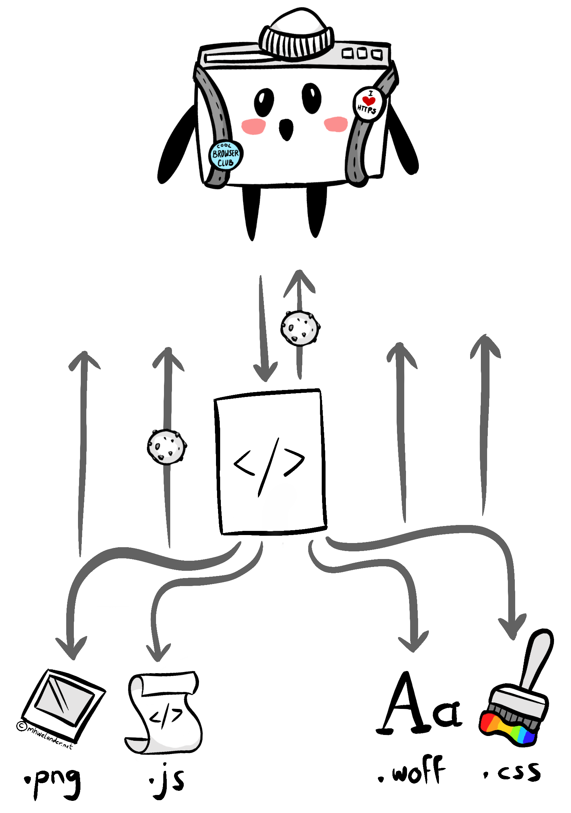

import Block from '../../components/Block.astro'

I'm pretty sure I know [what **cookies** are](https://developer.mozilla.org/en-US/docs/Web/HTTP/Cookies), and how they work. But I'm _also_ pretty sure I know what a **cat** looks like, and yet, drawing one without reference results in.. something less than ideal:

<figure class= "centerFig w400" data-lightbox="true">

[IMAGE NEEDED]

<figCaption>... meow, I guess?</figCaption>
</figure>

So I did some research. This post is for anyone with passing knowledge of cookies who really wants to get into the crumbs.

<Block class="note">
This blog post is about how cookies work - specifically _cookies_, and specifically how they _work_. It is not legal advice, nor does it cover other means of tracking and/or identifying users online.
</Block>

<!-- toc -->

## What is a cookie?

A cookie is a **piece of text** sent by a website to your browser that **uniquely identifies you** to that website. They have (at minimum) a name (`X`), a weird-looking value (`902A4Y`), and a domain (`mhwelander.net`):

<figure class="centerFig w300">

<figCaption>"Hi, I'm your cookie"</figCaption>
</figure>

Your browser **stores the cookie** in a backpack of cookies, and includes it in subsequent requests to that website _or_ that website's resources (images, scripts) [for as long as that cookie lasts](#how-long-does-a-cookie-last):

<figure class="centerFig w600">

<figCaption>A website recognizing an old friend</figCaption>
</figure>

Including relevant cookies in requests is just **something that a browser does**. If it sees that there's a cookie from `mhwelander.net` in your backpack, it will include that cookie in <span class="highlight">**all and any requests**</span> to `mhwelander.net` URLs. The website now has a  mechanism by which to identify you between page requests and (depending on the type of cookie) between browsing sessions:

<figure class="centerFig w400">

<figCaption>A website recognizing an old friend</figCaption>
</figure>

Without a cookie (or some other online identifier), a website cannot identify you between requests. You are a shiny and exciting stranger each time you request a page - like the internet of <s>my youth</s> old.

### What is a cookie used for?

Cookies by themselves <span class="highlight">**don't really do anything**</span>; the website and the browser pass them back and forth in a not-so-thrilling game of virtual table tennis. However, once a website can identify a visitor, it can use a script to **track that visitor's activity**.

<figure class="centerFig w300">

<figCaption>A lil' tracking script, ready to capture the action</figCaption>
</figure>

There is a difference between wearing a nametag (having a cookie), and wearing a nametag whilst someone observes and records that you eat boogers (read a blog post about cookies).

<figure class="centerFig w600">

<figCaption>Captured: You, eating snot</figCaption>
</figure>

A tracker can show the path you took through the website, how long you spent on each page, and maybe even which components you interacted with and how far you scrolled. Companies can use this data to **personalize your experience** and **monitor trends** - if you spent three sessions looking at 🐝beekeeping paraphenalia, the website might start to suggest that you buy the discounted Beginner Beekeper Bundle.

<figure class="centerFig w500">

<figCaption>A path through the content</figCaption>
</figure>

Without a cookie, these actions are disconnected. "Someone" from Denmark looked at manual honey extractors and "someone" from Denmark for spent 10 minutes reading a single page about carpets. Is it the same person? Who knows. Is it booger lady? Maybe.

<span class="highlight">**But does it really matter**?</span> On this website, maybe not - if you consent, I give you a cookie and track which pages you look at on this site _only_. So far, not excessively creepy (you can of course still opt out of tracking - just click the prefernces link in the footer).

But what if you brought that cookie with you to **hundreds of thousands of websites** with that **same tracking script**? Now it's watching you shop, book appointments, and browse listicles about why cats suck (how dare you). This is the potential threat posed by [third-party cookies with wide reach](#third-party-cookies).

### How long does a cookie last?

In my house? Less than three minutes.

In a browser, however, a **persistent cookie** lasts until you delete manually it, or until it expires. The website that issues the cookie sets the expiry date, _but_:

* Most browsers limit the max age ([Chrome's upper limit is 400 days](https://developer.chrome.com/blog/cookie-max-age-expires)) and may have additional rules that affect cookie expiry date
* Expiry dates must follow any regulation/s in the visitor's country

By contrast, a true **session cookie** (a cookie issued without an expiration date) lasts until you close the browser.

<figure class="centerFig w400">

<figCaption>A well-aged cookie</figCaption>
</figure>

### Who decides which cookies a website should issue?

Technically speaking, the **website owner** decides which cookies a website issues to visitors - but it's not always obvious where the cookies are coming from. Cookies can created by:

* The **website itself** - through server-side code or JavaScript
* An **embedded resource from another website**, such as a script, image, or iframe

A cookie set by a different website than the one you are currently visiting is called a **third party or 'cross-site' cookie**. Even if you didn't visit their website, the have now set a cookie and tracked your activity.

### Do websites really need cookies?

Some cookies are in fact **essential** for a website to function correctly. For example, many websites use session cookies to keep you logged.

Cookies used for marketing purposes such as tracking and analytics are considered **non-essential** - they might be essential to the _business_, but they are not essential to the visitor.

## Let's get technical: How do cookies actually work?

When you request a web page - let's say, `mhwelander.net` - that web page sends you a **response** (usually some HTML). That response triggers a **_cascade_ of responses** to get any referenced stylesheets, scripts, images, and fonts required. You might also receive some 🍪**cookies**:

<figure class="centerFig w500">

<figCaption>Responses</figCaption>
</figure>

You can see the responses in [Chrome Developer Tools](https://developer.chrome.com/docs/devtools). Click `Option + ⌘ + I` (Mac) or `F12` (Windows), then click on the **Network** tab and refresh your page. Notice that the response from `mhwelander.net` includes various requests to get fonts, stylesheets, script files, and iframes:

<figure class="centerFig">
<div  data-lightbox="true">

</div>
<figCaption>The network app</figCaption>
</figure>

### I was promised cookies - where are they?

Cookies are not separate requests - they are set by the `Set-Cookie` header of a request, or by Javascript. You can see the cookies your browser has stored for the site you are looking at in **Application** tab of the Chrome Developer Tools, under **Storage > Cookies > [yourwebsite]**:

<figure class="centerFig">
<div  data-lightbox="true">

</div>

<figCaption>Cookies sent by mhwelander.net</figCaption>
</figure>

If a website contains **iframes**, cookies are organised by which 'frame' (including your website, which is the 'top' frame) is using the cookie in a request or a response:

<figure class="centerFig w400">
<div  data-lightbox="true">

</div>

<figCaption>Cookies used by iframes</figCaption>
</figure>

An iframe is a reference to a third-party resource - just like an image or a script - and [can set cookies](https://prototyp.digital/blog/how-to-set-cookies-from-an-embedded-iframe-2) if the parent frame allows it.

### Where cookies come from

Cookies can come from two places:

* [HTTP response headers](#http-response-header)
* [Javascript](#javascript)

A response header can do certain things that Javascript cannot - such as creating a third-party cookie, or marking a cookie as HttpOnly.

#### HTTP response header

All requests and responses includes **headers**. [Headers](https://developer.mozilla.org/en-US/docs/Web/HTTP/Headers) are **meta data** about the request - for example, the `Content-Type` header describes kind of content that was requested. The following request returns an `image/webp`:

<figure class="centerFig">
<div   data-lightbox="true">

</div>
<figCaption>HTTP-only cookies</figCaption>
</figure>

A response can also **set a cookie** via the [`Set-Cookie` header](https://developer.mozilla.org/en-US/docs/Web/HTTP/Headers/Set-Cookie). You can set a cookie with a response from a document, or a script, or even an image. When I load the Wikipedia homepage, _Forside_ document sets several cookies:

<figure class="centerFig">
<div   data-lightbox="true">

</div>
<figCaption>HTTP-only cookies</figCaption>
</figure>

These cookies show up under **Application > Cookies**:

<figure class= "centerFig">
<div   data-lightbox="true">

</div>
<figCaption>HTTP-only cookies</figCaption>
</figure>

In this particular example, all cookies are **first-party** - they come from `wikipedia.com`. However, the `Set-Cookie` header can also be used to set a **third-party cookie**.

#### Javascript

Javascript can also set cookies - this example sets a cookie named `martina` that expires in 2030 (in reality, browsers have a max age for cookies):

```js
document.cookie = "martina=a cookie value;expires=Thu, 18 Dec 2030 12:00:00 UTC"
```

You can paste this one line into the **Console** tab and press enter to create a genuine cookie - it will appear alongside other cookies in the Applications tab:

<figure class= "centerFig">
<div   data-lightbox="true">

</div>
<figCaption>I'm a real cookie</figCaption>
</figure>


**Any script** can create a cookie. That includes scripts hosted on your own domain _and_ scripts from other domains, like Google Tag Manager:

```html
<script async src="https://www.googletagmanager.com/gtag/js?id=G-12345667"></script>
```

However, scripts can _only_ create cookies for the current domain - in other words, they can only create **first-party cookies**. If you attempt to run the following in the Console tab on mhwelander.net, the cookie will not be set - the domain does not match the website you are on:

```js
document.cookie = "martina=a cookie value;expires=Thu, 18 Dec 2030 12:00:00 UTC;domain=notmhwelander.net"
```

Even the Google Analytics script creates a first-party cookie - the domain is mhwelander.net:

<figure class= "centerFig">
<div   data-lightbox="true">

</div>
<figCaption>I'm a real cookie</figCaption>
</figure>

### HTTPOnly cookies

Cookies set by the `Set-Cookies` reponse header _can be_ [set to HttpOnly](https://developer.mozilla.org/en-US/docs/Web/HTTP/Headers/Set-Cookie#httponly). This means that a cookie **can only be accessed by the server** (included in the `Cookies` request header), _not_ by Javascript. Reqests initiated _by_ Javascript will still include this cookie, but the script itself cannot access it.

## Third-party cookies

On many websites, particularly after you accept non-essential cookies, you will suddenly see cookies from a list of _other_ domains - often domains you do not recognize or have never visited.  These are **third party or 'cross-site' cookies**.

<figure class="centerFig w400">

<figCaption>A sneaky third-party cookie - where did you come from?</figCaption>
</figure>

The thing that makes them third-party cookies is this: <span class="highlight">**the cookie domain does not match the current site.**</span> That's it. If you include a `mhwelander.net` resource that sets a cookie on _your_ website, and the domain of that cookie is `mhwelander.net`, it is a third-party cookie.

I visited ███████.com, accepted all cookies, and looked in the Application tab - notice that _most_ of the cookies are from other domains and are therefore third-party:

<figure class= "centerFig">
<div   data-lightbox="true">

</div>
<figCaption>Third party cookies on ███████.com</figCaption>
</figure>

It is the **context in which a cookie appears** that makes it third-party or first-party; the cookie itself is not inherently third or first party.

### Where do they come from and how are they used?

When a website owner <span class="highlight">**embeds a resource from another website**</span>, such as an image or a script, the **response** from that resource can include a `Set-Cookie` header. This sets a **third-party cookie** - it comes from a website you might never have visited.

<figure class="centerFig w400">

<figCaption>A sneaky third-party cookie - where did you come from?</figCaption>
</figure>

For example, the `_ttp` cookie (TikTok) is set by loading the `events.js` script from analytics.tiktok.com (the cookie is set by the request,  _not_ the Javascript itself).

<figure class= "centerFig">
<div   data-lightbox="true">

</div>
<figCaption>A cookie set by the `Set-Cookie` header</figCaption>
</figure>

The `Set-Cookie` response header a third-party cookie - your browser stores it. The tracking script sends information about your activities back home to the Planet TikTok - which automatically includes your cookie in the `Cookies` request header, because it's phoning home to `tiktok.com`, where the cookie came from. Here's the critical part:

> <span class="highlight">**any other website** you visit with the TikTok tracking script will see your TikTok cookie</span>

This means that you can be tracked as a single individual across the **hundreds of thousands** of websites that implement this script. TikTok isn't exactly an obscure advertising platform. 

<Block class="note">
I am not picking on TikTok specifically - all advertising platforms that use third-party cookies work this way.
</Block>

And remember - _we invite these cookies_ by adding tracking scripts to our websites. We invite them, and we give them a way to phone home and gossip about us:

<figure class="centerFig w500">

<figCaption>This Snapchat cookie is invited</figCaption>
</figure>

And frankly, for advertising purposes - third-party cookies are great! By collecting data about an individual across many, many websites, advertising platforms are able to target ads with **incredible accuracy**. This is great for anyone who uses the platform - and great for the platform, because we pay them.

But it's a bit creepy. In fact, it can be outright damaging.

## What's the big deal with _cookies_, specifically?

If you steal my laptop and look at my cookies, you won't get any data _out of the cookie_ - whether they are first or third-party cookie.
<figure class="centerFig w300">

<figCaption>"Oooh, some random numbers, how SCANDALOUS"</figCaption>
</figure>

But a cookie, particularly a _third-party or cross-site cookie_, can make it **easier** to compromise your privacy online:

> There is now a _lot_ of data about your activities across the internet stored by large ad platforms, and <span class="highlight">it is all linked together by a single identifier</span>

And here's the thing about all of this data:

* You don't know **exactly what data** has been collected, and **people mess up**. A misconfigured script on Mr. Bob's Nail Salon might have sent your name and email address to a third-party tracking service - it probably violates the terms of said service, but Mr. Bob made an honest mistake.
* Data breaches happen all the time.

This might not matter to you if you're booking a nail appointment at Mr Bob's. However, it probably _does_ matter if the same tracking script later [records you downloading the patient handbook for HIV from a hospital website](https://www.theguardian.com/society/2023/may/27/nhs-data-breach-trusts-shared-patient-details-with-facebook-meta-without-consent).

### Privacy legislation

* Opt in to cookies (not mentioned explicitly in GDPR - says 'online identifier')
* Rights to

### Browsers

* Blocking third party cookies
* 

Some browsers block third party cookies


## No cookies, no problems?

No, not really.

* Cookie-less tracking just uses another identifier (albeit not cross-site) to track you - cannot track between sessions, but can track per session
* Anonymous tracking - still see what a person did. Oh this person visited the MartinaIsCool profile 20 times in each of their 1000 sessions? I wonder who that could be.

## Beyond the basics

* Partitioned cookies
* Cookie-less tracking
