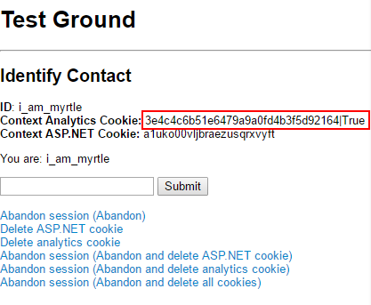

This blog post follows on from [Let's Talk About Session State](../blog/lets-talk-about-session-state/). Now that we understand the role played by session state in the xDB, let's take a closer look at what *exactly* happens during a session -- and how xDB is able to keep track of us across sessions.

## But first -- the setup!

I am using OutProc session state (specifically the MongoDB provider) for private *and* shared so that I can see what is happening to my session. They are using the same database, which is possible as long as you make sure that the sessionType properties on the provider differ -- e.g. `sessionType="private"`.

I also created this handy-dandy rendering that calls  It outputs the ASP.NET cookie, the analytics cookie, and the currently identified contact. The text box just calls `Tracker.Current.Session.Identify()`.

It also has quick links for abandoning session and clearing cookies in various combinations:


## What happens when you identify a contact for the first time?

I come to Sitecore as an anonymous user -- Sitecore issues me with an analytics cookie and an ASP.NET cookie. If I look in the session database, I can see that I have an entry for shared session state (which uses the same ID as my analytics cookie) and an entry for private session state (which uses the same ID as my ASP.NET cookie):


As soon as I identify myself, I immediately get an entry in the xDB -- notice that my ID matches the analytics cookie. This is because it's my first visit, and the first time that I have identified myself:


I did something at the same time as identifying my contact. I set a number of facets:


However, these have not yet appeared in the collection database. Unless you force data to be flushed to the xDB (more on this later), it will not appear in the collection database until the session ends.

## What happens when the session ends, and how can I force the session to end?

By default, sessions time out after 20 minutes of inactivity. Private session state times out first, and shared session state times out 1 minute later. You can modify the timeout setting in web.config -- search for the sessionState node and change the timeout property.

If you want to force a session to time out for testing purposes, you can call `System.Web.HttpContext.Current.Session.Abandon()`.

From this page, I linked to a page that abandons the session -- in my case, http://mysite.local/abandon

As part of abandoning the session, I also redirected to a page that doesn't exist. You don't have to do this, but for debugging purposes I did not want a brand new session to be created as soon as I hit a new page.  As far as I can tell, this does not happen if you redirect to 'page not found'.

The following screenshot shows what happened to my session. At this point I have *not browsed away from the 'Not Found'* *page*! This is important, as a new private session with the same ID will be created as soon as I go back to the site*. *

Notice that although private session state disappeared, shared session state is still in there:


If I check the collection database, you can see that my facet data has now appeared -- but the contact will have a 'lease' on it until the shared session state disappears:


Watch what happens when I visit a page now that I have abandoned my session:



Sitecore still knows who I am. We are stalking you just a lil' bit.


## Why does Sitecore still know who I am, even though I abandoned the session?

Abandoning your session does not delete your cookies. Because your original analytics cookie is present, Sitecore is able to identify you. It will also start a new session with the same ID as the previous one. This is because my original ASP.NET cookie is also still available.

Here is another contact:


And after we abandon session, here is the analytics cookie (still intact):


Here is the ASP.NET cookie (still intact):


Using the same session ID twice does not mean that you will continue the same interaction. It is a brand new interaction using the same session ID.

## What happens if I delete my ASP.NET cookie after my first visit?

Sitecore is still able to identify you using the original analytics cookie -- you can delete the ASP.NET cookie 3 times and Sitecore will still be able to identify you. Here I have cleared my ASP.NET cookie 3 times;the highlighted entries are private session state:


Sitecore will, however, interpret each fresh ASP.NET cookie as a new visit. I mention this because if you clear your ASP.NET cookie on logout, you are creating two separate visits for that contact.

If I delete my analytics cookie 3 times I must abandon the final session before I see any change to my visit count. My visit count will increment by 3 but only the last active private session actually disappears from the session database immediately; the others are orphaned and left to expire on their own. The expiry time of shared session state is updated to be +1 minute after the final private session.

Here you can see that my visit count is now 3 (keep in mind that you will only see the interactions when the sessions have expired):


Fortunately, contact data is stored in shared session state. This means that whatever I did in my first 19 sessions, the order in which those sessions expire do not affect what contact data is saved to the xDB.

Let's say that I changed my name in session 3 (Myrtle to Martin), and again in session 10 when I discovered a typo (Martin to Martina). Even if session 3 expires *last*, the final value of that facet will still be Martina; not Martin.

## What happens if I delete my analytics cookie after my first visit?

The ID you see in the analytics cookie on your first visit will become your contact GUID.

If you delete this cookie AND abandon your session (which deletes your private session state), Sitecore has no way of figuring out who you are.

As far as I can tell, the steps are (in no particular order):

1.  Check ASP.NET cookie -- does this person have an active session? If yes, they can be identified.
2.  If no, check the analytics cookie -- does this cookie match a contact GUID? If yes, they can be identified.
3.  If no -- does the the analytics cookie references  a device (see below for explanation) that has a 'last known contact' ID? If yes, they can be identified.

## My session has expired and I have an analytics cookie that does not match my contact GUID -- how does Sitecore still know who I am?

Every time you identify yourself, Sitecore associates your contact GUID with whatever the current analytics cookie ID is. It does that by creating an entry in the devices table. If you clear all cookies and re-identify yourself, Sitecore will create a record like the one below that links the analytics cookie ID to your contact ID:


When this new session expires and you re-visit the site, Sitecore is still able to identify you. Essentially, you have to re-identify yourself each time the analytics cookie is cleared, and a high percentage of non-technical people don't actually clear their cookies that often (shock horror, I know)!

## Forcing data to flush to the xDB

We know that we can force data to flush to the xDB by abandoning our session. You can also force session data to flush *without* abandoning the session:

```csharp
ContactManager contactManager = Sitecore.Configuration.Factory.CreateObject("tracking/contactManager", true) as ContactManager; 
contactManager.FlushContactToXdb(contact);
contactManager.SaveAndReleaseContactToXdb(contact);
```

I added these lines to my 'identify me' form, which means that clicking the 'Submit' button creates a contact, populates the facets, and flushes session data at the same time. Here is my contact data (identified as mudkip):


My facet data was available immediately; I did not need to abandon session:


My visit count remained at 1 even after I abandoned the session and cleared all cookies, proving that session data was flushed but the session remained active:


## One last thing -- mixing InProc and OutProc

I noticed that if I used InProc for private and OutProc for shared (which I do not think there is a reason for; I was just being lazy) my session behaviour became unpredictable -- sometimes facets would appear, sometimes not. If anyone else has experienced this, let me know in the comments.

## The end

Here is what my list of contact identifiers looked like towards the end of this experiment:


There's a lot going on with session state. If there is any part of this blog post where your experiences with session state differs, please let me know in the comments or tweet me (@mhwelander) -- I'll edit in your contributions (with credit, of course) so that we can share the love with the whole community. 🙂

<div class="comments">

## Comments (Imported from wordpress)

### Matt

_August 25, 2016 at 12:44_

This is a great overview -- Thanks for writing such a great post!

### Pingback: [MongoSessionStateProvider might slow down your application | Sitecore basics!](https://sitecorebasics.wordpress.com/2016/09/25/mongosessionstateprovider-might-slow-down-your-application/)

### Tauqir Malik

_October 17, 2016 at 17:28_

If the worker process crashes then the session records are not cleared and having a sql job that clears orphan session records helps clean up the database from time to time. We had an issue with our code where a cyclic reference in a class Properties would cause app pool to crash on high traffic load. The code would work fine on normal site traffic. This caused a lot of orphan session records in our database till we fix the issue. So if all is good then sessions will get cleared timely but if app pool is stopped and restarted then the session end event is not raised for the sessions in the memory and all these would end up permanently in the session database.\
However if you choose to move your session database to TempDB then no need for such a cleaning Job. In this case you need to remember that session database would need to be recreated every time SQL restarts. So this needs to be scripted out. Moving session DB to temp database is also recommended by Sitecore to boost performance of your site.

### [Anders Gjelstrup](http://anderscg.wordpress.com/)

_November 17, 2016 at 11:53_

Very thorough post Martina. Nice work 🙂

### Pingback: [Sitecore xDB demystified -- Useful mongo database queries -- Anders Christian Ellegaard Gjelstrup](https://aceditblog.wordpress.com/2016/11/15/sitecore-xdb-demystified-useful-mongo-database-queries/) 

### [Wayne Smith](http://lowwhistler.wordpress.com/)

_January 10, 2017 at 20:30_

Really thorough overview!

### Mary P

_April 14, 2017 at 12:27_

However if you choose to move your session database to TempDB then no need for such a cleaning Job. In this case you need to remember that session database would need to be recreated every time SQL restarts. Very thorough post Martina.

### [Roman Rozinov](http://blog.rozinov.net/)

_October 6, 2017 at 17:54_

Great overview, first of. I have posted a question on sitecore stackoverflow what happens to the "unidentified" contact entry. Is that governed by the shared session state expiration?

### hung nguyen

_October 3, 2019 at 05:36_

Hello Martina,

"If I delete my analytics cookie 3 times I must abandon the final session before I see any change to my visit count. My visit count will increment by 3 but only the last active private session actually disappears from the session database immediately; the others are orphaned and left to expire on their own. The expiry time of shared session state is updated to be +1 minute after the final private session."

Did you mean "If I delete my asp.net cookie 3 times... " ?

</div>